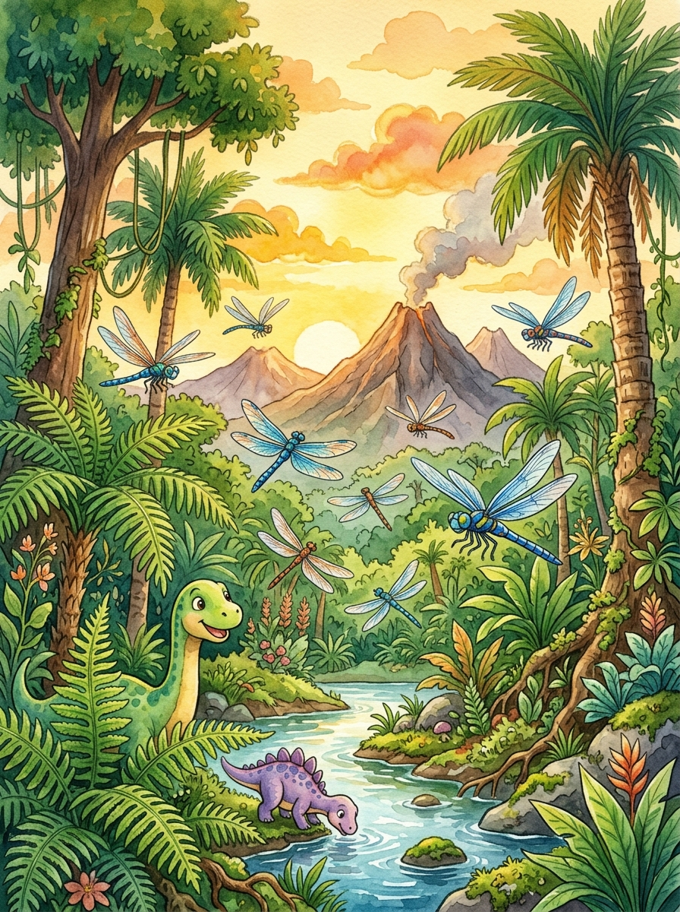

# Capítulo 1: Ficha Inicial y Presentación de la Aventura en el Bosque de Secuoyas de España

---

## [PÁGINA 1: PORTADILLA DE PERTENENCIA]

# LAS AVENTURAS DE NICO Y LUNA

### **Este libro pertenece a la tripulación de:**

__________________________________________________

*¡Que tu viaje por el bosque de secuoyas de Cantabria en España esté lleno de árboles gigantes, ardillas voladoras y piñas de oro brillantes!*

---

## [PÁGINA 2: PORTADA INTERIOR]

# LAS AVENTURAS DE NICO Y LUNA
## Aventura en el Bosque de Secuoyas

**Colección:** Las Aventuras de Nico y Luna — Libro 10  
**Escrito e Ilustrado por:** Julio Martín Rodríguez Sánchez  
**Para pequeños lectores y artistas de 4 a 8 años**

---

## [PÁGINA 3: DERECHOS DE AUTOR Y NOTA EDITORIAL]

**Las Aventuras de Nico y Luna: Aventura en el Bosque de Secuoyas**  
© 2026 Julio Martín Rodríguez Sánchez. Todos los derechos reservados.

Queda prohibida la reproducción total o parcial de esta obra por cualquier medio sin la autorización escrita del titular de los derechos de autor.

**Nota para los padres y educadores:**  
Este libro ha sido diseñado para estimular la imaginación, la creatividad y la lectura temprana en niños de 4 a 8 años. Cada capítulo de lectura a color se separa por portadillas ilustradas y las escenas se presentan con texto en la página izquierda e ilustraciones a página completa en la derecha.

---

## [PÁGINA 4: ¡PREPARADOS PARA EL VIAJE EN EL BOSQUE GIGANTE!]

### ¡Hola de nuevo, valiente explorador!

Nico, Luna y Copito están listos para cruzar los grandes helechos y descubrir la piña de oro del roble centenario:

- **Nico**: Lleva una pequeña brújula de madera colgada del cuello y una linterna de explorador de color verde.
- **Luna**: Sostiene una gran lupa de madera con borde amarillo y lleva una libreta para dibujar las flores silvestres.
- **Copito**: Lleva su bufanda roja y un pequeño pañuelo verde alrededor del cuello, listo para seguir los rastros de las ardillas.

¡Hoy cruzaremos puentes de troncos caídos y subiremos a la rama más alta en el bosque de secuoyas gigantes en España!

> **Instrucción de Coloreado:**  
> Pinta el musgo de color verde claro, dale brillo a la brújula dorada de Nico y colorea la mochila de Luna con tu color preferido.

---

## [PÁGINA 5: ILUSTRACIÓN DE BIENVENIDA]

# Capítulo 2: La Expedición en el Bosque Gigante

---

## [PÁGINA 6: PORTADILLA CAPÍTULO - LA EXPEDICIÓN EN EL BOSQUE GIGANTE]

---

## [PÁGINA 7: ESCENA 1 - EL CAMINO DEL BOSQUE]

En una fresca tarde de Cantabria, Nico y Luna caminan cogidos de la mano por el sendero que lleva al Bosque de Secuoyas. El camino está rodeado de helechos verdes y grandes hojas de roble que cubren el suelo de tierra húmeda. Copito corretea a su lado olfateando cada rincón con gran curiosidad y moviendo la cola muy contento al sentir el aroma de la naturaleza limpia y fresca. Los rayos de sol atraviesan las copas de los árboles lejanos, dibujando círculos dorados de luz en el suelo.

La entrada del bosque de Cantabria promete un viaje inolvidable lleno de grandes misterios entre secuoyas gigantes.

> **Texto de Lectura:**  
> —¡Es precioso! El bosque parece un túnel verde gigante lleno de misterios por descubrir. ¡Vamos a explorarlo! —exclama Luna llena de emoción.

---

## [PÁGINA 8: ILUSTRACIÓN ESCENA 1]

---

## [PÁGINA 9: ESCENA 2 - ¡LOS ÁRBOLES GIGANTES!]

De repente, una ráfaga de chispas verdes y doradas envuelve el sendero, transportando mágicamente a los niños al corazón del bosque. Ante ellos se elevan majestuosas las secuoyas gigantescas, cuyos troncos de color marrón rojizo son tan anchos que Nico y Luna no pueden rodearlos ni tomándose de las manos. Nico corre hacia la secuoya más cercana y la abraza fuerte, apoyando su mejilla contra la corteza suave y fibrosa que se siente templada y acogedora.

Las gigantescas secuoyas de Cantabria se elevan hacia el cielo, protegiendo a los pequeños exploradores de España.

> **Texto de Lectura:**  
> —¡Es impresionante! Su tronco es tan blando como el corcho y se siente muy calentito al abrazarlo —dice Nico sonriendo.

---

## [PÁGINA 10: ILUSTRACIÓN ESCENA 2]

---

## [PÁGINA 11: ESCENA 3 - SALTARINA LA ARDILLA]

Mientras observan las ramas más altas del bosque, del hueco de un tronco sale a saludarlos una simpática ardilla de color castaño brillante con una cola muy peluda. Al dar un gran salto en el aire, abre sus patitas mostrando una delgada membrana de piel que le permite planear suavemente como si fuera un cometa de papel. Es Saltarina, la ardilla voladora más alegre de Cantabria. Saltarina planea entre las ramas, aterrizando suavemente frente a Copito, quien salta feliz intentando jugar.

Nico y Luna ríen felices al ver los vuelos acrobáticos y los saltos juguetones de la simpática ardilla.

> **Texto de Lectura:**  
> —¡Hola, Saltarina! Eres la ardilla más rápida y divertida del bosque. ¡Tus planeos en el aire son mágicos! —dice Luna.

---

## [PÁGINA 12: ILUSTRACIÓN ESCENA 3]

---

## [PÁGINA 13: ESCENA 4 - LA PIÑA DE ORO]

Saltarina los guía hacia un claro desde donde se observa el viejo roble centenario, cuyas hojas verdes brillan con luz propia. Con gestos rápidos de sus patitas delanteras, la ardilla les cuenta la historia de la piña de oro, un tesoro dorado que descansa en la copa del gran roble y protege a todos los árboles del bosque. Si la piña pierde su brillo, las secuoyas dejarán de crecer altas y el musgo verde se secará por completo.

Nico y Luna escuchan con atención a su nueva amiga, decididos a ayudar a rescatar la gran piña protectora.

> **Texto de Lectura:**  
> —¡No te preocupes, Saltarina! Subiremos al gran roble y buscaremos la piña para salvar el bosque. ¡Adelante exploradores! —anuncia Nico.

---

## [PÁGINA 14: ILUSTRACIÓN ESCENA 4]

---

## [PÁGINA 15: ESCENA 5 - EL SENDERO DE MUSGO]

La expedición continúa por un sendero cubierto de un musgo verde tan espeso y suave que parece una gran alfombra de terciopelo. Nico y Luna caminan despacio, disfrutando del tacto mullido del musgo mientras examinan unas simpáticas setas rojas con lunares blancos que crecen junto a helechos más altos que ellos. Copito avanza dando saltos ágiles sobre el musgo húmedo, olfateando cada seta y buscando huellas de pequeños duendes del bosque.

El sendero de musgo esponjoso amortigua los pasos de los amigos mientras avanzan bajo la sombra de las secuoyas.

> **Texto de Lectura:**  
> —¡Es muy divertido! Caminar por encima de este musgo es como saltar sobre colchones de algodón verde —comenta Luna riendo.

---

## [PÁGINA 16: ILUSTRACIÓN ESCENA 5]

# Capítulo 3: El Misterio de la Piña de Oro

---

## [PÁGINA 17: PORTADILLA CAPÍTULO - EL MISTERIO DE LA PIÑA DE ORO]

---

## [PÁGINA 18: ESCENA 6 - EL PUENTE DE TRONCO]

Para continuar el viaje, Nico, Luna y Saltarina deben cruzar un pequeño riachuelo de agua cantarína y clara. Sobre el agua descansa un gran tronco de secuoya caído que sirve de puente natural entre las dos orillas de musgo. Nico avanza despacio con sus brazos extendidos para mantener el equilibrio, mientras Luna le sigue de cerca con paso firme y Copito corretea alegremente dando saltos sobre las piedras húmedas de la orilla. El agua del arroyo corre alegre haciendo pequeños murmullos al chocar contra las rocas.

El riachuelo brilla bajo el sol del bosque de Cantabria, rodeado de pequeñas flores amarillas.

> **Texto de Lectura:**  
> —¡Mirad qué agua tan clara! Caminemos despacio y con cuidado sobre el gran tronco de madera para no mojarnos los pies —dice Nico.

---

## [PÁGINA 19: ILUSTRACIÓN ESCENA 6]

---

## [PÁGINA 20: ESCENA 7 - EL CARBONERO CANTOR]

Al cruzar el arroyo, sobre una piña gigante de secuoya tirada en el suelo, descansa un pequeño carbonero de plumas blancas, grises y cabeza negra brillante. Es el pájaro cantor más sabio e inteligente del bosque de Cantabria. El carbonero abre su piquito y les saluda con un canto alegre, moviendo sus plumas con gracia. Guanche no está aquí, pero Saltarina la ardilla saluda al carbonero agitando su cola peluda, mientras Copito ladra muy contento al escuchar la dulce melodía del pájaro explorador.

El simpático carbonero se ofrece a mostrarles el camino secreto que lleva hacia el claro de musgo luminoso.

> **Texto de Lectura:**  
> —¡Qué canto tan alegre tienes, carbonero! ¿Nos ayudas a encontrar las raíces del viejo roble centenario? —pregunta Luna.

---

## [PÁGINA 21: ILUSTRACIÓN ESCENA 7]

---

## [PÁGINA 22: ESCENA 8 - EL ENIGMA DEL CLARO LUMINOSO]

El carbonero los guía hacia una zona más profunda del bosque, donde el suelo de musgo verde comienza a brillar con una hermosa luz esmeralda y violeta muy suave. En medio del claro, crecen setas luminosas que parecen pequeñas farolas de colores que alumbran el camino secreto. Para poder cruzar el claro sin apagar las setas, Nico y Luna deben resolver un enigma sobre las estaciones del año y los frutos secos del bosque.

Tras resolver el enigma, las setas brillan con más fuerza, abriendo un sendero natural de luz verde entre las secuoyas.

> **Texto de Lectura:**  
> —¡Es mágico! El musgo y las setas brillan para indicarnos el camino hacia el gran roble centenario —susurra Luna maravillada.

---

## [PÁGINA 23: ILUSTRACIÓN ESCENA 8]

---

## [PÁGINA 24: ESCENA 9 - LAS RAÍCES DEL ROBLE]

Siguiendo el sendero de luz, llegan ante el impresionante tronco del roble centenario, cuyas inmensas raíces rugosas y sabias sobresalen de la tierra formando escaleras naturales. Nico y Luna comienzan a subir con cuidado, sujetándose de la corteza arrugada del gran árbol y apoyando sus botas en las raíces gigantescas. Saltarina corre a gran velocidad por el tronco, dándoles ánimos desde las ramas superiores mientras Copito olfatea las hojas caídas de la base.

El viejo roble centenario de Cantabria parece darles la bienvenida con un susurro de sus hojas verdes al viento.

> **Texto de Lectura:**  
> —¡Estas raíces son como escaleras de madera gigante! ¡Sujetaos bien para subir a la copa más alta! —dice Nico subiendo.

---

## [PÁGINA 25: ILUSTRACIÓN ESCENA 9]

---

## [PÁGINA 26: ESCENA 10 - EL HALLAZGO DE LA PIÑA]

Al llegar al nido de ramas de la copa del roble centenario, Nico y Luna descubren la hermosa piña de oro. El gran tesoro del bosque flota suavemente en el aire, emitiendo una cálida y brillante luz dorada que ilumina todo el follaje con hermosos destellos de sol. Saltarina da saltos acrobáticos muy alegre al ver que la piña de oro está a salvo, mientras Copito asoma su cabecita por el borde del nido, moviendo la cola muy contento.

Luna estira sus manos y, con mucho cuidado, toma la piña de oro brillante para devolver la fuerza a todo el bosque.

> **Texto de Lectura:**  
> —¡La hemos encontrado! Su luz es muy cálida y brilla como un trocito de oro puro entre las hojas verdes —susurra Luna feliz.

---

## [PÁGINA 27: ILUSTRACIÓN ESCENA 10]

# Capítulo 4: La Fiesta del Bosque y el Regreso a la Tierra

---

## [PÁGINA 28: PORTADILLA CAPÍTULO - LA FIESTA DEL BOSQUE Y EL REGRESO A LA TIERRA]

---

## [PÁGINA 29: ESCENA 11 - EL BOSQUE AGRADECIDO]

Al bajar del roble centenario con la piña de oro a salvo, regresan a los senderos verdes del bosque. En señal de agradecimiento, Saltarina y el carbonero colocan la piña de oro en lo alto del gran roble, la cual emite una hermosa y brillante luz dorada que envuelve todo el follaje. Las hojas de las secuoyas brillan con un verde intenso y el musgo adquiere un tono esmeralda precioso, devolviendo la fuerza y la alegría a todo el Bosque de Secuoyas de Cantabria.

La gran piña de oro vuelve a proteger el bosque gigante gracias a la valentía de la tripulación de Nico y Luna.

> **Texto de Lectura:**  
> —¡Mirad qué bonito resplandece la piña dorada en el roble centenario! Todo el bosque se llena de color y alegría —dice Nico muy contento.

---

## [PÁGINA 30: ILUSTRACIÓN ESCENA 11]

---

## [PÁGINA 31: ESCENA 12 - LA MERIENDA EN EL MUSGO]

Para celebrar la gran victoria, Saltarina y el carbonero organizan una deliciosa merienda sobre una suave alfombra de musgo verde. Nico y Luna se sientan con cuidado sobre la hierba fresca para merendar deliciosas moras silvestres de color negro y avellanas dulces recién caídas de los árboles. Copito corretea entusiasmado a su alrededor, recibiendo una avellana pelada de manos de Saltarina por ser el perrito más valiente y simpático del bosque de Cantabria.

Los amigos disfrutan de la deliciosa merienda del bosque mientras los pájaros cantan alegres entre las secuoyas gigantes.

> **Texto de Lectura:**  
> —¡Qué ricas están las moras silvestres y las avellanas del bosque! Es la merienda más divertida y sabrosa —comenta Luna sonriendo.

---

## [PÁGINA 32: ILUSTRACIÓN ESCENA 12]

---

## [PÁGINA 33: ESCENA 13 - EL ATARDECER EN LAS SECUOYAS]

Mientras terminan su merienda en el bosque, el gran sol de la tarde comienza a ocultarse lentamente tras las montañas de Cantabria. El cielo se tiñe de unos espectaculares tonos de color rosa, naranja y violeta que se reflejan en las copas de las secuoyas más altas. Nico y Luna se sientan juntos sobre una gran roca cubierta de musgo, disfrutando en silencio de este hermoso atardecer gigante junto a sus amigos los animales del bosque.

Copito se acurruca entre las piernas de Nico, sintiendo el aire fresco de la tarde y el murmullo de las hojas al viento.

> **Texto de Lectura:**  
> —¡Mirad qué luz tan bonita! Las secuoyas parecen gigantes verdes que tocan el cielo de color rosa con sus copas —susurra Luna.

---

## [PÁGINA 34: ILUSTRACIÓN ESCENA 13]

---

## [PÁGINA 35: ESCENA 14 - COLUMPIÁNDOSE EN LAS LIANAS]

Antes de despedirse, Saltarina invita a Nico y Luna a jugar un último y divertido juego columpiándose en las largas lianas de hiedra verde que cuelgan de las secuoyas gigantes. Nico y Luna se sujetan fuerte con sus manos, balanceándose en el aire con movimientos suaves y ágiles bajo las copas de los árboles. Copito ladra de alegría desde el suelo de musgo, viendo a sus amigos volar de rama en rama junto a la divertida ardilla voladora.

Nico y Luna ríen a carcajadas mientras se columpian felices en las alturas del bosque gigante.

> **Texto de Lectura:**  
> —¡Sujetaos fuerte, exploradores! ¡Columpiarse en las lianas es como volar por encima de los grandes helechos! —grita Nico entusiasmado.

---

## [PÁGINA 36: ILUSTRACIÓN ESCENA 14]

---

## [PÁGINA 37: ESCENA 15 - LA DESPEDIDA DEL BOSQUE]

Al llegar cerca del sendero de entrada donde termina el bosque mágico, los amigos del Bosque de Secuoyas se reúnen para despedirse con mucho cariño. Saltarina la ardilla, el carbonero cantor y las grandes ramas de las secuoyas parecen despedirse agitando sus hojas y plumas bajo el viento de la tarde. Nico y Luna saludan con sus manos, llevando en su mochila una pequeña piña de secuoya de madera como recuerdo de esta hermosa expedición.

La gran amistad que nació bajo las secuoyas de Cantabria permanecerá siempre viva en los corazones de los pequeños aventureros de España.

> **Texto de Lectura:**  
> —¡Gracias por todo, Saltarina! ¡Gracias, carbonero! Cuidaremos de vuestro bosque gigante en nuestros sueños —gritan Nico y Luna despidiéndose.

---

## [PÁGINA 38: ILUSTRACIÓN ESCENA 15]

# Capítulo 5: El Regreso al Hogar y Dulces Sueños

---

## [PÁGINA 39: PORTADILLA CAPÍTULO - EL REGRESO A CASA Y DULCES SUEÑOS]

---

## [PÁGINA 40: ESCENA 16 - EL VIAJE DE REGRESO]

Una gran hoja de secuoya verde se desprende mágicamente de una rama alta, flotando suavemente en el aire como una balsa voladora para llevarlos de regreso a casa. Nico, Luna y Copito se sientan con cuidado sobre la hoja de madera flexible, la cual se desliza suavemente sobre el espeso follaje verde del bosque. El viento de la noche es fresco y arrastra un aroma a tierra húmeda y piñas dulces, marcando el camino hacia la ventana de su hogar.

Poco a poco, las copas de las secuoyas gigantes se desvanecen en la lejanía y el cielo se tiñe de un tono azul familiar.

> **Texto de Lectura:**  
> —¡Sujetaos bien, tripulación! ¡La gran hoja de secuoya nos lleva directos hacia nuestra ventana! —anuncia el capitán Nico con orgullo.

---

## [PÁGINA 41: ILUSTRACIÓN ESCENA 16]

---

## [PÁGINA 42: ESCENA 17 - EN LA HABITACIÓN]

Con un suave y mágico susurro de hojas al viento, Nico, Luna y Copito aparecen sentados de nuevo en la alfombra verde de su dormitorio. A través de la ventana abierta, se filtran las primeras luces del amanecer que tiñen el cuarto de unos hermosos colores dorados y violetas. Copito corretea feliz sacudiéndose las pequeñas hojas secas imaginarias del bosque, ladrando de alegría por estar de regreso y buscando sus juguetes en el dormitorio.

Nico y Luna se miran sonriendo, cansados pero muy contentos de estar de nuevo en sus camitas cómodas.

> **Texto de Lectura:**  
> —¡Qué viaje tan maravilloso! Pero qué bien se siente estar en nuestra camita y ver nuestros juguetes —dice Luna abrazando a Copito con cariño.

---

## [PÁGINA 43: ILUSTRACIÓN ESCENA 17]

---

## [PÁGINA 44: ESCENA 18 - LA PIÑA MÁGICA]

Antes de cerrar los ojos para descansar, Luna coloca con mucho cuidado la pequeña piña de secuoya de madera que trajeron del bosque sobre la repisa de su ventana. Enseguida, la piña comienza a brillar con un resplandor de color verde y dorado muy suave, proyectando en las paredes del cuarto hermosas siluetas de secuoyas gigantes, ardillas voladoras que planean y hojas de roble que flotan en el techo en silencio.

Nico y Luna contemplan este maravilloso mapa del bosque desde sus camas, sintiendo el aroma fresco del bosque de secuoyas.

> **Texto de Lectura:**  
> —¡Es mágico! Los recuerdos de nuestros amigos del bosque gigante velan por nuestra noche con cariño —susurra Luna sonriendo.

---

## [PÁGINA 45: ILUSTRACIÓN ESCENA 18]

---

## [PÁGINA 46: ESCENA 19 - SUEÑOS DEL BOSQUE]

Los pesados párpados de los pequeños exploradores se van cerrando muy despacito. En el dulce mundo de los sueños, Nico y Luna continúan su fantástico viaje flotando libremente entre secuoyas gigantes, ardillas voladoras que hacen acrobacias en el aire y carboneros que cantan dulces canciones de cuna. Saben muy bien que al amanecer les esperarán mil juegos nuevos en el jardín, pero ahora es momento de dejar volar la imaginación y descansar.

Copito da pequeños suspiros de felicidad a los pies de la cama, soñando tal vez con avellanas dulces y piñas de oro.

> **Texto de Lectura:**  
> Duerme en paz, pequeño aventurero. Las secuoyas gigantes y sus piñas de oro velan por tus hermosos sueños —susurra una voz misteriosa.

---

## [PÁGINA 47: ILUSTRACIÓN ESCENA 19]

---

## [PÁGINA 48: ESCENA 20 - AMANECER CON ENERGÍA]

Al brillar los primeros y cálidos rayos de sol de la mañana, Nico y Luna se despiertan con mucha energía y sonrisas en sus rostros. Se estiran y miran hacia el bosque de juguete del dormitorio, recordando con emoción el concierto del carbonero cantor y a la simpática ardilla Saltarina. Saben que el mundo de Cantabria es gigante y guarda misterios hermosos, pero su amistad y su imaginación son la aventura más bonita de todas.

Copito entra corriendo en el cuarto con su espada de madera en la boca, listo para un nuevo día de travesuras.

> **Texto de Lectura:**  
> —¡Buenos días! Cada nuevo amanecer trae un mundo entero de oportunidades para jugar y ser felices —dice Nico muy alegre.

---

## [PÁGINA 49: ILUSTRACIÓN ESCENA 20]

# Capítulo 6: Actividades y Juegos del Bosque Mágico

---

## [PÁGINA 50: PORTADILLA CAPÍTULO - ACTIVIDADES Y JUEGOS DEL BOSQUE MÁGICO]

---

## [PÁGINA 51: ACTIVIDAD 1 - BUSCA, CUENTA Y COLOREA EL BOSQUE DE SECUOYAS]

### 🧩 ¡Busca, Cuenta y Colorea!

Observa el dibujo y cuenta cuántos elementos encuentras en el sendero del bosque de secuoyas. Escribe el número en los círculos y colorea la escena.

---

## [PÁGINA 52: ACTIVIDAD 2 - BUSCA LAS 5 DIFERENCIAS]

### 🔍 ¡Encuentra las 5 diferencias!

Observa las dos escenas de Saltarina la ardilla y el perrito Copito jugando en el claro de musgo. ¿Puedes encontrar los 5 detalles cambiados en el dibujo de la derecha?

- [ ] 1. La piña de oro brillante en lo alto del roble centenario.
- [ ] 2. La hoja grande de helecho en la esquina del fondo.
- [ ] 3. Las rayas decorativas del pañuelo de Copito.
- [ ] 4. El caracol que sube lentamente por la rama de la secuoya.
- [ ] 5. La posición del pico del carbonero cantor en el cielo.

---

## [PÁGINA 53: ACTIVIDAD 3 - CONECTA LOS PUNTOS]

### ✏️ ¡Une los puntos del 1 al 20!

Descubre qué majestuosa y alta secuoya gigante de Cantabria se esconde aquí.  
Une los números en orden y luego... ¡coloréalo con tus colores preferidos!

`1 - 2 - 3 - 4 - 5 - 6 - 7 - 8 - 9 - 10 - 11 - 12 - 13 - 14 - 15 - 16 - 17 - 18 - 19 - 20`

---

## [PÁGINA 54: ACTIVIDAD 4 - DIBUJO Y CREATIVIDAD LIBRE]

### 🎨 ¡Diseña tu propia Piña de Oro!

En este espacio en blanco, utiliza tu imaginación para dibujar una piña de oro brillante o una ardilla voladora con la que explorar el bosque gigante.

**¿Cómo se llama tu piña o ardilla?**: ______________________________________  
**¿Qué brillo o poder mágico tiene?**: ________________________________________
# Capítulo 7: Próxima Aventura, Juegos Adicionales y Soluciones

---

## [PÁGINA 55: PORTADILLA CAPÍTULO - SOLUCIONES Y AVANCE DEL SIGUIENTE LIBRO]

---

## [PÁGINA 56: AVANCE DEL SIGUIENTE LIBRO DE LA COLECCIÓN]

### 🏔️ ¡Próxima Aventura!

### LAS AVENTURAS DE NICO Y LUNA — LIBRO 11
## Aventura en los Pirineos de España

Nico, Luna y Copito viajan a los impresionantes Pirineos en Aragón, en el norte de España.  
Conocerán a una simpática marmota llamada Mendi que vive en las praderas nevadas, explorarán ibones (lagos de montaña cristalinos) rodeados de flores de altura, y ayudarán a buscar la flor de nieve de cristal en la cima del gran pico de Aneto.

> **¡Consigue el Libro 11 de la colección en Amazon KDP!**

---

## [PÁGINA 57: ACTIVIDAD 5 - SOPA DE LETRAS DEL BOSQUE]

### 🧩 Encuentra las 5 palabras ocultas del bosque en esta sopa de letras.

Las palabras que debes buscar son: **ROBLE**, **ARDILLA**, **MUSGO**, **LUNA** y **NICO**. ¡Diviértete!

---

## [PÁGINA 58: ACTIVIDAD 6 - CONECTA LAS SOMBRAS DE LA PIÑA]

### 🧩 Une con una línea la piña de secuoya de la izquierda con su sombra correcta a la derecha.

Observa muy bien las escamas de la piña, los bordes y las borlas de pino decorativas.

---

## [PÁGINA 59: SOLUCIONARIO DE ACTIVIDADES]

### 💡 Soluciones de los Juegos

- **Página 51 (Busca y Cuenta):** Encontraste 3 Ardillas (🐿️), 2 Carboneros (🐦) y 4 Piñas (🌲).
- **Página 52 (Diferencias):** 1. La piña de oro en el roble; 2. La hoja grande de helecho; 3. Las rayas del pañuelo; 4. El caracol en la rama; 5. La posición del carbonero.
- **Página 53 (Conecta Puntos):** ¡Es la gran Secuoya Gigante del bosque de Cantabria!
- **Página 57 (Sopa de Letras):** Las palabras están ocultas en horizontal.
- **Página 58 (Conecta las Sombras):** La sombra correcta es la opción **B**.

---

## [PÁGINA 60: ¡MUCHAS GRACIAS EXPLORADOR!]

¡Gracias por leer y colorear con nosotros en esta emocionante aventura en el bosque de secuoyas gigantes de España!  

Si te ha gustado explorar los senderos y el roble centenario junto a Nico, Luna y Copito, te agradeceríamos enormemente si pudieras dedicarnos un minuto para dejarnos una opinión en Amazon. ¡Nos ayuda muchísimo a seguir creando libros llenos de ilusión y color!
