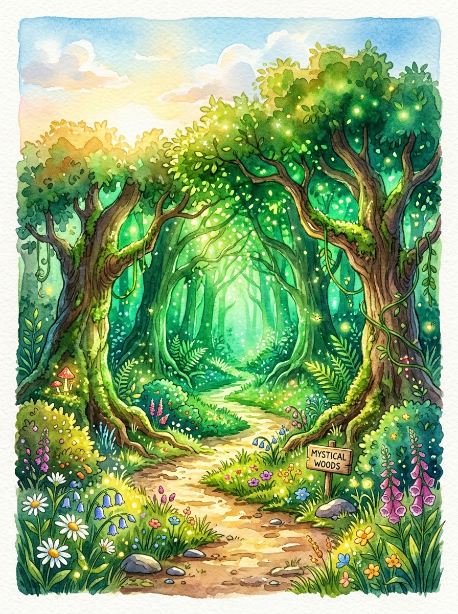
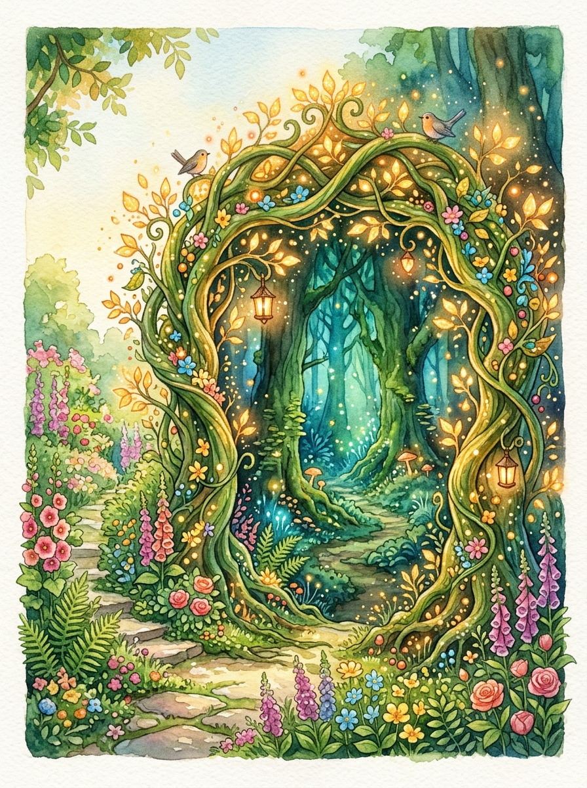
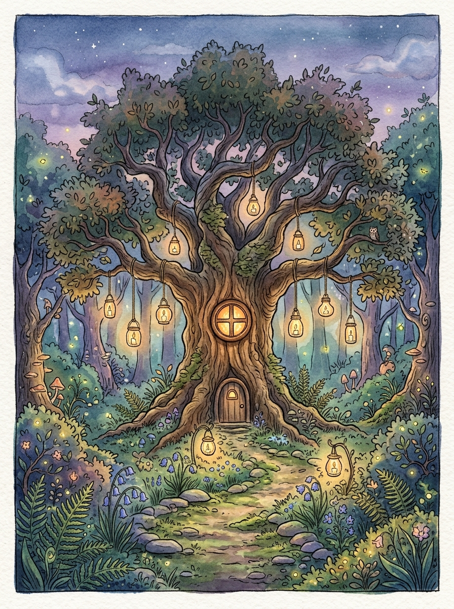
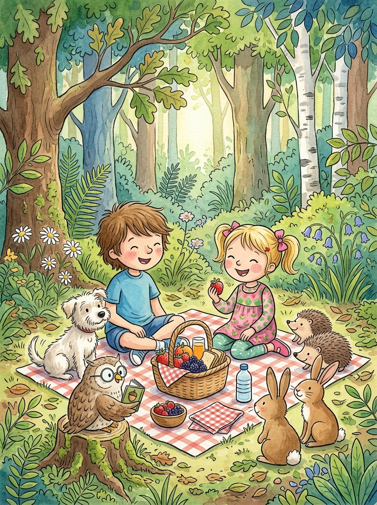
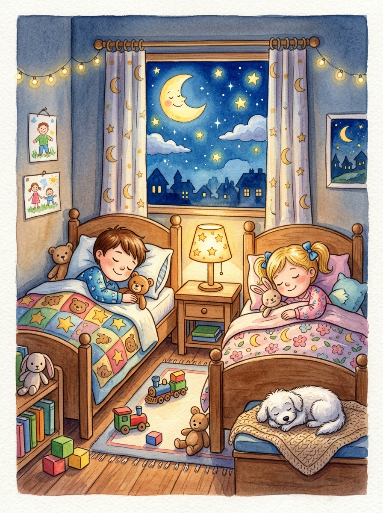

# Capítulo 1: Ficha Inicial y Presentación de los Personajes

---

## [PÁGINA 1: PORTADILLA DE PERTENENCIA]

# LAS AVENTURAS DE NICO Y LUNA

### **Este libro pertenece a:**

__________________________________________________

*¡Que tu viaje esté lleno de colores y fantasía!*

---

## [PÁGINA 2: PORTADA INTERIOR]

# LAS AVENTURAS DE NICO Y LUNA
## El Bosque Mágico

**Colección:** Las Aventuras de Nico y Luna — Libro 1  
**Escrito e Ilustrado por:** Julio Martín Rodríguez Sánchez  
**Para pequeños lectores y artistas de 4 a 8 años**

---

## [PÁGINA 3: DERECHOS DE AUTOR Y NOTA EDITORIAL]

**Las Aventuras de Nico y Luna: El Bosque Mágico**  
© 2026 Julio Martín Rodríguez Sánchez. Todos los derechos reservados.

Queda prohibida la reproducción total o parcial de esta obra por cualquier medio sin la autorización escrita del titular de los derechos de autor.

**Nota para los padres y educadores:**  
Este libro ha sido diseñado para estimular la imaginación, la creatividad y la lectura temprana en niños de 4 a 8 años. Cada capítulo de lectura a color se separa por portadillas ilustradas y las escenas se presentan con texto en la página izquierda e ilustraciones a página completa en la derecha.

---

## [PÁGINA 4: ¡CONOCE A LOS PROTAGONISTAS!]

### ¡Hola, amiguito!

Nosotros somos los protagonistas de este libro y estamos muy felices de conocerte:

- **Nico**: Tiene 6 años, le encanta explorar la naturaleza y siempre lleva su mochila azul llena de curiosidad.
- **Luna**: Tiene 5 años, le fascinan los animales y las flores, y siempre tiene una gran sonrisa para todos.
- **Copito**: Nuestro perrito travieso, blanco y esponjoso como una nube.

Hoy descubriremos un secreto muy especial... ¡Un bosque donde ocurren cosas increíbles!

> **Instrucción de Coloreado:**  
> Colorea a Nico con su camiseta preferida, dale color al vestido de Luna y ponle un lazo brillante a Copito.

---

## [PÁGINA 5: ILUSTRACIÓN DE BIENVENIDA]

# Capítulo 2: El Camino al Bosque Mágico

---

## [PÁGINA 6: PORTADILLA CAPÍTULO - EL CAMINO AL BOSQUE MÁGICO]

---

## [PÁGINA 7: ESCENA 1 - EL MAPA MISTERIOSO]

Un sol brillante ilumina el jardín de Nico y Luna.  
Copito rasca la tierra cerca del gran rosal y encuentra una pista sorprendente.  
¡Es un pequeño mapa dibujado sobre una hoja dorada!

> **Texto de Lectura:**  
> —¡Mirad! —exclama Nico—. ¡Es el mapa de un lugar secreto!

---

## [PÁGINA 8: ILUSTRACIÓN ESCENA 1]

---

## [PÁGINA 9: ESCENA 2 - EL ARCO DE RAMAS VERDES]

Siguiendo el mapa, los three amigos llegan al final del jardín.  
Allí descubren un arco mágico formado por ramas entrelazadas y hojas brillantes.  
Al cruzarlo, el aire huele a pino verde y fresas silvestres.

> **Texto de Lectura:**  
> —¡Bienvenid@s al Bosque Mágico! —susurra Luna con alegría.

---

## [PÁGINA 10: ILUSTRACIÓN ESCENA 2]

---

## [PÁGINA 11: ESCENA 3 - LAS SETAS GIGANTES DE LUNARES]

A los pocos pasos, encuentran setas gigantes más altas que Nico.  
Sus sombreros tienen lunares grandes y divertidos.  
Una simpática mariquita saluda desde lo alto de una seta.

> **Texto de Lectura:**  
> —¡Estas setas parecen paraguas mágicos! —dice Nico riendo.

---

## [PÁGINA 12: ILUSTRACIÓN ESCENA 3]

---

## [PÁGINA 13: ESCENA 4 - LAS MARIPOSAS DANZARINAS]

Un enjambre de mariposas de alas grandes baila suavemente en el aire.  
Revolotean alrededor de Nico y Luna creando espirales de luz.  
Copito intenta dar pequeños saltitos para saludarlas con el hocico.

> **Texto de Lectura:**  
> Las mariposas les dan la bienvenida con un divertido baile volador.

---

## [PÁGINA 14: ILUSTRACIÓN ESCENA 4]

---

## [PÁGINA 15: ESCENA 5 - LAS ARDILLAS MALABARISTAS]

Arriba en el tronco de un pino, dos pequeñas ardillas hacen piruetas.  
Llevan sombreritos de hojas y hacen malabares con tres grandes bellotas.  
¡Todo en este bosque es alegre y sorprendente!

> **Texto de Lectura:**  
> —¡Qué habilidad tienen estas ardillas! —aplaude Luna entusiasmada.

---

## [PÁGINA 16: ILUSTRACIÓN ESCENA 5]

# Capítulo 3: El Búho Sabio y el Pequeño Erizo

---

## [PÁGINA 17: PORTADILLA CAPÍTULO - EL BÚHO SABIO Y EL PEQUEÑO ERIZO]

---

## [PÁGINA 18: ESCENA 6 - EL GRAN ROBLE CENTENARIO]

Los niños caminan hasta llegar al centro del Bosque Mágico.  
Allí se alza un roble majestuoso con una ventana circular tallada en el tronco.  
Farolillos de cristal cuelgan de las ramas iluminando el camino.

> **Texto de Lectura:**  
> El árbol más antiguo del bosque custodia los secretos más hermosos.

---

## [PÁGINA 19: ILUSTRACIÓN ESCENA 6]

---

## [PÁGINA 20: ESCENA 7 - EL BÚHO SABIO CON GAFAS]

Desde la ventana del roble se asoma un viejo búho de plumas suaves.  
Llevan puestas unas enormes gafas redondas y un librito bajo la ala.  
Es el Búho Sabio, el guardián del conocimiento del bosque.

> **Texto de Lectura:**  
> —¡Hola, jóvenes exploradores! —dice el Búho Sabio ajustándose las gafas.

---

## [PÁGINA 21: ILUSTRACIÓN ESCENA 7]

---

## [PÁGINA 22: ESCENA 8 - EL CONSEJO DEL BÚHO SABIO]

El Búho Sabio les explica que el bosque premia a quienes tienen buen corazón.  
—Si ayudáis a los habitantes del bosque, la magia os acompañará siempre —les aconseja.  
Nico y Luna asienten con entusiasmo y prometen estar siempre listos para ayudar.

> **Texto de Lectura:**  
> —La mejor magia es la bondad y la amistad —enseña el Búho Sabio.

---

## [PÁGINA 23: ILUSTRACIÓN ESCENA 8]

---

## [PÁGINA 24: ESCENA 9 - EL PEQUEÑO ERIZO EN APUROS]

Al alejarse del gran roble, escuchan un suave sollozo bajo unas hojas secas.  
Al retirar el follaje, descubren a un pequeño erizito de púas suaves.  
Tiene una lágrima en su mejilla porque no encuentra el camino de regreso a su casita.

> **Texto de Lectura:**  
> —¡Ayuda, por favor! Me he despistado buscando moras dulces —pide el erizo.

---

## [PÁGINA 25: ILUSTRACIÓN ESCENA 9]

---

## [PÁGINA 26: ESCENA 10 - LA PROMESA DE NICO Y LUNA]

Luna se agacha con ternura y le acaricia el hociquito al erizito.  
—No llores, pequeño amigo. ¡Nico y yo te acompañaremos hasta tu casa!  
El erizo se alegra tanto que da un salto y sonríe de oreja a oreja.

> **Texto de Lectura:**  
> —¡Con el mapa y nuestro trabajo en equipo, lo lograremos! —promete Nico.

---

## [PÁGINA 27: ILUSTRACIÓN ESCENA 10]

# Capítulo 4: El Prado Encantado y la Casita de Troncos

---

## [PÁGINA 28: PORTADILLA CAPÍTULO - EL PRADO ENCANTADO Y LA CASITA DE TRONCOS]

---

## [PÁGINA 29: ESCENA 11 - EL ARROYO DE PIEDRAS SONRIENTES]

Para cruzar hacia el prado donde vive el erizo, deben atravesar un pequeño arroyo.  
En el agua clara hay piedras redondas alineadas como escalones.  
¡Cada piedra tiene labrada una carita sonriente!

> **Texto de Lectura:**  
> Nico, Luna y Copito cruzan saltando de piedra en piedra con cuidado.

---

## [PÁGINA 30: ILUSTRACIÓN ESCENA 11]

---

## [PÁGINA 31: ESCENA 12 - LAS FLORES GIGANTES CANTANTES]

Al otro lado del arroyo se despliega un prado repleto de flores gigantes.  
Sus pétalos suaves se mueven con la brisa emitiendo notas musicales ricas y dulces.  
Es el prado cantarín del Bosque Mágico.

> **Texto de Lectura:**  
> Las flores gigantes cantan melodías que llenan el aire de alegría.

---

## [PÁGINA 32: ILUSTRACIÓN ESCENA 12]

---

## [PÁGINA 33: ESCENA 13 - COPITO Y LOS PÉTALOS MÁGICOS]

Copito no puede contener el entusiasmo y corre persiguiendo pétalos coloridos que vuelan.  
Da vueltas divertidas sobre la hierba fresca.  
Todos se ríen al ver las travesuras del pequeño perrito blanco.

> **Texto de Lectura:**  
> ¡Copito atrapa un pétalo volador justo en el aire!

---

## [PÁGINA 34: ILUSTRACIÓN ESCENA 13]

---

## [PÁGINA 35: ESCENA 14 - LOS CONEJITOS GUÍAS]

Tres simpáticos conejitos de largas orejas salen al paso desde un matorral.  
Al ver al pequeño erizito, mueven los bigotes con alegría y señalan hacia la colina.  
—¡La casita de troncos está justo detrás de aquel gran pino! —avisan los conejos.

> **Texto de Lectura:**  
> —¡Gracias, amables conejitos! —dicen los niños al unísono.

---

## [PÁGINA 36: ILUSTRACIÓN ESCENA 14]

---

## [PÁGINA 37: ESCENA 15 - LA CASITA DE TRONCOS Y MUSGO]

Al subir la colina, contemplan una acogedora casita hecha de tronquitos redondos.  
Tiene un tejado cubierto de suave musgo verde y un chimenea de piedras pequeñas de la que sale humo en forma de corazones.  
¡Es la hermosa casita del erizo!

> **Texto de Lectura:**  
> —¡Hemos llegado a mi hogar! —exclama el erizito saltando de júbilo.

---

## [PÁGINA 38: ILUSTRACIÓN ESCENA 15]

# Capítulo 5: El Banquete del Bosque y el Regreso a Casa

---

## [PÁGINA 39: PORTADILLA CAPÍTULO - EL BANQUETE Y EL REGRESO A CASA]

---

## [PÁGINA 40: ESCENA 16 - EL ABRAZO DE AGRADECIMIENTO]

Mamá Erizo sale corriendo por la puerta y abraza muy fuerte a su pequeño.  
Luego mira a Nico y Luna con una sonrisa llena de gratitud.  
—Gracias por cuidar de mi hijito y guiarlo con tanto cariño —les dice dulcemente.

> **Texto de Lectura:**  
> La amabilidad siempre llena el corazón de calor y felicidad.

---

## [PÁGINA 41: ILUSTRACIÓN ESCENA 16]

---

## [PÁGINA 42: ESCENA 17 - EL GRAN PICNIC DE FRUTAS]

Para agradecerles, los animales del bosque preparan un banquete al aire libre.  
Servidas sobre hojas grandes hay moras jugosas, fresas rojas y manzanas crujientes.  
El Búho Sabio, los conejitos, las ardillas y los erizos comparten la merienda.

> **Texto de Lectura:**  
> ¡Qué merienda tan deliciosa compartida entre verdaderos amigos!

---

## [PÁGINA 43: ILUSTRACIÓN ESCENA 17]

---

## [PÁGINA 44: ESCENA 18 - EL ATARDECER DORADO]

El sol empieza a ponerse tiñendo las nubes de tonos dorados y violetas.  
Una brisa tibia acaricia las hojas de los árboles cantando un arrullo suave.  
Es momento de volver a casa antes de que salgan las primeras estrellas.

> **Texto de Lectura:**  
> El bosque se despide con un cielo brillante lleno de magia.

---

## [PÁGINA 45: ILUSTRACIÓN ESCENA 18]

---

## [PÁGINA 46: ESCENA 19 - LA DESPEDIDA DE LOS AMIGOS]

Al llegar de nuevo al arco de ramas mágicas, todos los animales agitan sus patas.  
—¡Volved pronto a visitarnos! —gritan en coro las ardillas y el Búho Sabio.  
Nico y Luna les prometen regresar muy pronto para vivir nuevas aventuras.

> **Texto de Lectura:**  
> —¡Hasta muy pronto, amigos del Bosque Mágico! —se despiden alegremente.

---

## [PÁGINA 47: ILUSTRACIÓN ESCENA 19]

---

## [PÁGINA 48: ESCENA 20 - DORMIR Y SOÑAR]

De vuelta en su hogar, Nico y Luna guardan la hoja dorada en su libro de tesoros.  
Se acurrucan en sus camas escuchando el susurro del viento exterior.  
Saben que el mundo está lleno de lugares mágicos por descubrir.

> **Texto de Lectura:**  
> Buenas noches, Nico. Buenas noches, Luna. ¡Mañana habrá un nuevo viaje!

---

## [PÁGINA 49: ILUSTRACIÓN ESCENA 20]

# Capítulo 6: Actividades y Juegos del Bosque Mágico

---

## [PÁGINA 50: PORTADILLA CAPÍTULO - ACTIVIDADES Y JUEGOS EN EL BOSQUE]

---

## [PÁGINA 51: ACTIVIDAD 1 - EL LABERINTO DEL BOSQUE]

### 🧩 ¡Ayuda a Nico y Luna a llegar a la Casita del Erizo!

Recorre con tu lápiz el camino correcto evitando los caminos sin salida.

---

## [PÁGINA 52: ACTIVIDAD 2 - BUSCA LAS 5 DIFERENCIAS]

### 🔍 ¡Encuentra las 5 diferencias!

Observa las dos escenas del pequeño erizo comiendo moras. ¿Puedes encontrar los 5 detalles cambiados en el dibujo de la derecha?

- [ ] 1. La mora sobre la cabeza del erizo.
- [ ] 2. La mariquita en la hoja.
- [ ] 3. La flor adicional cerca del pie.
- [ ] 4. La forma del sombrero de la seta.
- [ ] 5. La manzana en la cesta.

---

## [PÁGINA 53: ACTIVIDAD 3 - CONECTA LOS PUNTOS]

### ✏️ ¡Une los puntos del 1 al 20!

Descubre qué simpático amigo del bosque se esconde aquí.  
Une los números en orden y luego... ¡coloréalo como más te guste!

`1 - 2 - 3 - 4 - 5 - 6 - 7 - 8 - 9 - 10 - 11 - 12 - 13 - 14 - 15 - 16 - 17 - 18 - 19 - 20`

---

## [PÁGINA 54: ACTIVIDAD 4 - DIBUJO Y CREATIVIDAD LIBRE]

### 🎨 ¡Diseña tu propia Criatura Mágica del Bosque!

En este espacio en blanco, utiliza tu imaginación para dibujar un animal o flor mágica que te gustaría encontrar en el Bosque Mágico.

**¿Cómo se llama tu criatura?**: ______________________________________  
**¿Qué poder mágico tiene?**: ________________________________________

# Capítulo 7: Próxima Aventura, Probador de Color y Soluciones

---

## [PÁGINA 55: PORTADILLA CAPÍTULO - SOLUCIONES Y AVANCE DEL SIGUIENTE LIBRO]

---

## [PÁGINA 56: AVANCE DEL SIGUIENTE LIBRO DE LA COLECCIÓN]

### 🚀 ¡Próxima Aventura!

### LAS AVENTURAS DE NICO Y LUNA — LIBRO 2
## Viaje al Espacio

Nico, Luna y Copito construyen un cohete de cartón en su jardín y... ¡despegan hacia las estrellas!  
Conocerán planetas sonrientes, robots simpáticos y a un alegre alienígena que adora el helado de fresa.

> **¡Consigue el Libro 2 de la colección en Amazon KDP!**

---

## [PÁGINA 57: PROBADOR DE COLORES - LÁPICES]

### 🖍️ Probador de Lápices de Colores y Ceras

Utiliza esta página para probar la textura e intensidad de tus lápices de colores o ceras antes de pintar las páginas del libro.

- **Prueba de intensidad de lápiz:**  
  [ Rellena este círculo con color suave ]  
  [ Rellena este círculo con color fuerte ]

---

## [PÁGINA 58: PROBADOR DE COLORES - ROTULADORES]

### 🎨 Probador de Rotuladores y Acuarelas

Utiliza este espacio en blanco para probar la intensidad de tus rotuladores mágicos y asegurarte de que el color no traspase al otro lado de la hoja.

---

## [PÁGINA 59: SOLUCIONARIO DE ACTIVIDADES]

### 💡 Soluciones de los Juegos

- **Página 51 (Laberinto):** El camino correcto gira a la derecha tras el rosal, pasa por la izquierda de la seta gigante y cruza recto el puente de madera hasta la casita.
- **Página 52 (Diferencias):** 1. La mora sobre la cabeza; 2. La mariquita en la hoja; 3. La flor junto al pie; 4. Los lunares de la seta; 5. La manzana en la cesta.
- **Página 53 (Conecta Puntos):** ¡Es el entrañable Búho Sabio!

---

## [PÁGINA 60: ¡GRACIAS EXPLORADOR!]

¡Gracias por leer y colorear con nosotros!  
Si te ha gustado esta historia, déjanos una opinión en Amazon. ¡Nos ayuda muchísimo a crear más libros mágicos!
