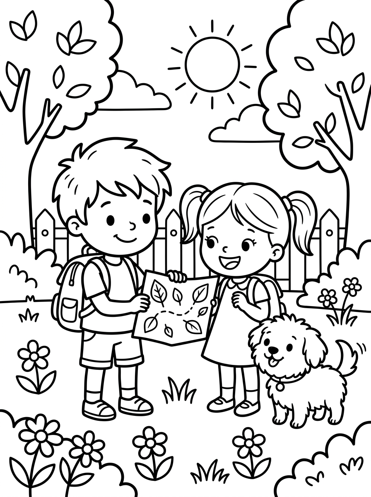
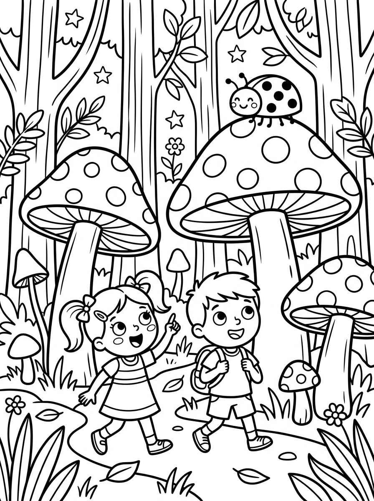

# Capítulo 1: Ficha Inicial y Presentación de los Personajes

---

## [PÁGINA 1: PORTADA INTERIOR]

# LAS AVENTURAS DE NICO Y LUNA
## El Bosque Mágico

**Colección:** Las Aventuras de Nico y Luna — Libro 1  
**Escrito e Ilustrado por:** Equipo Editorial bookIA  
**Para pequeños lectores y artistas de 4 a 8 años**

---

## [PÁGINA 2: DERECHOS DE AUTOR Y NOTA EDITORIAL]

**Las Aventuras de Nico y Luna: El Bosque Mágico**  
© 2026 Nico & Luna Publishing / KDP Edition. Todos los derechos reservados.

Queda prohibida la reproducción total o parcial de esta obra por cualquier medio sin la autorización escrita del titular de los derechos de autor.

**Nota para los padres y educadores:**  
Este libro ha sido diseñado para estimular la imaginación, la creatividad y la lectura temprana en niños de 4 a 8 años. Cada página combina frases de lectura ágil con ilustraciones listas para colorear.

*¡Prepara tus lápices de colores y acompaña a Nico y Luna en esta aventura mágica!*

---

## [PÁGINA 3: ¡CONOCE A LOS PROTAGONISTAS!]

### ¡Hola, amiguito!

Nosotros somos los protagonistas de este libro y estamos muy felices de conocerte:

- **Nico**: Tiene 6 años, le encanta explorar la naturaleza y siempre lleva su mochila azul llena de curiosidad.
- **Luna**: Tiene 5 años, le fascinan los animales y las flores, y siempre tiene una gran sonrisa para todos.
- **Copito**: Nuestro perrito travieso, blanco y esponjoso como una nube.

Hoy descubriremos un secreto muy especial... ¡Un bosque donde ocurren cosas increíbles!

> **Instrucción de Coloreado:**  
> Colorea a Nico con su camiseta preferida, dale color al vestido de Luna y ponle un lazo brillante a Copito.

**[Descripción de la Ilustración para Colorear]:**  
Nico y Luna saludando sonrientes en el centro de la página con los brazos abiertos. El perrito Copito salta alegremente a su lado. Dibujo de contornos negros gruesos, formas simples y claras sin sombras ni rellenos.
# Capítulo 2: El Camino al Bosque Mágico

---

## [PÁGINA 4: ESCENA 1 - EL MAPA MISTERIOSO]

Un sol brillante ilumina el jardín de Nico y Luna.  
Copito rasca la tierra cerca del gran rosal y encuentra una pista sorprendente.  
¡Es un pequeño mapa dibujado sobre una hoja dorada!

> **Texto de Lectura:**  
> —¡Mirad! —exclama Nico—. ¡Es el mapa de un lugar secreto!

---

## [PÁGINA 5: ESCENA 2 - EL ARCO DE RAMAS VERDES]

Siguiendo el mapa, los tres amigos llegan al final del jardín.  
Allí descubren un arco mágico formado por ramas entrelazadas y hojas brillantes.  
Al cruzarlo, el aire huele a pino verde y fresas silvestres.

> **Texto de Lectura:**  
> —¡Bienvenid@s al Bosque Mágico! —susurra Luna con alegría.

---

## [PÁGINA 6: ESCENA 3 - LAS SETAS GIGANTES DE LUNARES]

A los pocos pasos, encuentran setas gigantes más altas que Nico.  
Sus sombreros tienen lunares grandes y divertidos.  
Una simpática mariquita saluda desde lo alto de una seta.

> **Texto de Lectura:**  
> —¡Estas setas parecen paraguas mágicos! —dice Nico riendo.

---

## [PÁGINA 7: ESCENA 4 - LAS MARIPOSAS DANCARINAS]

Un enjambre de mariposas de alas grandes baila suavemente en el aire.  
Revolotean alrededor de Nico y Luna creando espirales de luz.  
Copito intenta dar pequeños saltitos para saludarlas con el hocico.

> **Texto de Lectura:**  
> Las mariposas les dan la bienvenida con un divertido baile volador.

---

## [PÁGINA 8: ESCENA 5 - LAS ARDILLAS MALABARISTAS]

Arriba en el tronco de un pino, dos pequeñas ardillas hacen piruetas.  
Llevan sombreritos de hojas y hacen malabares con tres grandes bellotas.  
¡Todo en este bosque es alegre y sorprendente!

> **Texto de Lectura:**  
> —¡Qué habilidad tienen estas ardillas! —aplaude Luna entusiasmada.
# Capítulo 3: El Búho Sabio y el Pequeño Erizo

---

## [PÁGINA 9: ESCENA 6 - EL GRAN ROBLE CENTENARIO]

Los niños caminan hasta llegar al centro del Bosque Mágico.  
Allí se alza un roble majestuoso con una ventana circular tallada en el tronco.  
Farolillos de cristal cuelgan de las ramas iluminando el camino.

> **Texto de Lectura:**  
> El árbol más antiguo del bosque custodia los secretos más hermosos.

---

## [PÁGINA 10: ESCENA 7 - EL BÚHO SABIO CON GAFAS]

Desde la ventana del roble se asoma un viejo búho de plumas suaves.  
Lleva puestas unas enormes gafas redondas y un librito bajo la ala.  
Es el Búho Sabio, el guardián del conocimiento del bosque.

> **Texto de Lectura:**  
> —¡Hola, jóvenes exploradores! —dice el Búho Sabio ajustándose las gafas.

---

## [PÁGINA 11: ESCENA 8 - EL CONSEJO DEL BÚHO SABIO]

El Búho Sabio les explica que el bosque premia a quienes tienen buen corazón.  
—Si ayudáis a los habitantes del bosque, la magia os acompañará siempre —les aconseja.  
Nico y Luna asienten con entusiasmo y promueven estar siempre listos para ayudar.

> **Texto de Lectura:**  
> —La mejor magia es la bondad y la amistad —enseña el Búho Sabio.

---

## [PÁGINA 12: ESCENA 9 - EL PEQUEÑO ERIZO EN APUROS]

Al alejarse del gran roble, escuchan un suave sollozo bajo unas hojas secas.  
Al retirar el follaje, descubren a un pequeño erizito de púas suaves.  
Tiene una lágrima en su mejilla porque no encuentra el camino de regreso a su casita.

> **Texto de Lectura:**  
> —¡Ayuda, por favor! Me he despistado buscando moras dulces —pide el erizo.

---

## [PÁGINA 13: ESCENA 10 - LA PROMESA DE NICO Y LUNA]

Luna se agacha con ternura y le acaricia el hociquito al erizito.  
—No llores, pequeño amigo. ¡Nico y yo te acompañaremos hasta tu casa!  
El erizo se alegra tanto que da un salto y sonríe de oreja a oreja.

> **Texto de Lectura:**  
> —¡Con el mapa y nuestro trabajo en equipo, lo lograremos! —promete Nico.
# Capítulo 4: El Prado Encantado y la Casita de Troncos

---

## [PÁGINA 14: ESCENA 11 - EL ARROYO DE PIEDRAS SONRIENTES]

Para cruzar hacia el prado donde vive el erizo, deben atravesar un pequeño arroyo.  
En el agua clara hay piedras redondas alineadas como escalones.  
¡Cada piedra tiene labrada una carita sonriente!

> **Texto de Lectura:**  
> Nico, Luna y Copito cruzan saltando de piedra en piedra con cuidado.

---

## [PÁGINA 15: ESCENA 12 - LAS FLORES GIGANTES CANTANTES]

Al otro lado del arroyo se despliega un prado repleto de flores gigantes.  
Sus pétalos suaves se mueven con la brisa emitiendo notas musicales ricas y dulces.  
Es el prado cantarín del Bosque Mágico.

> **Texto de Lectura:**  
> Las flores gigantes cantan melodías que llenan el aire de alegría.

---

## [PÁGINA 16: ESCENA 13 - COPITO Y LOS PÉTALOS MÁGICOS]

Copito no puede contener el entusiasmo y corre persiguiendo pétalos coloridos que vuelan.  
Da vueltas divertidas sobre la hierba fresca.  
Todos se ríen al ver las travesuras del pequeño perrito blanco.

> **Texto de Lectura:**  
> ¡Copito atrapa un pétalo volador justo en el aire!

---

## [PÁGINA 17: ESCENA 14 - LOS CONEJITOS GUÍAS]

Tres simpáticos conejitos de largas orejas salen al paso desde un matorral.  
Al ver al pequeño erizito, mueven los bigotes con alegría y señalan hacia la colina.  
—¡La casita de troncos está justo detrás de aquel gran pino! —avisan los conejos.

> **Texto de Lectura:**  
> —¡Gracias, amables conejitos! —dicen los niños al unísono.

---

## [PÁGINA 18: ESCENA 15 - LA CASITA DE TRONCOS Y MUSGO]

Al subir la colina, contemplan una acogedora casita hecha de tronquitos redondos.  
Tiene un tejado cubierto de suave musgo verde y un chimenea de piedras pequeñas de la que sale humo en forma de corazones.  
¡Es la hermosa casita del erizo!

> **Texto de Lectura:**  
> —¡Hemos llegado a mi hogar! —exclama el erizito saltando de júbilo.

# Capítulo 5: El Banquete del Bosque y el Regreso a Casa

---

## [PÁGINA 19: ESCENA 16 - EL ABRAZO DE AGRADECIMIENTO]

Mamá Erizo sale corriendo por la puerta y abraza muy fuerte a su pequeño.  
Luego mira a Nico y Luna con una sonrisa llena de gratitud.  
—Gracias por cuidar de mi hijito y guiarlo con tanto cariño —les dice dulcemente.

> **Texto de Lectura:**  
> La amabilidad siempre llena el corazón de calor y felicidad.

**[Prompt de Ilustración para Colorear - Pág. 19]:**  
Mamá Erizo abrazando al pequeño erizo frente a su casita. Nico y Luna tomados de la mano mirando la tierna escena. Copito descansando contento en el césped. Dibujo dulce, expresivo y con trazos limpios.

---

## [PÁGINA 20: ESCENA 17 - EL GRAN PICNIC DE FRUTAS]

Para agradecerles, los animales del bosque preparan un banquete al aire libre.  
Servidas sobre hojas grandes hay moras jugosas, fresas rojas y manzanas crujientes.  
El Búho Sabio, los conejitos, las ardillas y los erizos comparten la merienda.

> **Texto de Lectura:**  
> ¡Qué merienda tan deliciosa compartida entre verdaderos amigos!

**[Prompt de Ilustración para Colorear - Pág. 20]:**  
Nico, Luna y todos los animales del bosque (búho, erizos, ardillas, conejos) sentados en círculo en un picnic con canastas y frutas variadas. Muchas formas sencillas para colorear.

---

## [PÁGINA 21: ESCENA 18 - EL ATARDECER DORADO]

El sol empieza a ponerse tiñendo las nubes de tonos dorados y violetas.  
Una brisa tibia acaricia las hojas de los árboles cantando un arrullo suave.  
Es momento de volver a casa antes de que salgan las primeras estrellas.

> **Texto de Lectura:**  
> El bosque se despide con un cielo brillante lleno de magia.

**[Prompt de Ilustración para Colorear - Pág. 21]:**  
Paisaje de colinas con árboles al atardecer, un gran sol ocultándose en el horizonte y nubes esponjosas con siluetas de pájaros volando hacia su nido. Nico y Luna caminando de regreso tomados de la mano.

---

## [PÁGINA 22: ESCENA 19 - LA DESPEDIDA DE LOS AMIGOS]

Al llegar de nuevo al arco de ramas mágicas, todos los animales agitán sus patas.  
—¡Volved pronto a visitarnos! —gritan en coro las ardillas y el Búho Sabio.  
Nico y Luna les prometen regresar muy pronto para vivir nuevas aventuras.

> **Texto de Lectura:**  
> —¡Hasta muy pronto, amigos del Bosque Mágico! —se despiden alegremente.

**[Prompt de Ilustración para Colorear - Pág. 22]:**  
Nico, Luna y Copito despidiéndose desde el arco mágico agitando las manos. Al fondo, las siluetas simpáticas del búho, los erizos y las ardillas saludando.

---

## [PÁGINA 23: ESCENA 20 - DORMIR Y SOÑAR]

De vuelta en su hogar, Nico y Luna guardan la hoja dorada en su libro de tesoros.  
Se acurrucan en sus camas escuchando el susurro del viento exterior.  
Saben que el mundo está lleno de lugares mágicos por descubrir.

> **Texto de Lectura:**  
> Buenas noches, Nico. Buenas noches, Luna. ¡Mañana habrá un nuevo viaje!

**[Prompt de Ilustración para Colorear - Pág. 23]:**  
Habitación infantil acogedora con dos camitas. Nico en una y Luna en otra arropados sonriendo mientras duermen. Copito dormido al pie de la cama. Estrellitas y una luna sonriente asomada por la ventana.
# Capítulo 6: Actividades y Juegos del Bosque Mágico

---

## [PÁGINA 24: ACTIVIDAD 1 - EL LABERINTO DEL BOSQUE]

### 🧩 ¡Ayuda a Nico y Luna a llegar a la Casita del Erizo!

Recorre con tu lápiz el camino correcto evitando los caminos sin salida.

**[Diseño Visual de la Ilustración / Actividad]:**  
Laberinto sencillo en forma de sendero forestal. Entrada con Nico y Luna arriba a la izquierda. Salida abajo a la derecha con la casita del erizo. Obstáculos bonitos (charco con ranita, setas gigantes, matorral de espinas) en los caminos incorrectos. Líneas gruesas y claras para niños de 4-8 años.

---

## [PÁGINA 25: ACTIVIDAD 2 - BUSCA LAS 5 DIFERENCIAS]

### 🔍 ¡Encuentra las 5 diferencias!

Observa las dos escenas del pequeño erizo comiendo moras. ¿Puedes encontrar los 5 detalles cambiados en el dibujo de la derecha?

- [ ] 1. La mora sobre la cabeza del erizo.
- [ ] 2. La mariquita en la hoja.
- [ ] 3. La flor adicional cerca del pie.
- [ ] 4. La forma del sombrero de la seta.
- [ ] 5. La manzana en la cesta.

**[Diseño Visual de la Ilustración / Actividad]:**  
Dos dibujos lineales idénticos lado a lado del erizito en el picnic, excepto por los 5 detalles modificados en el panel derecho. Ideal para pintar y desarrollar concentración.

---

## [PÁGINA 26: ACTIVIDAD 3 - CONECTA LOS PUNTOS]

### ✏️ ¡Une los puntos del 1 al 20!

Descubre qué simpático amigo del bosque se esconde aquí.  
Une los números en orden y luego... ¡coloréalo como más te guste!

`1 - 2 - 3 - 4 - 5 - 6 - 7 - 8 - 9 - 10 - 11 - 12 - 13 - 14 - 15 - 16 - 17 - 18 - 19 - 20`

**[Diseño Visual de la Ilustración / Actividad]:**  
Dibujo con la silueta exterior del Búho Sabio posado en una rama, donde la parte superior de las alas y la cabeza son puntos numerados del 1 al 20 fáciles de unir.

---

## [PÁGINA 27: ACTIVIDAD 4 - DIBUJO Y CREATIVIDAD LIBRE]

### 🎨 ¡Diseña tu propia Criatura Mágica del Bosque!

En este espacio en blanco, utiliza tu imaginación para dibujar un animal o flor mágica que te gustaría encontrar en el Bosque Mágico.

**¿Cómo se llama tu criatura?**: ______________________________________  
**¿Qué poder mágico tiene?**: ________________________________________

**[Diseño Visual de la Ilustración / Actividad]:**  
Marco decorativo bonito hecho de ramas, hojas y flores con un amplio espacio en blanco al centro para dibujar.
# Capítulo 7: Próxima Aventura, Probador de Color y Soluciones

---

## [PÁGINA 28: AVANCE DEL SIGUIENTE LIBRO DE LA COLECCIÓN]

### 🚀 ¡Próxima Aventura!

### LAS AVENTURAS DE NICO Y LUNA — LIBRO 2
## Viaje al Espacio

Nico, Luna y Copito construyen un cohete de cartón en su jardín y... ¡despegan hacia las estrellas!  
Conocerán planetas sonrientes, robots simpáticos y a un alegre alienígena que adora el helado de fresa.

> **¡Consigue el Libro 2 de la colección en Amazon KDP!**

**[Ilustración de Muestra para Colorear - Pág. 28]:**  
Nico y Luna vestidos con cascos de astronauta dentro de un cohete espacial sonriente despegando entre estrellas grandes y un planeta con anillos. Contornos gruesos para colorear.

---

## [PÁGINA 29: PROBADOR DE COLORES]

### 🖍️ Probador de Colores y Rotuladores

Utiliza esta página para probar tus lápices de colores, ceras o rotuladores antes de pintar las páginas del libro.

- **Prueba de intensidad de lápiz:**  
  [ Rellena este círculo con color suave ]  
  [ Rellena este círculo con color fuerte ]

- **Prueba de traspaso de rotulador:**  
  [ Espacio para probar tus colores preferidos ]

---

## [PÁGINA 30: SOLUCIONARIO DE ACTIVIDADES]

### 💡 Soluciones de los Juegos

- **Página 24 (Laberinto):** El camino correcto gira a la derecha tras el rosal, pasa por la izquierda de la seta gigante y cruza recto el puente de madera hasta la casita.
- **Página 25 (Diferencias):** 1. La mora sobre la cabeza; 2. La mariquita en la hoja; 3. La flor junto al pie; 4. Los lunares de la seta; 5. La manzana en la cesta.
- **Página 26 (Conecta Puntos):** ¡Es el entrañable Búho Sabio!

---

¡Gracias por leer y colorear con nosotros!  
Si te ha gustado esta historia, déjanos una opinión en Amazon. ¡Nos ayuda muchísimo a crear más libros mágicos!
