# Capítulo 1: Ficha Inicial y Presentación de la Aventura Espacial

---

## [PÁGINA 1: PORTADILLA DE PERTENENCIA]

# LAS AVENTURAS DE NICO Y LUNA

### **Este libro pertenece a:**

__________________________________________________

*¡Que tu viaje esté lleno de colores y fantasía!*

---

## [PÁGINA 2: PORTADA INTERIOR]

# LAS AVENTURAS DE NICO Y LUNA
## Viaje al Espacio

**Colección:** Las Aventuras de Nico y Luna — Libro 2  
**Escrito e Ilustrado por:** Julio Martín Rodríguez Sánchez  
**Para pequeños lectores y artistas de 4 a 8 años**

---

## [PÁGINA 3: DERECHOS DE AUTOR Y NOTA EDITORIAL]

**Las Aventuras de Nico y Luna: Viaje al Espacio**  
© 2026 Julio Martín Rodríguez Sánchez. Todos los derechos reservados.

Queda prohibida la reproducción total o parcial de esta obra por cualquier medio sin la autorización escrita del titular de los derechos de autor.

**Nota para los padres y educadores:**  
Este libro ha sido diseñado para estimular la imaginación, la creatividad y la lectura temprana en niños de 4 a 8 años. Cada capítulo de lectura a color se separa por portadillas ilustradas y las escenas se presentan con texto en la página izquierda e ilustraciones a página completa en la derecha.

---

## [PÁGINA 4: ¡PREPARADOS PARA EL DESPEGUE!]

### ¡Hola de nuevo, explorador!

Nico, Luna y Copito están de vuelta con una nueva aventura fascinante:

- **Nico**: Ha construido un cohete espacial con una caja de cartón gigante, pegatinas brillantes y un timón de madera.
- **Luna**: Lleva puesto su casco de astronauta hecho de papel plateado y su mochila con provisiones.
- **Copito**: Lleva una preciosa escafandra transparente para perritos exploradores.

¡Hoy viajaremos más allá de las nubes a descubrir los secretos del universo!

> **Instrucción de Coloreado:**  
> Pinta el cohete con tus colores preferidos, dale brillo a las estrellas y ponle un traje galáctico a Copito.

---

## [PÁGINA 5: ILUSTRACIÓN DE BIENVENIDA]

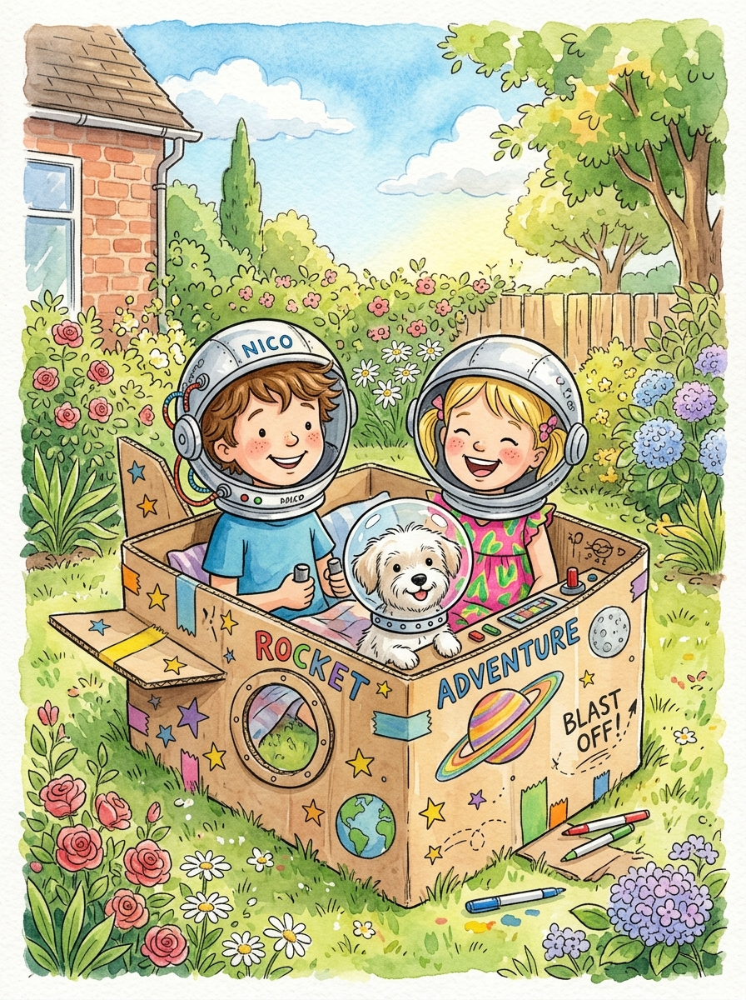

# Capítulo 2: El Despegue Mágico y el Universo Infinito

---

## [PÁGINA 6: PORTADILLA CAPÍTULO - EL DESPEGUE MÁGICO Y EL UNIVERSO INFINITO]

---

## [PÁGINA 7: ESCENA 1 - CONSTRUYENDO EL COHETE]

En una tarde soleada, Nico y Luna transforman una gran caja de cartón en un flamante cohete.  
Le dibujan botones de colores, una gran ventana redonda y alas para volar alto.  
Copito mueve la cola ansioso por subir a bordo.

> **Texto de Lectura:**  
> —¡Con imaginación y trabajo en equipo, todo es posible! —exclama Nico.

---

## [PÁGINA 8: ILUSTRACIÓN ESCENA 1]

---

## [PÁGINA 9: ESCENA 2 - ¡DESPEGUE HACIA LAS ESTRELLAS!]

De repente, una chispa de magia hace que el cohete comience a flotar suavemente.  
Cinco, cuatro, tres, dos, uno... ¡DESPEGUE!  
El cohete atraviesa las nubes esponjosas elevándose hacia el brillante cielo nocturno.

> **Texto de Lectura:**  
> —¡Mirad, el jardín se ve pequeñito desde arriba! —grita Luna emocionada.

---

## [PÁGINA 10: ILUSTRACIÓN ESCENA 2]

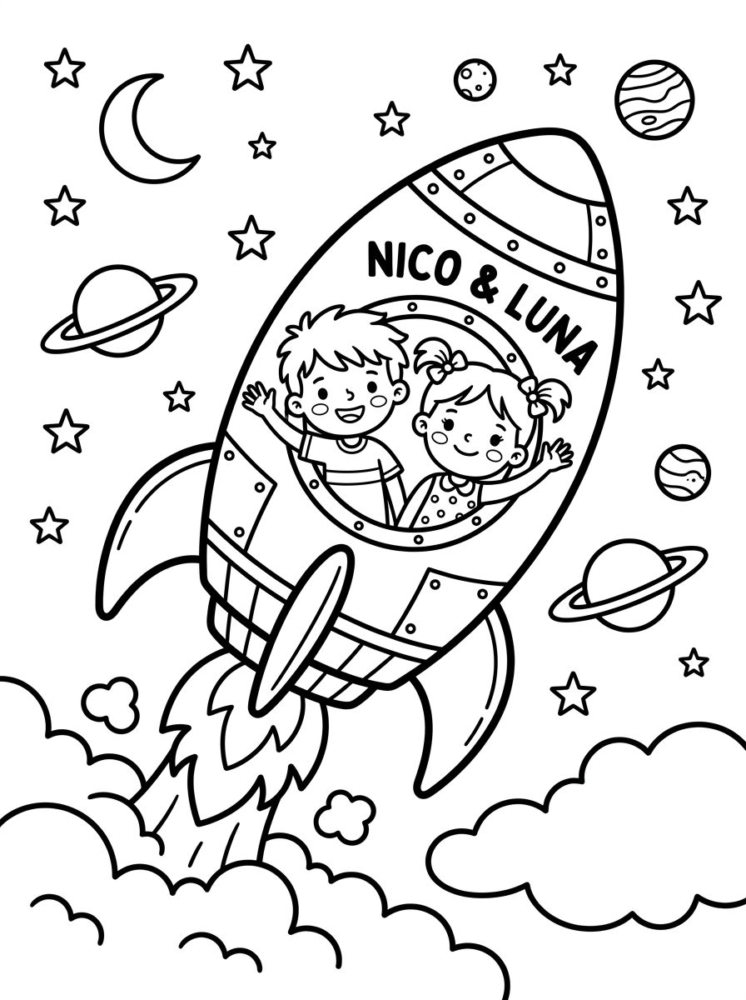

---

## [PÁGINA 11: ESCENA 3 - FLOTANDO EN INGRAVIDEZ]

Al salir de la atmósfera, de repente sus pies se separan del suelo de la cabina.  
¡Están flotando en ingravidez! Nico da volteretas en el aire mientras Luna ríe.  
Copito flota feliz persiguiendo una galleta canina que vuela suavemente.

> **Texto de Lectura:**  
> En el espacio sin gravedad, ¡volar es tan fácil como soñar!

---

## [PÁGINA 12: ILUSTRACIÓN ESCENA 3]

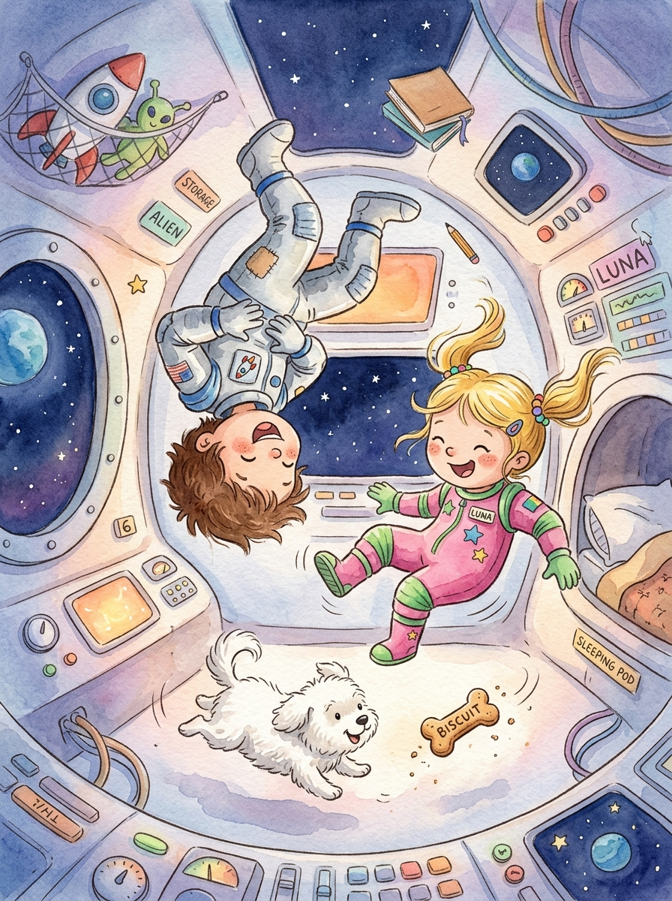

---

## [PÁGINA 13: ESCENA 4 - SALUDANDO A LA LUNA SONRIENTE]

El cohete se aproxima a una enorme Luna plateada que sonríe amablemente.  
Sus cráteres parecen hoyuelos felices y saluda a los niños guiñándoles un ojo.  
Los tres viajeros agitan sus manos desde la ventana de su nave.

> **Texto de Lectura:**  
> —¡Buenas noches, señora Luna! —saludan Nico, Luna y Copito.

---

## [PÁGINA 14: ILUSTRACIÓN ESCENA 4]

---

## [PÁGINA 15: ESCENA 5 - SATURNO Y SUS ANILLOS BRILLANTES]

Más adelante divisan al majestuoso planeta Saturno rodeado de gigantescos anillos de luz.  
Los anillos parecen una gran pista de carreras de colores flotantes.  
Un pequeño cometa pasa veloz dejando una cauda brillante de polvo de estrellas.

> **Texto de Lectura:**  
> El universo guarda los colores más espectaculares del mundo.

---

## [PÁGINA 16: ILUSTRACIÓN ESCENA 5]

# Capítulo 3: El Robot Tuerca y el Pequeño Alienígena

---

## [PÁGINA 17: PORTADILLA CAPÍTULO - EL ROBOT TUERCA Y EL PEQUEÑO ALIENÍGENA]

---

## [PÁGINA 18: ESCENA 6 - EL SIMPÁTICO ROBOT TUERCA]

Junto a una estación espacial flotante, una pequeña nave dorada les abre paso.  
De ella se asoma un simpático robot metálico con ojos redondos y antenas parabólicas.  
Es el Robot Tuerca, el mecánico espacial más alegre de la galaxia.

> **Texto de Lectura:**  
> —¡Bip, bop! ¡Bienvenidos a la estación de las estrellas! —saluda el Robot Tuerca.

---

## [PÁGINA 19: ILUSTRACIÓN ESCENA 6]

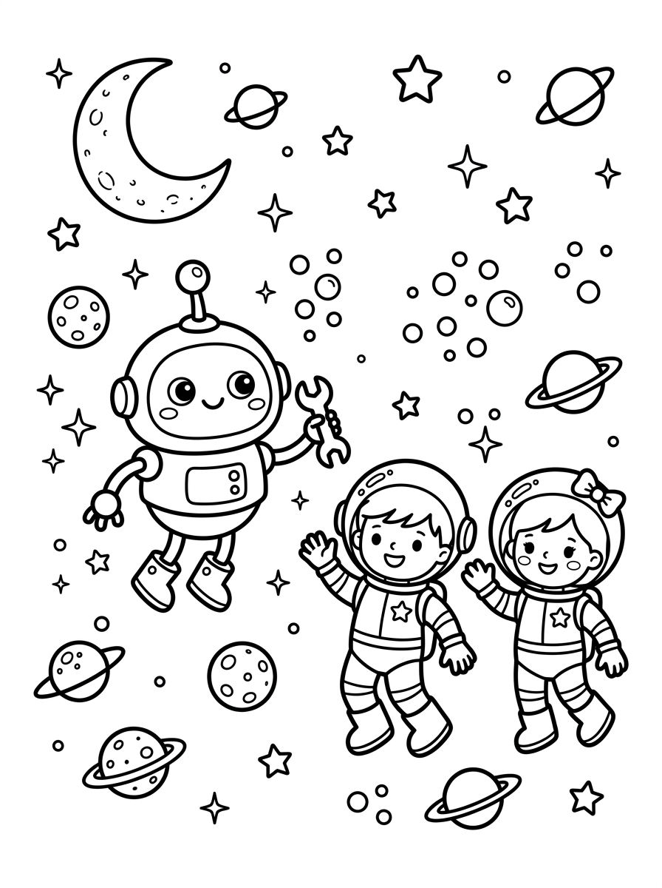

---

## [PÁGINA 20: ESCENA 7 - EL MOTOR DE BURBUJAS]

El Robot Tuerca les enseña cómo funciona su nave espacial.  
Su motor no usa combustible ruidoso, ¡sino burbujas cósmicas de jabón multicolor!  
Nico le ayuda a apretar una tuerca dorada con su llave inglesa de juguete.

> **Texto de Lectura:**  
> La energía limpia y divertida mantiene limpia toda la galaxia.

---

## [PÁGINA 21: ILUSTRACIÓN ESCENA 7]

---

## [PÁGINA 22: ESCENA 8 - EL PLANETA DE LOS HELADOS FLOTANTES]

Guiados por el Robot Tuerca, llegan a un planeta muy especial habitado por diminutas nubes de colores.  
En este lugar, las colinas están hechas de vainilla y hay ríos de chocolate suave.  
¡Es el planeta de los postres espaciales!

> **Texto de Lectura:**  
> —¡Este lugar parece un sueño delicioso! —dice Luna riendo.

---

## [PÁGINA 23: ILUSTRACIÓN ESCENA 8]

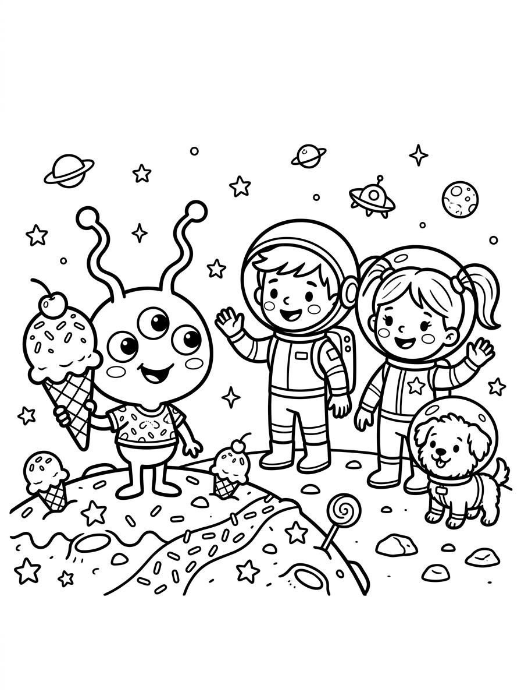

---

## [PÁGINA 24: ESCENA 9 - EL PEQUEÑO ALIENÍGENA BIP-BIP]

Detrás de una colina de fresa sale a saludar un pequeño alienígena de tres ojos tiernos y largas orejas.  
Se llama Bip-Bip y lleva un gran cucurucho de helado en la mano.  
Al ver a Copito, el perrito, Bip-Bip mueve sus antenas con una gran sonrisa.

> **Texto de Lectura:**  
> —¡Hola, nuevos amigos de la Tierra! —dice Bip-Bip con su voz melodiosa.

---

## [PÁGINA 25: ILUSTRACIÓN ESCENA 9]

---

## [PÁGINA 26: ESCENA 10 - EL PICNIC CÓSMICO DE FRESA]

Nico, Luna, Copito, el Robot Tuerca y Bip-Bip se sientan juntos a compartir un picnic.  
Prueban helados mágicos que nunca se derriten y galletas con forma de estrella.  
Bip-Bip comparte con felicidad y todos disfrutan del banquete intergaláctico.

> **Texto de Lectura:**  
> Compartir tus dulces preferidos duplica la alegría de la amistad.

---

## [PÁGINA 27: ILUSTRACIÓN ESCENA 10]

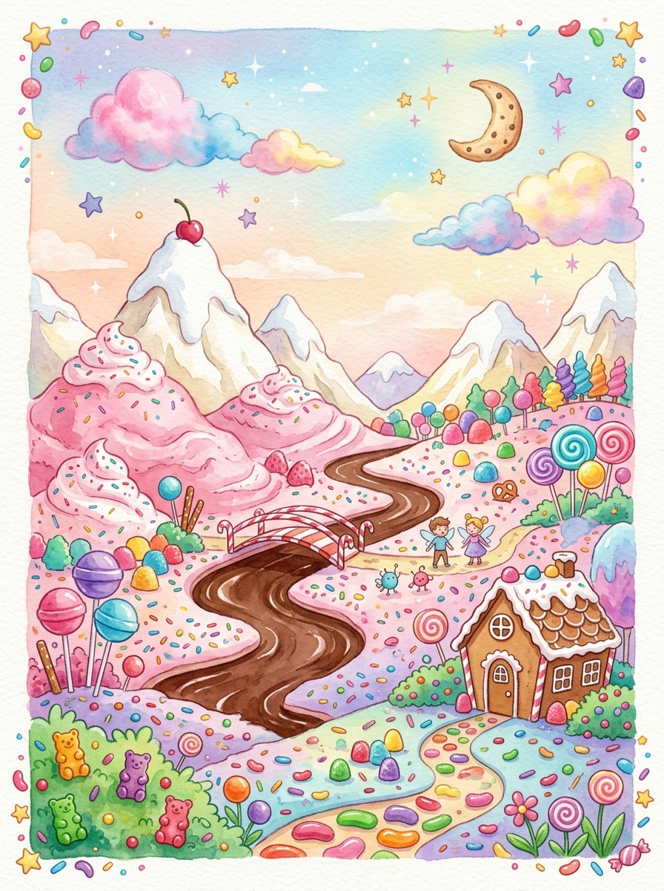

# Capítulo 4: Las Estrellas Fugaces y el Camino de Regreso

---

## [PÁGINA 28: PORTADILLA CAPÍTULO - LAS ESTRELLAS FUGACES Y EL CAMINO DE REGRESO]

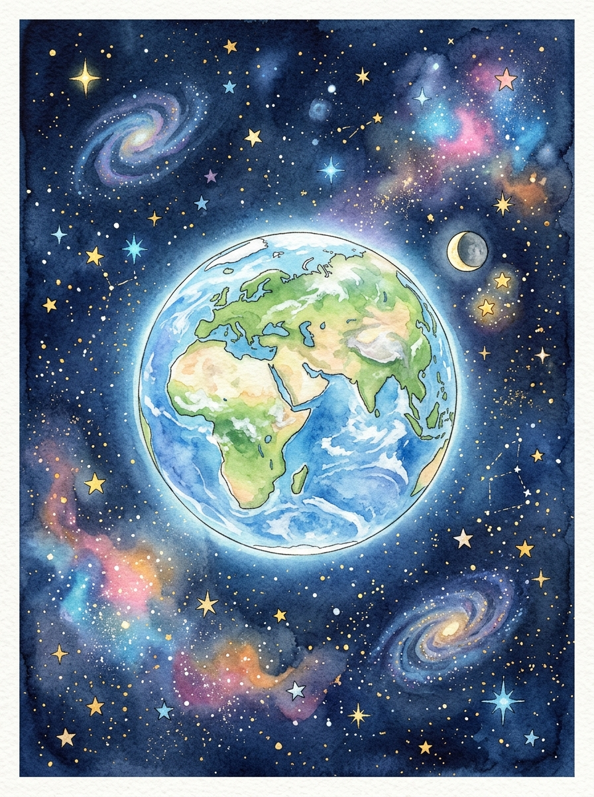

---

## [PÁGINA 29: ESCENA 11 - BAILANDO CON LAS ESTRELLAS]

Al finalizar el picnic, pequeñas estrellas fugaces se acercan a jugar.  
Revolotean en círculos como luciérnagas de luz plateada.  
Luna extiende las manos y una pequeña estrellita se posa suavemente en su palma.

> **Texto de Lectura:**  
> Las estrellas cantan bajito una canción de cuna espacial.

---

## [PÁGINA 30: ILUSTRACIÓN ESCENA 11]

---

## [PÁGINA 31: ESCENA 12 - EL CINTURÓN DE ASTEROIDES SONRIENTES]

Para iniciar la ruta hacia la Tierra, deben cruzar un cinturón de asteroides muy simpáticos.  
Las rocas espaciales no son duras ni peligrosas, ¡parecen grandes esponjas suaves con caras felices!  
El cohete esquiva suavemente a los asteroides mientras estos les dicen adiós con la patita.

> **Texto de Lectura:**  
> En el espacio de Nico y Luna, hasta las rocas son amigables.

---

## [PÁGINA 32: ILUSTRACIÓN ESCENA 12]

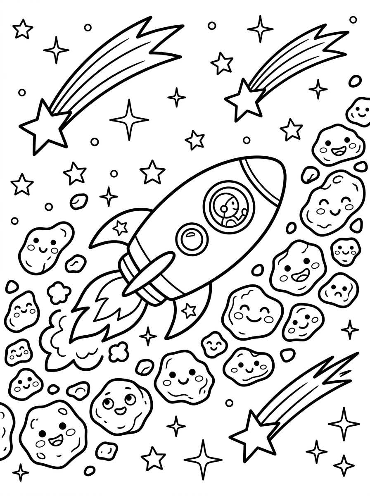

---

## [PÁGINA 33: ESCENA 13 - EL TOBOGÁN DEL ARCO ÍRIS CÓSMICO]

De pronto, un haz de luz de arcoíris se despliega frente a la nave.  
El cohete se desliza como en un divertido tobogán de agua a través de bandas de rojo, amarillo y azul.  
Copito ladra de felicidad mientras todos ríen a carcajadas.

> **Texto de Lectura:**  
> ¡El tobogán de luz los lleva velozmente de regreso a casa!

---

## [PÁGINA 34: ILUSTRACIÓN ESCENA 13]

---

## [PÁGINA 35: ESCENA 14 - LA TIERRA, NUESTRO HOGAR AZUL]

Desde la ventana frontal contemplan el planeta Tierra flotando en la inmensidad.  
Se ve hermosa, redonda y brillante como una canica azul decorada con nubes blancas y continentes verdes.  
—¡Qué hermosa es nuestra casa! —suspira Nico con orgullo.

> **Texto de Lectura:**  
> No hay lugar más lindo en todo el universo que nuestro propio hogar.

---

## [PÁGINA 36: ILUSTRACIÓN ESCENA 14]

---

## [PÁGINA 37: ESCENA 15 - LA DESPEDIDA GALÁCTICA]

El Robot Tuerca y Bip-Bip acompañan al cohete hasta el límite del espacio.  
Se dan un fuerte abrazo y se prometen volver a encontrarse para explorar nuevas galaxias.  
Bip-Bip les regala un pequeño cristal brillante como recuerdo.

> **Texto de Lectura:**  
> —¡Hasta la próxima aventura intergaláctica, amigos! —se despiden con emoción.

---

## [PÁGINA 38: ILUSTRACIÓN ESCENA 15]

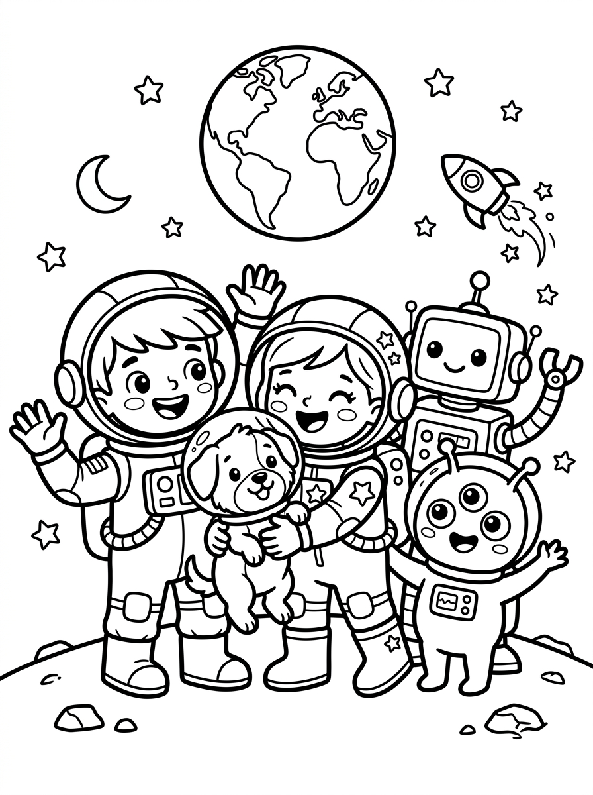

# Capítulo 5: Aterrizaje Suave y Dulces Sueños

---

## [PÁGINA 39: PORTADILLA CAPÍTULO - ATERRIZAJE SUAVE Y DULCES SUEÑOS]

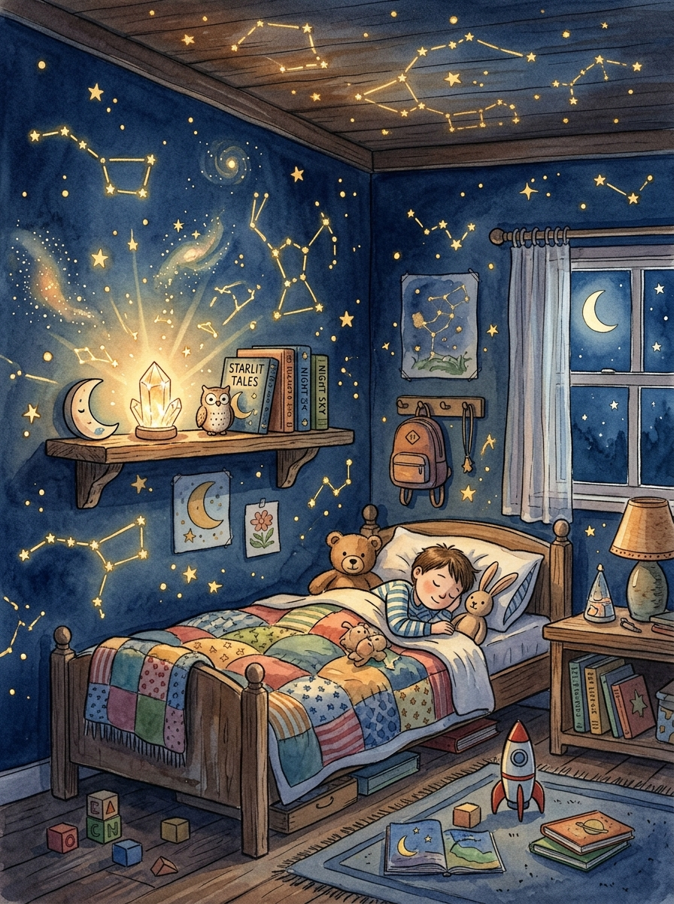

---

## [PÁGINA 40: ESCENA 16 - ATERRIZAJE ENTRE LAS FLORES]

El cohete desciende suavemente atravesando las últimas nubes del atardecer.  
Aterriza con un ligerísimo *¡plop!* justo sobre el césped mullido del jardín.  
Copito salta el primero y se reboza en la hierba fresca.

> **Texto de Lectura:**  
> —¡Misión cumplida! —anuncia el capitán Nico con entusiasmo.

---

## [PÁGINA 41: ILUSTRACIÓN ESCENA 16]

---

## [PÁGINA 42: ESCENA 17 - EL TESORO CRISTALINO]

Luna coloca el cristal brillante que les regaló Bip-Bip en la repisa de su habitación.  
El cristal proyecta diminutas constelaciones de luz por todo el techo.  
Parece que la magia del espacio los arropa con su calidez.

> **Texto de Lectura:**  
> Los recuerdos de los buenos amigos siempre iluminan la noche.

---

## [PÁGINA 43: ILUSTRACIÓN ESCENA 17]

---

## [PÁGINA 44: ESCENA 18 - CONTANDO LAS ESTRELLAS]

Arropados en sus camitas, Nico y Luna miran por la ventana abierta.  
Buscan con la mirada el planeta de los helados y la estación del Robot Tuerca.  
Copito duerme a los pies de la cama dando suaves ronquidos de perrito feliz.

> **Texto de Lectura:**  
> —Buenas noches, Nico. Buenas noches, Luna. ¡Buenas noches, universo!

---

## [PÁGINA 45: ILUSTRACIÓN ESCENA 18]

---

## [PÁGINA 46: ESCENA 19 - SUEÑOS CÓSMICOS]

Los párpados de los pequeños exploradores se van cerrando despacito.  
En sus sueños continúan flotando alegremente entre cometas sonrientes y nubes de colores.  
Saben que mañana les aguarda otra gran aventura.

> **Texto de Lectura:**  
> Duerme en paz, pequeño explorador. El mundo está lleno de maravillas por descubrir.

---

## [PÁGINA 47: ILUSTRACIÓN ESCENA 19]

---

## [PÁGINA 48: ESCENA 20 - DESPERTAR CON SONRISAS]

Al brillar los primeros rayos de sol de la mañana, Nico y Luna abren sus ojos llenos de felicidad.  
Saben que el universo es gigante, pero su amistad es el viaje más bonito de todos.

> **Texto de Lectura:**  
> Cada nuevo amanecer trae una galaxia de oportunidades.

---

## [PÁGINA 49: ILUSTRACIÓN ESCENA 20]

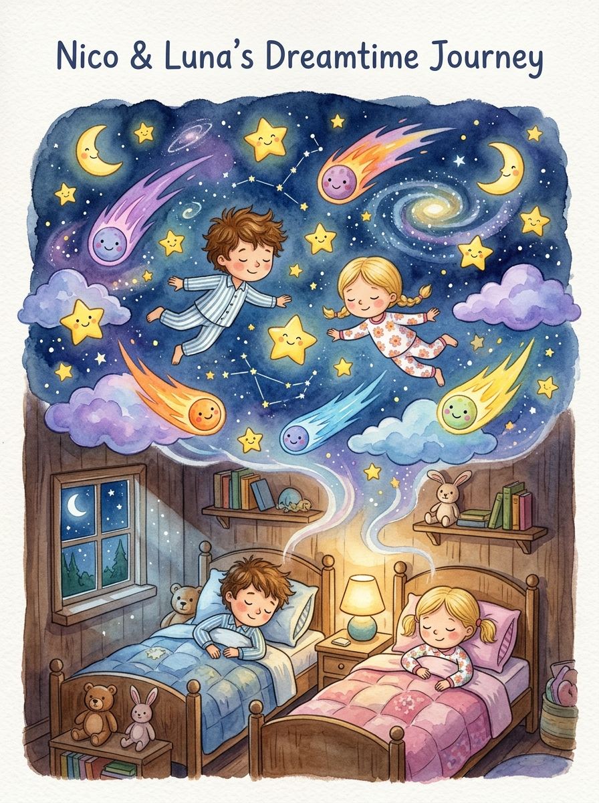

# Capítulo 6: Actividades y Juegos del Espacio Mágico

---

## [PÁGINA 50: PORTADILLA CAPÍTULO - ACTIVIDADES Y JUEGOS ESPACIALES]

---

## [PÁGINA 51: ACTIVIDAD 1 - EL LABERINTO ESPACIAL]

### 🧩 ¡Guía al Cohete de Nico y Luna hasta el Planeta de Helado!

Recorre el camino espacial esquivando los agujeros negros y los cometas traviesos.

---

## [PÁGINA 52: ACTIVIDAD 2 - BUSCA LAS 5 DIFERENCIAS]

### 🔍 ¡Encuentra las 5 diferencias!

Observa las dos escenas del Robot Tuerca ajustando su nave. ¿Puedes encontrar las 5 diferencias en el dibujo de la derecha?

- [ ] 1. La antena del casco del robot.
- [ ] 2. La estrella cerca de la ventana.
- [ ] 3. El número de burbujas en el motor.
- [ ] 4. El botón en el pecho del robot.
- [ ] 5. La llave inglesa en la mano.

---

## [PÁGINA 53: ACTIVIDAD 3 - CONECTA LOS PUNTOS]

### ✏️ ¡Une los puntos del 1 al 20!

Descubre la forma del fabuloso cohete espacial de Nico y Luna.  
Une los números en orden y luego... ¡coloréalo con tus colores preferidos!

`1 - 2 - 3 - 4 - 5 - 6 - 7 - 8 - 9 - 10 - 11 - 12 - 13 - 14 - 15 - 16 - 17 - 18 - 19 - 20`

---

## [PÁGINA 54: ACTIVIDAD 4 - DIBUJO Y CREATIVIDAD LIBRE]

### 🎨 ¡Diseña tu propio Planeta o Extraterrestre Divertido!

En este espacio en blanco, utiliza tu imaginación para dibujar un planeta de tu sabor preferido o a un amigo alienígena simpático.

**¿Cómo se llama tu planeta o alien?**: ______________________________________  
**¿Qué le gusta comer?**: _________________________________________________

# Capítulo 7: Próxima Aventura, Probador de Color y Soluciones

---

## [PÁGINA 55: PORTADILLA CAPÍTULO - SOLUCIONES Y AVANCE DEL SIGUIENTE LIBRO]

---

## [PÁGINA 56: AVANCE DEL SIGUIENTE LIBRO DE LA COLECCIÓN]

### 🦕 ¡Próxima Aventura!

### LAS AVENTURAS DE NICO Y LUNA — LIBRO 3
## Los Dinosaurios Perdidos

Nico, Luna y Copito viajan en el tiempo a una isla mágica habitada por dinosaurios herbívoros y juguetones.  
Conocerán a un T-Rex simpático que come hojas, a un Triceratops que le encanta el escondite y ayudarán a cuidar un huevo gigante a punto de eclosionar.

> **¡Consigue el Libro 3 de la colección en Amazon KDP!**

---

## [PÁGINA 57: PROBADOR DE COLORES - LÁPICES]

### 🖍️ Probador de Lápices de Colores y Ceras

Utiliza esta página para probar tus lápices de colores o rotuladores espaciales antes de pintar las páginas del libro.

---

## [PÁGINA 58: PROBADOR DE COLORES - ROTULADORES]

### 🎨 Probador de Rotuladores y Acuarelas

Utiliza este espacio en blanco para probar la intensidad de tus rotuladores espaciales y asegurarte de que el color no traspase la hoja.

---

## [PÁGINA 59: SOLUCIONARIO DE ACTIVIDADES]

### 💡 Soluciones de los Juegos

- **Página 51 (Laberinto):** El camino correcto rodea el primer asteroide por la derecha, pasa por debajo de la luna sonriente y avanza directo al planeta de helado.
- **Página 52 (Diferencias):** 1. La antena del casco; 2. La estrella cerca de la ventana; 3. La burbuja extra del motor; 4. El botón del pecho; 5. La llave inglesa en la mano.
- **Página 53 (Conecta Puntos):** ¡Es el majestuoso Cohete Espacial!

---

## [PÁGINA 60: ¡GRACIAS EXPLORADOR!]

¡Gracias por leer y colorear con nosotros!  
Si te ha gustado esta aventura galáctica, déjanos una opinión en Amazon. ¡Nos ayuda muchísimo a crear más libros de estrellas!
