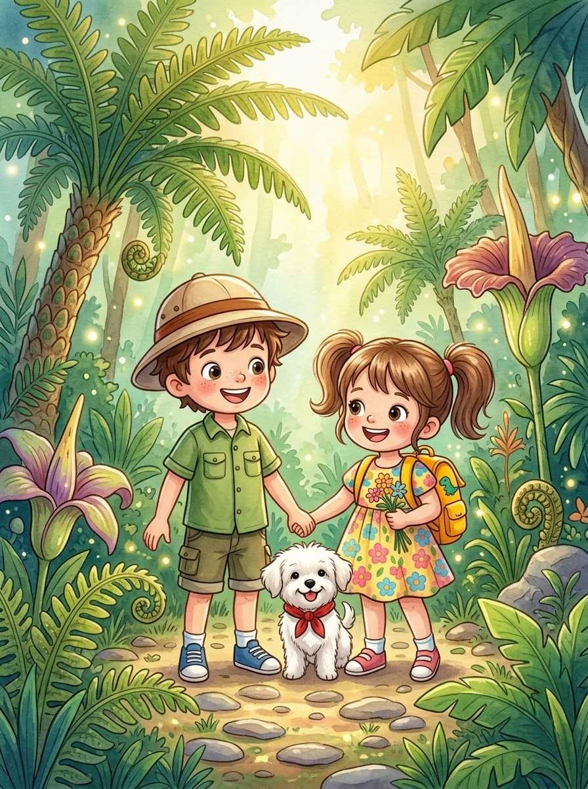
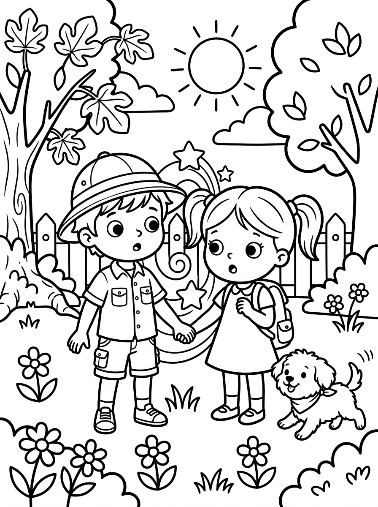
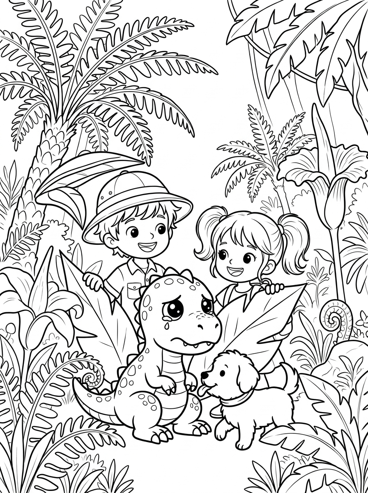
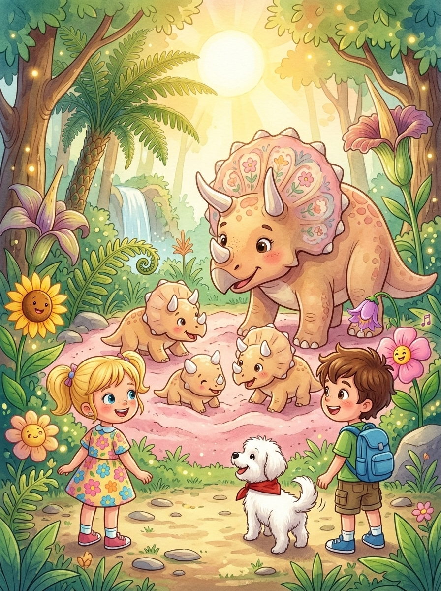
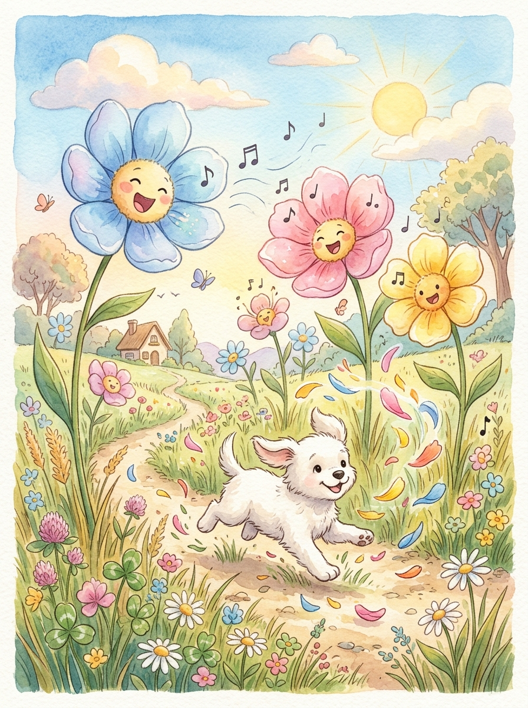
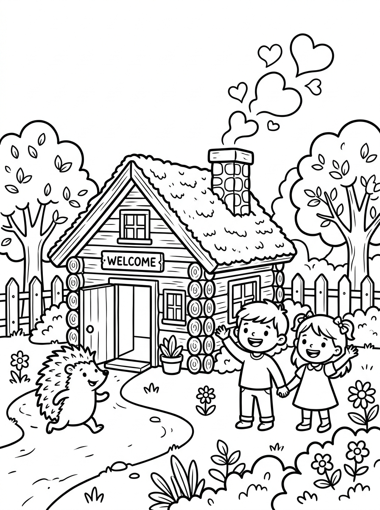

# Capítulo 1: Ficha Inicial y Presentación de la Aventura Prehistórica

---

## [PÁGINA 1: PORTADILLA DE PERTENENCIA]

# LAS AVENTURAS DE NICO Y LUNA

### **Este libro pertenece a:**

__________________________________________________

*¡Que tu viaje esté lleno de colores y fantasía!*

---

## [PÁGINA 2: PORTADA INTERIOR]

# LAS AVENTURAS DE NICO Y LUNA
## Los Dinosaurios Perdidos

**Colección:** Las Aventuras de Nico y Luna — Libro 3  
**Escrito e Ilustrado por:** Julio Martín Rodríguez Sánchez  
**Para pequeños lectores y artistas de 4 a 8 años**

---

## [PÁGINA 3: DERECHOS DE AUTOR Y NOTA EDITORIAL]

**Las Aventuras de Nico y Luna: Los Dinosaurios Perdidos**  
© 2026 Julio Martín Rodríguez Sánchez. Todos los derechos reservados.

Queda prohibida la reproducción total o parcial de esta obra por cualquier medio sin la autorización escrita del titular de los derechos de autor.

**Nota para los padres y educadores:**  
Este libro ha sido diseñado para estimular la imaginación, la creatividad y la lectura temprana en niños de 4 a 8 años. Cada capítulo de lectura a color se separa por portadillas ilustradas y las escenas se presentan con texto en la página izquierda e ilustraciones a página completa en la derecha.

---

## [PÁGINA 4: ¡VIAJEROS DEL TIEMPO!]

### ¡Hola de nuevo, pequeño explorador!

Nico, Luna y Copito vuelven en una aventura prehistórica increíble:

- **Nico**: Se ha puesto su gorro de explorador y lleva una brújula mágica que gira sin parar.
- **Luna**: Lleva una cantimplora y una lupa gigante para examinar hojas de helechos y fósiles.
- **Copito**: Lleva un pañuelo de aventurero atado al cuello y ladra emocionado buscando rastros.

¡Hoy cruzaremos el portal del tiempo para conocer a los seres más gigantescos de la Tierra!

> **Instrucción de Coloreado:**  
> Pinta el gorro de Nico, colorea la mochila de Luna y ponle manchas divertidas al pañuelo de Copito.

---

## [PÁGINA 5: ILUSTRACIÓN DE BIENVENIDA]

# Capítulo 2: El Portal en el Jardín y la Selva Gigante

---

## [PÁGINA 6: PORTADILLA CAPÍTULO - EL PORTAL EN EL JARDÍN]

---

## [PÁGINA 7: ESCENA 1 - EL PORTAL BRILLANTE ENTRE LOS HELECHOS]

El intrépido perrito Copito corre de un lado a otro por el jardín, olfateando con mucha curiosidad las gruesas raíces de una vieja higuera. De repente, el suelo empieza a temblar suavemente y un asombroso destello de color verde manzana y dorado brillante brota de la tierra, iluminando los arbustos del jardín. ¡Un portal mágico de luz prehistórica empieza a girar como un remolino de purpurina frente a ellos!

Nico y Luna se acercan tomados de la mano, con los ojos muy abiertos y el corazón latiendo de emoción por el maravilloso descubrimiento.

> **Texto de Lectura:**  
> —¡Mirad, chicos! —susurra Luna con una gran sonrisa—. ¡El portal del tiempo se ha abierto y nos invita a una fantástica aventura!

---

## [PÁGINA 8: ILUSTRACIÓN ESCENA 1]

---

## [PÁGINA 9: ESCENA 2 - LA LLEGADA A LA SELVA PREHISTÓRICA]

Al dar un paso a través del portal brillante, los niños sienten que el aire se vuelve cálido y huele a tierra mojada y a dulces flores gigantes. A su alrededor se extiende una selva alucinante, repleta de helechos verdes que son más altos que un edificio de tres pisos y árboles con hojas tan gigantescas que parecen sábanas de colores. De repente, una simpática libélula de color azul brillante y del tamaño de un pájaro sobrevuela sus cabezas dándoles una alegre bienvenida.

Nico se acomoda su gorro de explorador y mira su brújula mágica, que da vueltas sin parar en su mano.

> **Texto de Lectura:**  
> —¡Es increíble! —exclama Nico asombrado—. ¡Estamos en la época de los dinosaurios!

---

## [PÁGINA 10: ILUSTRACIÓN ESCENA 2]

---

## [PÁGINA 11: ESCENA 3 - EL ENCUENTRO CON EL TIRANOSAURIO DINO]

Caminando entre los enormes troncos de la selva, Nico y Luna escuchan un llanto muy bajito y tierno que proviene de una gran hoja de palma plateada. Al apartar la hoja con cuidado, descubren a un pequeño Tiranosaurio Rex con escamas de color verde brillante y grandes ojos amarillos llenos de lágrimas. El pequeño dinosaurio Dino les explica, dando pequeños hipos, que ha perdido sus tres juguetes favoritos y no sabe dónde buscarlos.

Copito se acerca moviendo la cola y le da un cariñoso lengüetazo en la patita para animarlo.

> **Texto de Lectura:**  
> —No llores, Dino —le consuela Luna dándole un suave abrazo—. ¡Te ayudaremos a buscar tus juguetes por todo el valle!

---

## [PÁGINA 12: ILUSTRACIÓN ESCENA 3]

---

## [PÁGINA 13: ESCENA 4 - EL MAPA DE HOJAS FÓSILES]

El pequeño Dino deja de llorar y les enseña una piedra muy lisa y plana que lleva grabada la silueta de tres hojas fosilizadas de colores brillantes. Este asombroso mapa prehistórico muestra los mágicos rincones del valle donde solía jugar con sus amigos los dinosaurios. Nico saca de su mochila su brújula mágica dorada, cuya aguja señala de inmediato hacia un sendero oculto bajo unos helechos gigantescos de color morado.

Dino da un saltito alegre e intenta imitar el rugido de un gran T-Rex, haciendo un gracioso "¡grrr!" que parece más bien un tierno bostezo.

> **Texto de Lectura:**  
> —¡La primera pista está cruzando el río de vapor! —indica Nico señalando el mapa de piedra.

---

## [PÁGINA 14: ILUSTRACIÓN ESCENA 4]

---

## [PÁGINA 15: ESCENA 5 - LAS HUELLAS GIGANTES EN EL LODO]

Guiados por el mapa de piedra, el travieso perrito Copito descubre unas enormes pisadas circulares marcadas en el barro blando del camino. ¡Son tan increíblemente gigantes que Nico y Luna podrían sentarse dentro de ellas y usarlas como divertidos columpios! Copito se mete emocionado en una de las huellas y empieza a ladrar de alegría, salpicando gotitas de barro a su alrededor mientras Dino intenta meter su pequeña cola en la huella vecina.

—¿De quién crees que sean estas pisadas tan grandes, Dino? —pregunta Nico con curiosidad.

—¡Son de mi amigo Bronto, el gigante comelón! —responde Dino dando saltitos.

> **Texto de Lectura:**  
> —¡Sigamos estas huellas gigantes! —rie Luna—. ¡Nos llevarán directos al Valle de los Dinosaurios Buenos!

---

## [PÁGINA 16: ILUSTRACIÓN ESCENA 5]

# Capítulo 3: El Valle de los Dinosaurios Buenos

---

## [PÁGINA 17: PORTADILLA CAPÍTULO - EL VALLE DE LOS DINOSAURIOS BUENOS]

---

## [PÁGINA 18: ESCENA 6 - EL NIDO DE LOS TRICERATOPS BEBÉS]

Los pequeños aventureros llegan a un hermoso claro del bosque donde una mamá Triceratops vigila con ternura a sus tres pequeños bebés. Los dinosaurios bebés tienen tres simpáticos cuernos blancos y redondos, y juegan muy alegres en su nido de arena suave y de color rosa. Al ver llegar al grupo, los bebés Triceratops se acercan y saludan a Copito moviendo sus cabecitas decoradas con pequeños volantes en el cuello.

Dino corre a saludarlos con alegría y da vueltas buscando su pelota de piedra favorita.

> **Texto de Lectura:**  
> —¡Hola, pequeños amigos! —saluda Luna con voz suave—. ¿Sabéis dónde está la pelota perdida de Dino?

---

## [PÁGINA 19: ILUSTRACIÓN ESCENA 6]

---

## [PÁGINA 20: ESCENA 7 - EL PUENTE SOBRE EL RÍO DE LAVA TIBIA]

Para seguir el mapa, los amigos deben cruzar un pequeño arroyo de lava tibia y brillante que fluye despacio como si fuera miel de fresa. Afortunadamente, hay un puente natural formado por grandes piedras lisas y redondas que son completamente seguras. En el aire flotan hermosas burbujas de vapor de colores que estallan con un gracioso sonido de "¡plop!".

Dino mira el agua rosada con duda y dice:

—¡Tengo miedo de mojar mis garritas de T-Rex!

Nico le toma de la pata con cariño y le da confianza.

> **Texto de Lectura:**  
> —¡No te preocupes, Dino! —advierte Nico—. ¡Crucemos de roca en roca, despacio y sin prisa!

---

## [PÁGINA 21: ILUSTRACIÓN ESCENA 7]

---

## [PÁGINA 22: ESCENA 8 - EL GRAN BRONTOSAURIO DE CUELLO LARGO]

Al otro lado del arroyo de lava, un gigantesco Brontosaurio de cuello larguísimo mastica con calma las hojas más tiernas de una palmera. Aunque su cabeza llega casi hasta las esponjosas nubes del cielo prehistórico, sus grandes ojos son muy dulces y tiene una sonrisa de lo más amigable. Nico se quita su gorro de explorador y lo agita en el aire para saludar al simpático gigante.

Dino da un gran salto y grita entusiasmado:

—¡Hola, señor Bronto! ¿Ha visto mis juguetes perdidos por aquí arriba?

El gigante menea la cabeza con cariño.

> **Texto de Lectura:**  
> —¡Caramba! —exclama Nico asombrado—. ¡Es el dinosaurio más grande y bueno que he visto en mi vida!

---

## [PÁGINA 23: ILUSTRACIÓN ESCENA 8]

---

## [PÁGINA 24: ESCENA 9 - EL JUEGO CON LOS PTERODÁCTILOS MALABARISTAS]

Dos simpáticos Pterodáctilos de alas moradas y brillantes vuelan en círculos sobre las copas de los helechos gigantes de la selva. En sus picos llevan unos cocos redondos y se los lanzan el uno al otro en el aire, realizando unos divertidos malabares dignos de un circo prehistórico. Copito da graciosos saltitos en el suelo persiguiendo las sombras de sus alas gigantes, mientras Dino intenta atrapar los cocos con sus cortitos brazos de T-Rex.

—¡Casi lo tengo! —grita Dino haciendo reír a todos con sus divertidas piruetas.

> **Texto de Lectura:**  
> —¡Qué divertido! —aplaude Luna alegremente—. ¡Esos Pterodáctilos voladores son unos malabaristas fantásticos!

---

## [PÁGINA 25: ILUSTRACIÓN ESCENA 9]

---

## [PÁGINA 26: ESCENA 10 - LA CUEVA DE LOS CRISTALES LUMINOSOS]

El sendero se vuelve estrecho y los conduce al interior de una misteriosa cueva excavada en la gran montaña del valle. Al entrar, todos se quedan sin aliento: ¡miles de cristales mágicos de color rosa, azul y amarillo brillan en las paredes oscuras como si fuesen pequeñas bombillas! La luz multicolor ilumina los rostros de Nico y Luna, y hace que las verdes escamas de Dino brillen de una forma espectacular.

Dino da palmas muy emocionado y dice:

—¡Esta cueva brilla más que mi pelota de piedra!

> **Texto de Lectura:**  
> —¡Es bellísimo! —susurra Luna maravillada—. ¡Esta cueva parece un cielo mágico lleno de estrellas de colores!

---

## [PÁGINA 27: ILUSTRACIÓN ESCENA 10]

# Capítulo 4: La Búsqueda de los Juguetes Perdidos

---

## [PÁGINA 28: PORTADILLA CAPÍTULO - LA BÚSQUEDA DE LOS JUGUETES]

---

## [PÁGINA 29: ESCENA 11 - LA PELOTA DE PIEDRA DE DINO EN LA CASCADA]

Al salir de la cueva de cristales, los amigos escuchan el alegre sonido de una cascada de agua cristalina y tibia que cae en una laguna azul. De pronto, el perspicaz Copito empieza a ladrar señalando hacia la orilla: ¡allí está la pelota de piedra de Dino flotando suavemente entre unas flores acuáticas gigantes! Dino da grandes saltos de alegría en la arena y estira sus pequeños brazos intentando alcanzar su preciado juguete.

—¡Cuidado, Dino, no te caigas al agua! —le advierte Nico mientras busca una solución ingeniosa.

> **Texto de Lectura:**  
> —¡No te preocupes! —dice Nico sujetando una rama larga—. ¡Yo la pescaré con cuidado desde la orilla!

---

## [PÁGINA 30: ILUSTRACIÓN ESCENA 11]

---

## [PÁGINA 31: ESCENA 12 - EL PELUCHE DE HELECHO EN EL GRAN ÁRBOL]

El segundo juguete de Dino es un peluche de dinosaurio muy suave, fabricado con musgo verde y hojas tiernas de helecho. Sin embargo, el peluche se encuentra atorado en una rama altísima de una palmera jurásica y ninguno de los pequeños amigos logra alcanzarlo. Por suerte, el Brontosaurio gigante pasa por allí, estira su larguísimo cuello con elegancia y toma el juguete con su boca con muchísimo cuidado para no dañarlo.

Dino aplaude con sus patitas y le da las gracias con un simpático silbido de alegría.

> **Texto de Lectura:**  
> —¡Muchísimas gracias, gigante bueno! —agradece Luna abrazando con cariño el suave peluche de Dino.

---

## [PÁGINA 32: ILUSTRACIÓN ESCENA 12]

---

## [PÁGINA 33: ESCENA 13 - LA CORONA DE FLORES DEL TRICERATOPS]

El último juguete perdido de Dino es una preciosa corona tejida con flores silvestres del valle. Al buscarla por los alrededores, descubren que se la ha puesto un travieso bebé Triceratops, quien corretea de un lado a otro creyéndose el rey de la selva jurásica. Luna, muy lista, decide tejer una preciosa corona de hojas de sauce tiernas y crujientes y se la ofrece al pequeño dinosaurio a cambio de la corona de flores.

—¡Mira qué corona verde tan deliciosa! —le dice Dino ofreciéndole una gran sonrisa.

> **Texto de Lectura:**  
> —¡Es un trato fantástico para los dos reyes del valle! —sonríe Luna intercambiando los regalos.

---

## [PÁGINA 34: ILUSTRACIÓN ESCENA 13]

---

## [PÁGINA 35: ESCENA 14 - LOS DINOSAURIOS NADADORES DEL LAGO AZUL]
 
Para agradecer a Nico y Luna su valiosa ayuda, Dino los lleva al lago azul, el hogar del Plesiosaurio, el simpático dinosaurio nadador. De repente, una hermosa cabeza con un cuello muy largo y elegante emerge de las tranquilas aguas de color turquesa. El Plesiosaurio sostiene en su hocico una caracola mágica que brilla bajo el sol con los colores del arcoíris y se la entrega a los niños como un regalo especial por su bondad.

—¡Es un amuleto mágico del lago! —dice Dino entusiasmado dando pequeños saltitos en la orilla.

> **Texto de Lectura:**  
> —¡Gracias por ayudar a Dino a encontrar sus juguetes y por cuidar de nuestro hermoso valle! —canta el Plesiosaurio.

---

## [PÁGINA 36: ILUSTRACIÓN ESCENA 14]

---

## [PÁGINA 37: ESCENA 15 - EL REGRESO AL NIDO CON TODOS LOS JUGUETES]

Con la ayuda de Nico, Luna y el travieso Copito, el pequeño Dino por fin tiene de vuelta sus tres queridos juguetes: su pelota de piedra, su peluche de helecho y su corona de flores silvestres. El pequeño T-Rex corre feliz por el verde prado prehistórico, abrazando sus juguetes contra su pechito con mucho cariño y dando alegres vueltas. Copito ladra sin parar y corre a su alrededor celebrando la gran victoria del equipo de exploradores del tiempo.

—¡Sois los mejores amigos del mundo entero! —exclama Dino muy emocionado.

> **Texto de Lectura:**  
> —¡Lo hemos conseguido trabajando juntos como un gran equipo! —dice Nico abrazando a su nuevo amigo.

---

## [PÁGINA 38: ILUSTRACIÓN ESCENA 15]

# Capítulo 5: El Gran Volcán de Burbujas y el Viaje de Vuelta

---

## [PÁGINA 39: PORTADILLA CAPÍTULO - EL VOLCÁN DE BURBUJAS Y EL REGRESO]

---

## [PÁGINA 40: ESCENA 16 - LA FIESTA PREHISTÓRICA EN EL PRADO]

Para celebrar que han encontrado todos los juguetes de Dino, todos los simpáticos dinosaurios del valle se reúnen en el gran prado verde de helechos gigantes. Los pequeños Triceratops tocan el tambor en troncos huecos, el gran Brontosaurio menea su largo cuello al compás y los Pterodáctilos silban una melodía alegre en el aire. Nico, Luna y el travieso Copito bailan en un gran círculo con Dino, quien da graciosos pasos de T-Rex.

—¡Este es el mejor baile de la historia! —grita Dino riendo sin parar.

> **Texto de Lectura:**  
> ¡La música y las divertidas risas unen a los amigos de todas las épocas de la Tierra!

---

## [PÁGINA 41: ILUSTRACIÓN ESCENA 16]

---

## [PÁGINA 42: ESCENA 17 - EL VOLCÁN ECHA BURBUJAS DE COLORES]

De repente, un suave sonido de tambores lejanos se escucha y el gran volcán que se alza al fondo del valle comienza a rugir con fuerza. ¡Pero no hay de qué preocuparse! En lugar de lava caliente, el volcán empieza a lanzar millones de burbujas gigantes de jabón de todos los colores del arcoíris. Las burbujas flotan perezosas por el cielo prehistórico, brillando y reflejando la luz del sol dorado sobre las copas de los árboles gigantes.

—¡Me encantan las burbujas! —exclama Dino intentando explotar una muy grande con su hocico.

> **Texto de Lectura:**  
> —¡Mirad hacia arriba! —grita Luna entusiasmada—. ¡El volcán mágico está celebrando nuestra gran amistad con burbujas!

---

## [PÁGINA 43: ILUSTRACIÓN ESCENA 17]

---

## [PÁGINA 44: ESCENA 18 - EL REGALO DE DINO: UN DIENTE DE PIEDRA]

Antes de despedirse, el pequeño Dino saca de su nido un colgante muy especial fabricado con una piedrecilla fósil que brilla con destellos plateados. Con mucho cuidado, Dino se lo entrega a Nico para que nunca olvide su viaje a la prehistoria, y Nico se lo cuelga en el cuello muy orgulloso. Luego, el tierno tiranosaurio Rex les da a Nico y a Luna un enorme y cálido abrazo, rozando sus mejillas con cariño.

—Llevad este recuerdo siempre con vosotros —dice Dino con una gran sonrisa de agradecimiento.

> **Texto de Lectura:**  
> —¡Muchas gracias, Dino! —promete Nico con gran emoción—. ¡Siempre seremos amigos de la prehistoria!

---

## [PÁGINA 45: ILUSTRACIÓN ESCENA 18]

---

## [PÁGINA 46: ESCENA 19 - EL PORTAL SE ABRE DE NUEVO EN LAS ROCAS]

Entre dos inmensas rocas cubiertas de musgo blando, el portal mágico de color verde y dorado comienza a brillar de nuevo con hermosos destellos. Ha llegado el momento de regresar a casa antes de que el sol se oculte del todo tras las montañas jurásicas. Nico con su brújula, Luna con su lupa y el perrito Copito miran hacia atrás una última vez para despedirse de todos sus amigos prehistóricos.

Dino los despide agitando alegremente su colita y dando pequeños saltitos de T-Rex en la hierba.

> **Texto de Lectura:**  
> —¡Adiós, Dino! ¡Adiós, gigantes buenos del valle! —se despiden los tres viajeros con la mano.

---

## [PÁGINA 47: ILUSTRACIÓN ESCENA 19]

---

## [PÁGINA 48: ESCENA 20 - DORMIR Y SOÑAR EN LA HABITACIÓN]

De regreso en su acogedora habitación, Nico y Luna se acuestan cansados pero muy felices en sus camitas suaves y abrigadas. Nico sostiene con fuerza en su mano el colgante brillante que le regaló Dino, mientras Luna abraza su lupa de exploradora y recuerda a los simpáticos Triceratops. A los pies de la cama, el pequeño Copito ya duerme profundamente enroscado como una rosquilla, soñando con volcanes de burbujas y divertidos juegos prehistóricos.

Al fondo, la luna brilla en la ventana, iluminando una noche llena de magia y dulces sueños.

> **Texto de Lectura:**  
> ¡Al cerrar los ojos, nuestra gran imaginación nos llevará siempre de vuelta a las tierras mágicas!

---

## [PÁGINA 49: ILUSTRACIÓN ESCENA 20]

# Capítulo 6: Actividades y Juegos Prehistóricos

---

## [PÁGINA 50: PORTADILLA CAPÍTULO - ACTIVIDADES Y JUEGOS PREHISTÓRICOS]

---

## [PÁGINA 51: ACTIVIDAD 1 - EL LABERINTO DEL VOLCÁN]

### 🧩 ¡Ayuda al pequeño Dino a llegar al Volcán de Burbujas!

Recorre con tu lápiz el camino correcto evitando los caminos sin salida.

---

## [PÁGINA 52: ACTIVIDAD 2 - BUSCA LAS 5 DIFERENCIAS]

### 🔍 ¡Encuentra las 5 diferencias!

Observa las dos escenas del Triceratops comiendo hojas tiernas. ¿Puedes encontrar los 5 detalles cambiados en el dibujo de la derecha?

- [ ] 1. El cuerno superior del Triceratops.
- [ ] 2. La mariposa en la palmera.
- [ ] 3. La flor del helecho junto al pie.
- [ ] 4. La forma de la nube en el cielo.
- [ ] 5. La pequeña piedra en el camino.

---

## [PÁGINA 53: ACTIVIDAD 3 - CONECTA LOS PUNTOS]

### ✏️ ¡Une los puntos del 1 al 20!

Descubre qué simpático amigo prehistórico se esconde aquí.  
Une los números en orden y luego... ¡coloréalo como más te guste!

`1 - 2 - 3 - 4 - 5 - 6 - 7 - 8 - 9 - 10 - 11 - 12 - 13 - 14 - 15 - 16 - 17 - 18 - 19 - 20`

---

## [PÁGINA 54: ACTIVIDAD 4 - DIBUJO Y CREATIVIDAD LIBRE]

### 🎨 ¡Diseña tu propio Dinosaurio Mágico!

En este espacio en blanco, utiliza tu imaginación para dibujar un dinosaurio o dragón que te gustaría tener de mascota.

**¿Cómo se llama tu dinosaurio?**: ______________________________________  
**¿Qué poder mágico tiene?**: ________________________________________

# Capítulo 7: Próxima Aventura, Probador de Color y Soluciones

---

## [PÁGINA 55: PORTADILLA CAPÍTULO - SOLUCIONES Y AVANCE DEL SIGUIENTE LIBRO]

---

## [PÁGINA 56: AVANCE DEL SIGUIENTE LIBRO DE LA COLECCIÓN]

### 🏺 ¡Próxima Aventura!

### LAS AVENTURAS DE NICO Y LUNA — LIBRO 4
## El Templo del Faraón

Nico, Luna y Copito cruzan de nuevo el portal mágico y aparecen en las cálidas arenas del Antiguo Egipto.  
Ayudarán a un pequeño escarabajo de la suerte a recuperar el amuleto dorado dentro de la gran pirámide del Faraón.  
¡Conocerán a esfinges sabias, jeroglíficos mágicos y resolverán misteriosos acertijos de arena!

> **¡Consigue el Libro 4 de la colección en Amazon KDP!**

---

## [PÁGINA 57: PROBADOR DE COLORES - LÁPICES]

### 🖍️ Probador de Lápices de Colores y Ceras

Utiliza esta página para probar la textura e intensidad de tus lápices de colores o ceras antes de pintar las páginas del libro.

- **Prueba de intensidad de lápiz:**  
  [ Rellena este círculo con color suave ]  
  [ Rellena este círculo con color fuerte ]

---

## [PÁGINA 58: PROBADOR DE COLORES - ROTULADORES]

### 🎨 Probador de Rotuladores y Acuarelas

Utiliza este espacio en blanco para probar la intensidad de tus rotuladores mágicos y asegurarte de que el color no traspase al otro lado de la hoja.

---

## [PÁGINA 59: SOLUCIONARIO DE ACTIVIDADES]

### 💡 Soluciones de los Juegos

- **Página 51 (Laberinto):** El camino correcto gira a la izquierda tras el gran helecho, pasa por debajo del cuello del Brontosaurio y cruza directo el camino de rocas hasta el pie del volcán.
- **Página 52 (Diferencias):** 1. Falta la punta del cuerno; 2. La mariposa tiene alas redondas; 3. Hay una flor más en el suelo; 4. La nube es más alargada; 5. Falta la piedra pequeña junto a la pata.
- **Página 53 (Conecta Puntos):** ¡Es un simpático Triceratops bebé!

---

## [PÁGINA 60: ¡GRACIAS EXPLORADOR!]

¡Gracias por leer y colorear con nosotros!  
Si te ha gustado esta historia, déjanos una opinión en Amazon. ¡Nos ayuda muchísimo a crear más libros mágicos!
