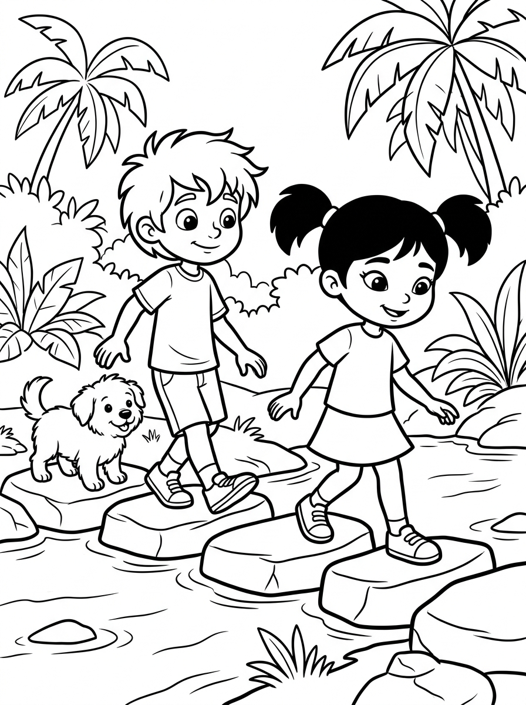

# Capítulo 3: El Reino del Coral y la Ostra Gigante

---

## [PÁGINA 17: PORTADILLA CAPÍTULO - EL REINO DEL CORAL Y LA OSTRA GIGANTE]

---

## [PÁGINA 18: ESCENA 6 - EL CABALLITO DE MAR GOLDY]

Al salir del bosque de algas, el paisaje se abre a un espectacular arrecife cubierto de corales de todas las formas y colores imaginables. De repente, de una rama de coral rosa brillante sale a saludarlos un caballito de mar de color dorado brillante. Es Goldy, el guardián más alegre y juguetón del arrecife. Goldy se presenta haciendo una pirueta en el agua y soltando una pequeña ráfaga de burbujas en forma de estrella de mar.

El pequeño caballito los mira con sus ojos redondos, agitando su aleta dorsal a toda velocidad y dando vueltas graciosas en el agua.

> **Texto de Lectura:**  
> —¡Glup, glup! ¡Bienvenidos al Reino del Coral! ¿Queréis venir a jugar conmigo por el arrecife? —saluda Goldy.

---

## [PÁGINA 19: ILUSTRACIÓN ESCENA 6]

---

## [PÁGINA 20: ESCENA 7 - EL CONCIERTO DE LAS ANÉMONAS]

Goldy guía a los niños a una preciosa explanada submarina donde vive un grupo de anémonas mágicas. Al acercarse, descubren con asombro que las anémonas no son plantas comunes; ¡tienen unos tentáculos suaves y coloridos que se mueven al ritmo de una melodía misteriosa! Al compás del agua, emiten suaves notas musicales que resuenan en el mar como el sonido de arpas de cristal.

Nico y Luna se sientan sobre una roca lisa, disfrutando de este increíble concierto submarino mientras Copito mueve la cola con el ritmo.

> **Texto de Lectura:**  
> —¡Es precioso! La música del mar es la más bonita que he escuchado. ¡Mira cómo bailan, Luna! —exclama Nico emocionado.

---

## [PÁGINA 21: ILUSTRACIÓN ESCENA 7]

---

## [PÁGINA 22: ESCENA 8 - EL CANGREJO PINZAS]

Justo en medio del concierto, sale de su escondite bajo una gran roca un simpático cangrejo de color rojo brillante. Lleva una pequeña caracola de mar vacía entre sus pinzas, utilizándola como si fuera un tambor de percusión para acompañar el canto de las anémonas. Se presenta como el Cangrejo Pinzas, el percusionista más famoso del arrecife de coral. Nico, muy entusiasmado, le acompaña aplaudiendo bajo el agua mientras Luna baila con Goldy.

El cangrejo Pinzas da pequeños pasos laterales en la arena, haciendo sonar su caracola con gran orgullo y alegría.

> **Texto de Lectura:**  
> —¡Pom, pom, clac! Con ritmo y alegría, ¡todo el arrecife de coral se llena de magia! —dice el Cangrejo Pinzas.

---

## [PÁGINA 23: ILUSTRACIÓN ESCENA 8]

---

## [PÁGINA 24: ESCENA 9 - LA CUEVA DE LA OSTRA GIGANTE]

Siguiendo al caballito Goldy y al cangrejo Pinzas, los amigos llegan a la entrada de una misteriosa cueva de roca azulada. En el centro de la cueva descansa una ostra gigante de bordes nacarados. Al acercarse con cuidado, la ostra se abre despacio y revela en su interior una perla perfecta del tamaño de una manzana que brilla con una luz dorada y cálida, iluminando todos los rincones oscuros de la cueva.

La perla mágica flota suavemente sobre el manto de la ostra, proyectando hermosos reflejos de luz en el agua.

> **Texto de Lectura:**  
> —¡Mirad qué luz tan bonita! La perla brilla como una estrella cautiva en el fondo del mar —susurra Luna maravillada.

---

## [PÁGINA 25: ILUSTRACIÓN ESCENA 9]

---

## [PÁGINA 26: ESCENA 10 - EL REGALO DE LA PERLA]

La Ostra Gigante, en señal de amistad y generosidad, permite a Luna tomar la perla dorada entre sus manos. La luz de la perla es cálida y reconfortante, y al contacto con el agua crea una pequeña burbuja dorada alrededor de los niños que los protege de las corrientes fuertes. Nico y Luna agradecen el regalo a la Ostra Gigante, prometiendo cuidar de ella y de su luz durante su viaje submarino.

Nico y Luna guardan la perla dorada con mucho cariño en su mochila submarina, sintiendo que su luz les guiará.

> **Texto de Lectura:**  
> —¡Gracias, hermosa ostra! Tu perla iluminará nuestro camino de regreso a casa —dice Luna con una gran sonrisa.

---

## [PÁGINA 27: ILUSTRACIÓN ESCENA 10]

