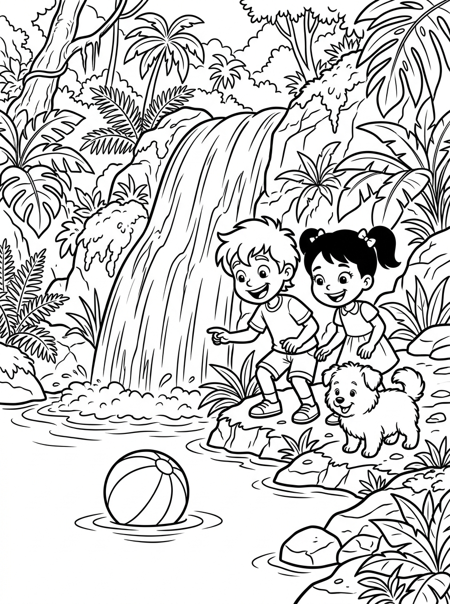

# Capítulo 4: Las Estrellas de Mar y el Pulpo Juguetón

---

## [PÁGINA 28: PORTADILLA CAPÍTULO - LAS ESTRELLAS DE MAR Y EL PULPO JUGUETÓN]

---

## [PÁGINA 29: ESCENA 11 - LOS PECES PAYASO BAILARINES]

Al salir de la cueva con la perla dorada iluminando el camino, los amigos se encuentran con un alegre grupo de peces payaso de colores naranja, blanco y negro. Los peces payaso juegan entre los tentáculos de una gran anémona púrpura, dando saltos graciosos en el agua y haciendo círculos rápidos alrededor de los niños. Nico y Luna se unen a su juego submarino, girando y flotando con gracia al compás del agua templada.

Copito intenta imitar a los peces payaso, nadando en círculos rápidos y ladrando de alegría tras las burbujas de colores.

> **Texto de Lectura:**  
> —¡Mirad qué divertidos son! Bailar con los peces es el juego más alegre de todo el mar —dice Luna riendo.

---

## [PÁGINA 30: ILUSTRACIÓN ESCENA 11]

---

## [PÁGINA 31: ESCENA 12 - EL PULPO OCHO-BRAZOS]

Continuando su viaje por el arrecife de coral, llegan a una zona de laberintos de roca coralina. De una gran grieta se asoma un pulpo de color violeta brillante con ojos grandes y curiosos. Es el Pulpo Ocho-Brazos, el habitante más travieso y juguetón del arrecife. El pulpo estira sus largos brazos con cuidado y comienza a hacerles cosquillas en las aletas a Nico y Luna, haciéndoles reír a carcajadas bajo el agua.

Nico y Luna juegan con el pulpo a chocar sus manos con sus suaves tentáculos llenos de pequeñas ventosas de colores.

> **Texto de Lectura:**  
> —¡Clac, clac! ¡Qué cosquillas! Eres el pulpo más gracioso de todo el océano —exclama Nico riendo.

---

## [PÁGINA 32: ILUSTRACIÓN ESCENA 12]

---

## [PÁGINA 33: ESCENA 13 - EL DESFILE DE LAS ESTRELLAS]

Al final del laberinto de coral, el fondo del mar se cubre de arena blanca y suave. Allí se reúne un deslumbrante grupo de estrellas de mar de todos los colores del arcoíris. Las estrellas de mar flotan y se deslizan perezosas sobre la arena, brillando con una luz suave y mágica como si fueran constelaciones celestes caídas al fondo del mar. Luna recoge con cuidado una pequeña estrella de mar rosa que brilla con ternura.

Los amigos contemplan este hermoso desfile de estrellas marinas, sintiéndose parte de un cuadro pintado con la luz del mar.

> **Texto de Lectura:**  
> —¡Es precioso! El fondo del mar tiene sus propias estrellas brillantes. ¡Mira esa estela rosa, Copito! —exclama Nico emocionado.

---

## [PÁGINA 34: ILUSTRACIÓN ESCENA 13]

---

## [PÁGINA 35: ESCENA 14 - EL DELFÍN CANTARÍN]

Mientras disfrutan del desfile de estrellas, se acerca nadando veloz un delfín de piel plateada y lisa. Es Saltarín, el delfín más cantarín y veloz del arrecife. Saltarín da saltos acrobáticos fuera del agua y emite unos graciosos chasquidos musicales que suenan como una alegre canción de bienvenida. Se ofrece a llevar a los niños en su lomo para ayudarlos a subir de regreso a la superficie antes del atardecer.

Nico y Luna se sujetan con cuidado a la aleta de Saltarín, mientras Copito se acomoda feliz sobre el lomo liso del delfín.

> **Texto de Lectura:**  
> —¡Sujetaos fuerte! ¡Saltarín nos guiará de regreso a la superficie con su canto alegre! —grita Nico con los brazos abiertos.

---

## [PÁGINA 36: ILUSTRACIÓN ESCENA 14]

---

## [PÁGINA 37: ESCENA 15 - LA DESPEDIDA SUBMARINA]

Al llegar cerca de la superficie templada del agua, el caballito Goldy, el cangrejo Pinzas y el Pulpo Ocho-Brazos se colocan al lado del delfín Saltarín para despedirse. A través del agua cristalina, se envían besos y agitan sus aletas y tentáculos con cariño. Prometen volver a encontrarse muy pronto para explorar nuevos rincones del arrecife de coral. Goldy les da un último guiño y les hace una pirueta de despedida.

Este maravilloso viaje submarino les recordará siempre la fantástica amistad que nació bajo las olas del mar.

> **Texto de Lectura:**  
> —¡Gracias por todo, amigos! ¡Hasta la próxima aventura bajo el mar! —gritan Nico y Luna despidiéndose con emoción.

---

## [PÁGINA 38: ILUSTRACIÓN ESCENA 15]

