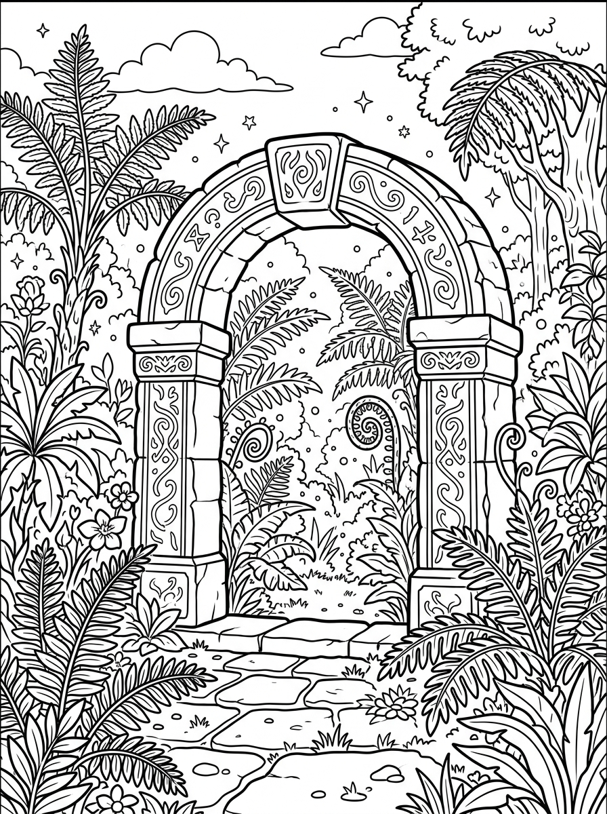

# Capítulo 2: La Expedición en la Selva de las Mariposas

---

## [PÁGINA 6: PORTADILLA CAPÍTULO - LA EXPEDICIÓN EN LA SELVA]

---

## [PÁGINA 7: ESCENA 1 - EL JEEP DE JUGUETE]

En una calurosa tarde, Nico y Luna juegan entusiasmados sobre la alfombra verde de su habitación. Nico desliza un pequeño jeep de plástico de color verde militar, haciéndolo saltar sobre montañas de cojines y libros. Mientras tanto, Luna consulta un gran mapa del tesoro lleno de dibujos de lianas, templos antiguos e insectos de colores. Copito corretea a su alrededor con su pequeña gorrita de safari, ladrando y mordisqueando una hoja de helecho de juguete que sobresale de una maceta del cuarto.

El jeep de juguete está listo para comenzar la expedición imaginaria. Nico y Luna se ajustan sus mochilas de exploradores listos para la gran aventura.

> **Texto de Lectura:**  
> —¡Con nuestra imaginación, este pasillo se convertirá en la selva más espesa y misteriosa del mundo! —exclama Nico muy sonriente.

---

## [PÁGINA 8: ILUSTRACIÓN ESCENA 1]

---

## [PÁGINA 9: ESCENA 2 - ¡LLEGADA A LA SELVA!]

De repente, una nube de chispas doradas y hojas flotantes de colores envuelve la habitación. La alfombra verde comienza a crecer y a convertirse en un suelo cubierto de musgo húmedo y helechos gigantes. El pequeño jeep de plástico se transforma mágicamente en un gran vehículo todo terreno con ruedas enormes y techo abierto. Nico y Luna se sujetan fuerte mientras el coche avanza suavemente por un estrecho sendero de tierra batida, rodeados de lianas colgantes y troncos de árboles que tocan el cielo.

El jeep avanza despacio por la espesura de la selva. Luna y Nico miran con sus prismáticos el asombroso paisaje tropical.

> **Texto de Lectura:**  
> —¡Mirad, el coche es de verdad y los árboles son gigantescos! ¡Vamos a explorar la selva! —grita Luna llena de emoción.

---

## [PÁGINA 10: ILUSTRACIÓN ESCENA 2]

---

## [PÁGINA 11: ESCENA 3 - CAMINANDO ENTRE HELECHOS]

Al bajar del todo terreno con sus trajes de safari mágicos, Nico y Luna sienten el aire cálido y perfumado de la selva. Caminan despacio sobre el suave colchón de hojas secas, apartando con cuidado las hojas gigantescas de helechos que miden más que ellos. Nico señala unas extrañas flores de color fucsia brillante que se abren al paso de los niños, liberando pequeños destellos luminosos.

Copito camina al frente olfateando cada rincón con gran curiosidad, moviendo la cola muy contento al descubrir el rastro de algún animal misterioso de la selva.

> **Texto de Lectura:**  
> —¡Es como caminar por un jardín de gigantes! El perfume de estas flores es dulce y mágico —dice Nico maravillado.

---

## [PÁGINA 12: ILUSTRACIÓN ESCENA 3]

---

## [PÁGINA 13: ESCENA 4 - EL MONITO COCO]

Mientras avanzan entre la densa vegetación, oyen unos graciosos chillidos que provienen de las ramas de un árbol de plátanos. De repente, baja balanceándose por una liana un monito de pelaje marrón y ojos grandes y brillantes. Se presenta dando saltos alegres y ofreciéndoles un plátano dorado. Es Coco, el monito más travieso y comilón de la selva. Coco hace una voltereta en el aire y se sienta sobre el capó del jeep, haciendo muecas divertidas.

Nico y Luna ríen a carcajadas con las piruetas del monito, mientras Copito le ladra invitándole a jugar en el suelo.

> **Texto de Lectura:**  
> —¡Hola, Coco! Eres el monito más divertido de la selva. ¿Nos enseñas el camino al templo? —pregunta Luna.

---

## [PÁGINA 14: ILUSTRACIÓN ESCENA 4]

---

## [PÁGINA 15: ESCENA 5 - EL PASEO EN BARCA]

Coco los guía hasta la orilla de un gran río de aguas tranquilas y cristalinas. Allí, flotando junto a la orilla, descansa una hermosa barca hecha con troncos de bambú atados con lianas fuertes. Los exploradores suben a la barca y se dejan llevar suavemente por la corriente del río tropical. A ambos lados de la orilla, la selva se muestra en todo su esplendor: tucanes que vuelan entre las copas de los árboles y coloridas mariposas que escoltan la barca.

Nico y Luna reman despacio disfrutando del murmullo del agua y del canto de las aves tropicales.

> **Texto de Lectura:**  
> —¡Esto es fantástico! Viajar en barca por el río es como navegar por un canal de aventuras —exclama Nico feliz.

---

## [PÁGINA 16: ILUSTRACIÓN ESCENA 5]

