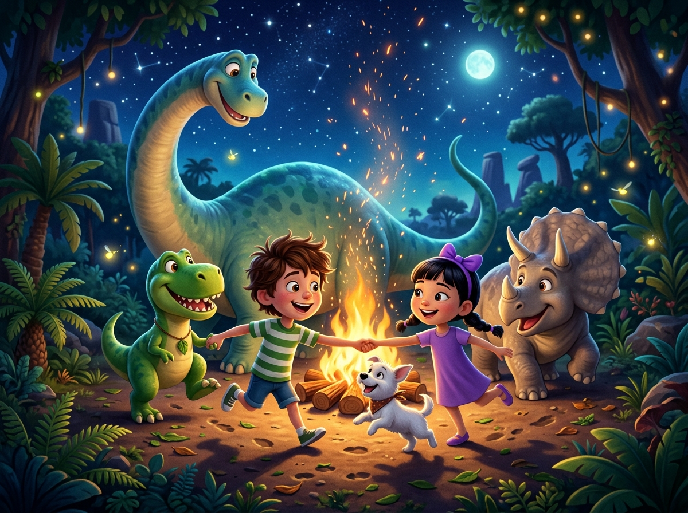

# Capítulo 1: Ficha Inicial y Presentación de la Aventura en la Selva

---

## [PÁGINA 1: PORTADILLA DE PERTENENCIA]

# LAS AVENTURAS DE NICO Y LUNA

### **Este libro pertenece a la tripulación de:**

__________________________________________________

*¡Que tu viaje por la selva esté lleno de lianas, animales y flores mágicas!*

---

## [PÁGINA 2: PORTADA INTERIOR]

# LAS AVENTURAS DE NICO Y LUNA
## Aventura en la Selva Tropical

**Colección:** Las Aventuras de Nico y Luna — Libro 5  
**Escrito e Ilustrado por:** Julio Martín Rodríguez Sánchez  
**Para pequeños lectores y artistas de 4 a 8 años**

---

## [PÁGINA 3: DERECHOS DE AUTOR Y NOTA EDITORIAL]

**Las Aventuras de Nico y Luna: Aventura en la Selva Tropical**  
© 2026 Julio Martín Rodríguez Sánchez. Todos los derechos reservados.

Queda prohibida la reproducción total o parcial de esta obra por cualquier medio sin la autorización escrita del titular de los derechos de autor.

**Nota para los padres y educadores:**  
Este libro ha sido diseñado para estimular la imaginación, la creatividad y la lectura temprana en niños de 4 a 8 años. Cada capítulo de lectura a color se separa por portadillas ilustradas y las escenas se presentan con texto en la página izquierda e ilustraciones a página completa en la derecha.

---

## [PÁGINA 4: ¡PREPARADOS PARA LA EXPEDICIÓN!]

### ¡Hola de nuevo, valiente explorador!

Nico, Luna y Copito están listos para una nueva expedición en el corazón de la naturaleza:

- **Nico**: Se ha puesto un sombrero de ala ancha de color caqui, un chaleco de explorador con muchos bolsillos y unas botas de montaña.
- **Luna**: Lleva un traje de safari de color verde oliva y unos prismáticos colgados al cuello para observar las aves.
- **Copito**: Lleva una pequeña gorra de aventurero y una mochila minúscula para llevar cantimploras de juguete.

¡Hoy nos adentraremos en una selva tropical de hojas gigantes en busca del Templo de las Mariposas Mágicas!

> **Instrucción de Coloreado:**  
> Pinta el sombrero de explorador de Nico de color arena, el chaleco de Luna de verde selva y dale brillo a las grandes hojas verdes que los rodean.

---

## [PÁGINA 5: ILUSTRACIÓN DE BIENVENIDA]

# Capítulo 2: La Expedición en la Selva de las Mariposas

---

## [PÁGINA 6: PORTADILLA CAPÍTULO - LA EXPEDICIÓN EN LA SELVA]

---

## [PÁGINA 7: ESCENA 1 - EL JEEP DE JUGUETE]

En una calurosa tarde, Nico y Luna juegan entusiasmados sobre la alfombra verde de su habitación. Nico desliza un pequeño jeep de plástico de color verde militar, haciéndolo saltar sobre montañas de cojines y libros. Mientras tanto, Luna consulta un gran mapa del tesoro lleno de dibujos de lianas, templos antiguos e insectos de colores. Copito corretea a su alrededor con su pequeña gorrita de safari, ladrando y mordisqueando una hoja de helecho de juguete que sobresale de una maceta del cuarto.

El jeep de juguete está listo para comenzar la expedición imaginaria. Nico y Luna se ajustan sus mochilas de exploradores listos para la gran aventura.

> **Texto de Lectura:**  
> —¡Con nuestra imaginación, este pasillo se convertirá en la selva más espesa y misteriosa del mundo! —exclama Nico muy sonriente.

---

## [PÁGINA 8: ILUSTRACIÓN ESCENA 1]

---

## [PÁGINA 9: ESCENA 2 - ¡LLEGADA A LA SELVA!]

De repente, una nube de chispas doradas y hojas flotantes de colores envuelve la habitación. La alfombra verde comienza a crecer y a convertirse en un suelo cubierto de musgo húmedo y helechos gigantes. El pequeño jeep de plástico se transforma mágicamente en un gran vehículo todo terreno con ruedas enormes y techo abierto. Nico y Luna se sujetan fuerte mientras el coche avanza suavemente por un estrecho sendero de tierra batida, rodeados de lianas colgantes y troncos de árboles que tocan el cielo.

El jeep avanza despacio por la espesura de la selva. Luna y Nico miran con sus prismáticos el asombroso paisaje tropical.

> **Texto de Lectura:**  
> —¡Mirad, el coche es de verdad y los árboles son gigantescos! ¡Vamos a explorar la selva! —grita Luna llena de emoción.

---

## [PÁGINA 10: ILUSTRACIÓN ESCENA 2]

---

## [PÁGINA 11: ESCENA 3 - CAMINANDO ENTRE HELECHOS]

Al bajar del todo terreno con sus trajes de safari mágicos, Nico y Luna sienten el aire cálido y perfumado de la selva. Caminan despacio sobre el suave colchón de hojas secas, apartando con cuidado las hojas gigantescas de helechos que miden más que ellos. Nico señala unas extrañas flores de color fucsia brillante que se abren al paso de los niños, liberando pequeños destellos luminosos.

Copito camina al frente olfateando cada rincón con gran curiosidad, moviendo la cola muy contento al descubrir el rastro de algún animal misterioso de la selva.

> **Texto de Lectura:**  
> —¡Es como caminar por un jardín de gigantes! El perfume de estas flores es dulce y mágico —dice Nico maravillado.

---

## [PÁGINA 12: ILUSTRACIÓN ESCENA 3]

---

## [PÁGINA 13: ESCENA 4 - EL MONITO COCO]

Mientras avanzan entre la densa vegetación, oyen unos graciosos chillidos que provienen de las ramas de un árbol de plátanos. De repente, baja balanceándose por una liana un monito de pelaje marrón y ojos grandes y brillantes. Se presenta dando saltos alegres y ofreciéndoles un plátano dorado. Es Coco, el monito más travieso y comilón de la selva. Coco hace una voltereta en el aire y se sienta sobre el capó del jeep, haciendo muecas divertidas.

Nico y Luna ríen a carcajadas con las piruetas del monito, mientras Copito le ladra invitándole a jugar en el suelo.

> **Texto de Lectura:**  
> —¡Hola, Coco! Eres el monito más divertido de la selva. ¿Nos enseñas el camino al templo? —pregunta Luna.

---

## [PÁGINA 14: ILUSTRACIÓN ESCENA 4]

---

## [PÁGINA 15: ESCENA 5 - EL PASEO EN BARCA]

Coco los guía hasta la orilla de un gran río de aguas tranquilas y cristalinas. Allí, flotando junto a la orilla, descansa una hermosa barca hecha con troncos de bambú atados con lianas fuertes. Los exploradores suben a la barca y se dejan llevar suavemente por la corriente del río tropical. A ambos lados de la orilla, la selva se muestra en todo su esplendor: tucanes que vuelan entre las copas de los árboles y coloridas mariposas que escoltan la barca.

Nico y Luna reman despacio disfrutando del murmullo del agua y del canto de las aves tropicales.

> **Texto de Lectura:**  
> —¡Esto es fantástico! Viajar en barca por el río es como navegar por un canal de aventuras —exclama Nico feliz.

---

## [PÁGINA 16: ILUSTRACIÓN ESCENA 5]

# Capítulo 3: El Templo de las Mariposas Mágicas

---

## [PÁGINA 17: PORTADILLA CAPÍTULO - EL TEMPLO DE LAS MARIPOSAS MÁGICAS]

---

## [PÁGINA 18: ESCENA 6 - EL TUCÁN KIKO]

Al desembarcar en una pequeña playa de arena fina, un ave muy colorida desciende volando de forma elegante desde las alturas y se posa sobre una rama baja. Es Kiko, un hermoso tucán con un pico enorme y brillante que tiene todos los colores del arcoíris. Kiko saluda a los niños con un canto alegre y melodioso, inclinando su cabeza con curiosidad. Se presenta como el gran consejero de la selva y el guardián de las leyendas antiguas.

Kiko abre sus alas de par en par, mostrando sus plumas negras y amarillas que brillan bajo la luz dorada del sol de la selva.

> **Texto de Lectura:**  
> —¡Hola, pequeños exploradores! Seguid el camino de las mariposas para encontrar el gran tesoro —canta Kiko.

---

## [PÁGINA 19: ILUSTRACIÓN ESCENA 6]

---

## [PÁGINA 20: ESCENA 7 - EL PUENTE DE LIANAS]

Kiko los guía hacia un arroyo profundo que bloquea el camino. La única forma de cruzar al otro lado es un viejo puente colgante hecho enteramente de lianas entrelazadas y tablas de madera húmeda. Nico y Luna se sujetan fuerte de las cuerdas laterales, dando pasos cortos y firmes mientras el puente se balancea suavemente sobre el agua cristalina que corre debajo.

Copito cruza el puente muy valiente con su colita levantada, mientras el monito Coco cruza saltando de liana en liana a su alrededor haciendo piruetas divertidas.

> **Texto de Lectura:**  
> —¡Despacio y con cuidado! Sujetaos bien de las lianas. ¡Ya casi estamos al otro lado! —dice Nico con valentía.

---

## [PÁGINA 21: ILUSTRACIÓN ESCENA 7]

---

## [PÁGINA 22: ESCENA 8 - EL CAMALEÓN CAMUFLADO]

Al otro lado del arroyo, apoyado sobre una hoja gigante de plátano, descubren a un pequeño camaleón que cambia mágicamente de color. Comienza siendo verde brillante, luego pasa a amarillo dorado y finalmente adopta un tono azul turquesa con lunares rosas. Se presenta como Camy, el maestro del escondite de la selva tropical. Camy les saluda guiñando un ojo y enrollando su colita en forma de espiral perfecta.

Los niños observan asombrados cómo Camy se funde de forma perfecta con el fondo de las flores y hojas mágicas.

> **Texto de Lectura:**  
> —¡Es increíble! Puede cambiar de color según la flor que toque. ¡Es el mejor disfraz de la selva! —exclama Luna.

---

## [PÁGINA 23: ILUSTRACIÓN ESCENA 8]

---

## [PÁGINA 24: ESCENA 9 - EL TEMPLO DE LAS MARIPOSAS]

Camy y Kiko guían a los amigos hacia una antigua estructura cubierta de raíces y flores trepadoras: el Templo de las Mariposas. Al cruzar el umbral de piedra, se encuentran en una inmensa sala circular donde vuelan miles de mariposas gigantes de alas luminosas. Las mariposas vuelan en círculos perfectos, creando una suave brisa de aire perfumado que hace flotar los cabellos de Nico y Luna en la semioscuridad del templo.

Nico y Luna miran maravillados este asombroso festival de alas de colores que brillan como pequeñas bombillas mágicas.

> **Texto de Lectura:**  
> —¡Es el lugar más mágico de la selva! Siento que estamos volando dentro de un arcoíris de mariposas —susurra Luna.

---

## [PÁGINA 25: ILUSTRACIÓN ESCENA 9]

---

## [PÁGINA 26: ESCENA 10 - LA FLOR DE LOTO DORADA]

En el centro exacto del templo, sobre un estanque circular de agua cristalina, flota una hermosa flor de loto dorada. Al acercarse Nico y Luna, la flor se abre de par en par y revela una luz cálida y brillante que inunda toda la sala con un resplandor dorado y protector. Kiko les explica que la flor de loto dorada cuida de la vida y el color de toda la selva tropical.

Las mariposas se posan suavemente alrededor de la flor, reflejando su cálida luz dorada en sus alas luminosas.

> **Texto de Lectura:**  
> —Esta flor es el corazón de la selva. Su luz nos guiará y mantendrá a salvo durante el regreso —dice Luna con ternura.

---

## [PÁGINA 27: ILUSTRACIÓN ESCENA 10]

# Capítulo 4: La Cascada de las Luces y el Jaguar Bebé

---

## [PÁGINA 28: PORTADILLA CAPÍTULO - LA CASCADA DE LAS LUCES Y EL JAGUAR BEBÉ]

---

## [PÁGINA 29: ESCENA 11 - LOS COLIBRÍES VELOCES]

Al salir del templo con la flor de loto dorada brillando en su mochila, Nico y Luna son recibidos por una bandada de pequeños colibríes veloces. Las diminutas aves baten sus alas tan rápido que parecen pequeños helicópteros de colores verde, azul y violeta flotando en el aire. Los colibríes giran de forma alegre alrededor de las cabezas de los niños, jugando a esquivarse entre las flores trepadoras de la salida del templo.

Copito salta intentando seguir el veloz vuelo de los colibríes, dando pequeños ladridos de alegría bajo la cálida tarde.

> **Texto de Lectura:**  
> —¡Mirad qué rápidos son! Sus alas se mueven tan de prisa que parecen destellos de colores en el aire —dice Luna.

---

## [PÁGINA 30: ILUSTRACIÓN ESCENA 11]

---

## [PÁGINA 31: ESCENA 12 - EL JAGUAR BEBÉ]

Siguiendo el sendero de helechos, los amigos descubren a un pequeño cachorro de jaguar de pelaje manchado y ojos dorados muy grandes. El jaguar bebé está jugando de forma divertida con una gran hoja que cae de un árbol, dándole zarpazos suaves y rodando sobre el musgo verde. Al ver a los niños, se acerca dando pequeños pasos curiosos y emite un suave ronroneo en señal de amistad.

Nico y Luna se arrodillan despacio para acariciar el suave pelaje del juguetón jaguar, mientras Copito le ofrece su patita con cariño.

> **Texto de Lectura:**  
> —¡Qué bonito eres, pequeño jaguar! Tienes manchas hermosas y juegas como un gatito travieso —dice Nico sonriendo.

---

## [PÁGINA 32: ILUSTRACIÓN ESCENA 12]

---

## [PÁGINA 33: ESCENA 13 - LA CASCADA MISTERIOSA]

El jaguar bebé guía a los niños hacia una gran cascada misteriosa oculta tras unas rocas cubiertas de musgo azul. El agua cristalina cae majestuosamente desde una gran altura, golpeando las rocas y creando una refrescante neblina que brilla con todos los colores del arcoíris bajo el sol de la tarde. Detrás de la cortina de agua se esconde una pequeña cueva secreta donde crecen helechos luminosos.

Nico y Luna se sientan junto a la orilla del estanque de la cascada, sintiendo la brisa fresca del agua en sus rostros.

> **Texto de Lectura:**  
> —¡Es impresionante! La cascada canta con el sonido del agua cayendo. ¡Mirad el arcoíris en el estanque! —exclama Luna.

---

## [PÁGINA 34: ILUSTRACIÓN ESCENA 13]

---

## [PÁGINA 35: ESCENA 14 - EL CORO DE LAS RANITAS]

En las hojas de loto flotantes del estanque de la cascada, se reúne un gran grupo de simpáticas ranitas verdes de ojos rojos. Al compás de la caída del agua, las ranitas comienzan a croar alegremente en coro, inflando sus gargantas amarillas de forma divertida como si tocaran pequeños tambores. Se presentan como el Coro del Estanque de la Selva. Nico y Luna marcan el ritmo con las palmas mientras el monito Coco baila.

El jaguar bebé da pequeños saltos en el agua salpicando feliz, animado por la divertida melodía de las ranas.

> **Texto de Lectura:**  
> —¡Croc, croc, croac! Con música y saltos, ¡todo el estanque se llena de ritmo y alegría! —cantan las ranitas verdes.

---

## [PÁGINA 36: ILUSTRACIÓN ESCENA 14]

---

## [PÁGINA 37: ESCENA 15 - LA DESPEDIDA DE LA SELVA]

Al comenzar a ocultarse el sol, el tucán Kiko, el monito Coco, el camaleón Camy y el jaguar bebé se reúnen junto al jeep verde todo terreno para despedirse. Agradecen a Nico y Luna su visita y su cariño por la naturaleza. Prometen volver a encontrarse muy pronto para explorar nuevos rincones de la selva de las mariposas. Coco les lanza un beso cariñoso desde una liana.

Esta gran aventura en la selva les recordará siempre la fantástica amistad que nació bajo las hojas gigantes de los árboles.

> **Texto de Lectura:**  
> —¡Gracias por todo, amigos! ¡Cuidaremos siempre de vuestra selva mágica y de sus flores! —gritan Nico y Luna despidiéndose.

---

## [PÁGINA 38: ILUSTRACIÓN ESCENA 15]

# Capítulo 5: El Regreso al Jardín y Dulces Sueños

---

## [PÁGINA 39: PORTADILLA CAPÍTULO - EL REGRESO A CASA Y DULCES SUEÑOS]

---

## [PÁGINA 40: ESCENA 16 - EL VIAJE DE REGRESO]

Nico conduce despacio el jeep verde todo terreno a través de los senderos cubiertos de neblina de la tarde. El bosque tropical empieza a llenarse de luciérnagas brillantes que vuelan felices, iluminando el camino como pequeñas estrellas flotantes. En la mochila, la flor de loto dorada brilla con un tono verde y dorado muy suave, calentando los corazones de los niños y protegiéndolos de la neblina fresca.

Poco a poco, los sonidos de la selva se alejan y el camino se vuelve familiar.

> **Texto de Lectura:**  
> —¡Misión cumplida, tripulación! ¡El jeep nos lleva directos de regreso a nuestro jardín! —anuncia el conductor Nico.

---

## [PÁGINA 41: ILUSTRACIÓN ESCENA 16]

---

## [PÁGINA 42: ESCENA 17 - EL REGRESO A LA HABITACIÓN]

Con un suave y mágico silbido de viento fresco, Nico, Luna y Copito aparecen sentados de nuevo en la alfombra verde de su habitación. El atardecer tiñe las paredes de unos hermosos colores dorados y violetas. Copito corretea alegre por el cuarto sacudiéndose las hojas secas imaginarias, ladrando de alegría por estar de regreso y buscando sus juguetes.

Nico y Luna se miran sonriendo, cansados pero muy felices por haber explorado una selva tropical real en su propia casa.

> **Texto de Lectura:**  
> —¡Qué viaje tan maravilloso! Pero qué reconfortante se siente estar de nuevo en nuestra camita —dice Luna abrazando a Copito.

---

## [PÁGINA 43: ILUSTRACIÓN ESCENA 17]

---

## [PÁGINA 44: ESCENA 18 - EL BRILLO DE LA FLOR]

Antes de acostarse, Luna coloca con mucho cuidado la flor de loto dorada que trajeron del templo sobre la repisa de su ventana. Enseguida, la flor comienza a brillar con un resplandor azul y verde muy suave, proyectando en las paredes y en el techo siluetas de helechos flotantes, mariposas luminosas y simpáticos monos que parecen balancearse en las lianas en silencio.

Nico y Luna contemplan este maravilloso mapa de la selva desde sus camas, sintiendo la paz de la naturaleza.

> **Texto de Lectura:**  
> —¡Es mágico! Los recuerdos de nuestros amigos de la selva iluminan nuestra noche con cariño —susurra Luna sonriendo.

---

## [PÁGINA 45: ILUSTRACIÓN ESCENA 18]

---

## [PÁGINA 46: ESCENA 19 - SUEÑOS TROPICALES]

Los cansados exploradores de la selva van cerrando los ojos muy despacito. En el dulce mundo de los sueños, Nico y Luna continúan su fantástico viaje flotando suavemente entre tucanes cantarines, camaleones de colores y cachorros de jaguar que juegan al escondite con flores. Saben muy bien que al amanecer les esperarán mil juegos nuevos, pero ahora es momento de dejar volar la imaginación y descansar.

Copito da pequeños suspiros a los pies de la cama, soñando tal vez con mariposas que nunca escapan.

> **Texto de Lectura:**  
> Duerme en paz, pequeño aventurero. La selva y sus misterios velan por tus dulces sueños —susurra una voz misteriosa.

---

## [PÁGINA 47: ILUSTRACIÓN ESCENA 19]

---

## [PÁGINA 48: ESCENA 20 - AMANECER CON SONRISAS]

Al brillar los primeros rayos de sol del nuevo día, Nico y Luna se despiertan con mucha energía y sonrisas en sus rostros. Se estiran y miran hacia el jeep de juguete del jardín, recordando con emoción el concierto de las ranitas y al monito Coco. Saben que la selva es inmensa y guarda misterios hermosos, pero su amistad y su imaginación son la aventura más bonita de todas.

Copito entra corriendo en el cuarto con su sombrero de safari en la boca, listo para un nuevo día de travesuras.

> **Texto de Lectura:**  
> —¡Buenos días! Cada nuevo amanecer trae un bosque entero de oportunidades para jugar y ser felices —dice Nico muy contento.

---

## [PÁGINA 49: ILUSTRACIÓN ESCENA 20]

# Capítulo 6: Actividades y Juegos de la Selva Mágica

---

## [PÁGINA 50: PORTADILLA CAPÍTULO - ACTIVIDADES Y JUEGOS DE LA SELVA MÁGICA]

---

## [PÁGINA 51: ACTIVIDAD 1 - BUSCA, CUENTA Y COLOREA LA SELVA MÁGICA]

### 🧩 ¡Busca, Cuenta y Colorea!

Observa el dibujo y cuenta cuántos elementos de la selva encuentras en el templo. Escribe el número en los círculos y colorea la escena.

---

## [PÁGINA 52: ACTIVIDAD 2 - BUSCA LAS 5 DIFERENCIAS]

### 🔍 ¡Encuentra las 5 diferencias!

Observa las dos escenas del pequeño monito Coco pelando una banana. ¿Puedes encontrar los 5 detalles cambiados en el dibujo de la derecha?

- [ ] 1. La flor en la liana de arriba.
- [ ] 2. La mariposa en la roca de fondo.
- [ ] 3. Las rayas del plátano.
- [ ] 4. El helecho pequeño a la derecha.
- [ ] 5. La sonrisa del tucán de fondo.

---

## [PÁGINA 53: ACTIVIDAD 3 - CONECTA LOS PUNTOS]

### ✏️ ¡Une los puntos del 1 al 20!

Descubre qué simpático y cantarín amigo de la selva se esconde aquí.  
Une los números en orden y luego... ¡coloréalo con tus colores preferidos!

`1 - 2 - 3 - 4 - 5 - 6 - 7 - 8 - 9 - 10 - 11 - 12 - 13 - 14 - 15 - 16 - 17 - 18 - 19 - 20`

---

## [PÁGINA 54: ACTIVIDAD 4 - DIBUJO Y CREATIVIDAD LIBRE]

### 🎨 ¡Diseña tu propia Flor de Loto Mágica!

En este espacio en blanco, utiliza tu imaginación para dibujar una flor mágica o un jeep todo terreno con el que explorar la selva tropical.

**¿Cómo se llama tu flor mágica o jeep?**: ______________________________________  
**¿Qué poder mágico o accesorio tiene?**: ________________________________________

# Capítulo 7: Próxima Aventura, Juegos Adicionales y Soluciones

---

## [PÁGINA 55: PORTADILLA CAPÍTULO - SOLUCIONES Y AVANCE DEL SIGUIENTE LIBRO]

---

## [PÁGINA 56: AVANCE DEL SIGUIENTE LIBRO DE LA COLECCIÓN]

### 🐫 ¡Próxima Aventura!

### LAS AVENTURAS DE NICO Y LUNA — LIBRO 6
## Aventura en el Desierto Dorado

Nico, Luna y Copito viajan al corazón de un desierto dorado lleno de dunas gigantes e historias antiguas.  
Conocerán a un camello simpático llamado Dandi que adora los dátiles, a un zorro del desierto con orejas muy grandes y ayudarán a buscar un oasis mágico con agua fresca de cristal.

> **¡Consigue el Libro 6 de la colección en Amazon KDP!**

---

## [PÁGINA 57: ACTIVIDAD 5 - SOPA DE LETRAS MÁGICA]

### 🧩 Encuentra las 5 palabras ocultas de la selva en esta sopa de letras.

Las palabras que debes buscar son: **SELVA**, **LOTOS**, **MONO**, **LUNA** y **NICO**. ¡Diviértete!

---

## [PÁGINA 58: ACTIVIDAD 6 - CONECTA LAS SOMBRAS DE LA SELVA]

### 🧩 Une con una línea el jeep todo terreno de la izquierda con su sombra correcta a la derecha.

Observa muy bien los faros delanteros, las ruedas de repuesto y la capota.

---

## [PÁGINA 59: SOLUCIONARIO DE ACTIVIDADES]

### 💡 Soluciones de los Juegos

- **Página 51 (Busca y Cuenta):** Encontraste 3 Tucanes (🦜), 2 Monitos (🐒) y 4 Mariposas Gigantes (🦋).
- **Página 52 (Diferencias):** 1. La flor en la liana; 2. La mariposa en la roca; 3. Las rayas de la banana; 4. El helecho pequeño; 5. La sonrisa del tucán.
- **Página 53 (Conecta Puntos):** ¡Es Kiko, el tucán de pico arcoíris!
- **Página 57 (Sopa de Letras):** Las palabras están ocultas en horizontal.
- **Página 58 (Conecta las Sombras):** La sombra correcta es la opción **B**.

---

## [PÁGINA 60: ¡MUCHAS GRACIAS EXPLORADOR!]

¡Gracias por leer y colorear con nosotros en esta emocionante aventura en la selva tropical!  

Si te ha gustado explorar la naturaleza junto a Nico, Luna y Copito, te agradeceríamos enormemente si pudieras dedicarnos un minuto para dejarnos una opinión en Amazon. ¡Nos ayuda muchísimo a seguir creando libros llenos de ilusión y color!
