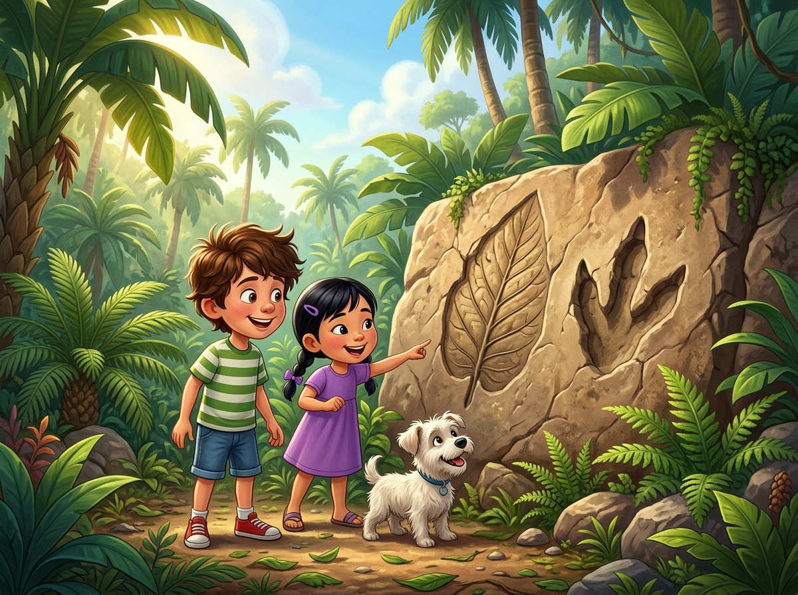
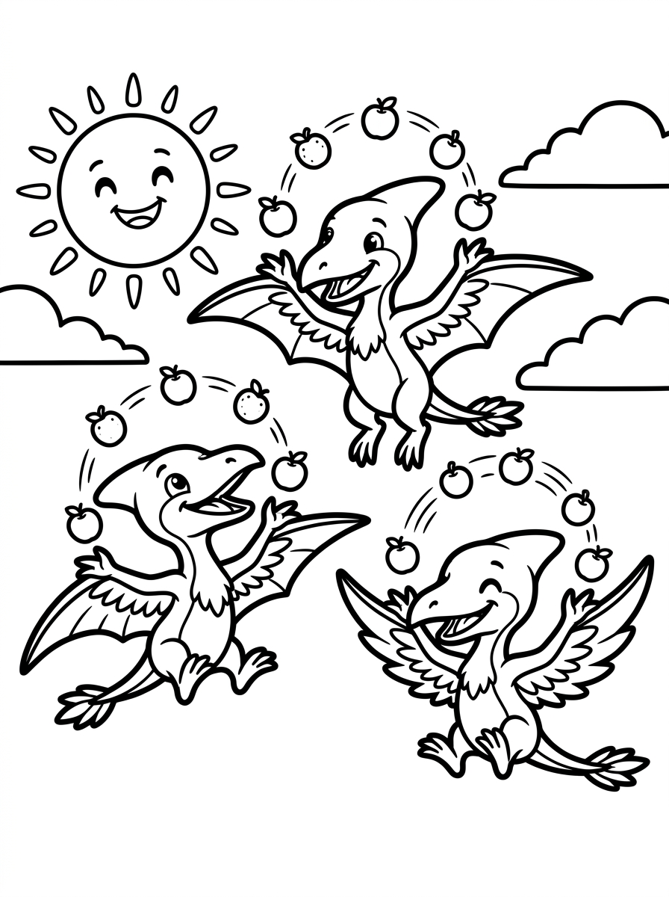
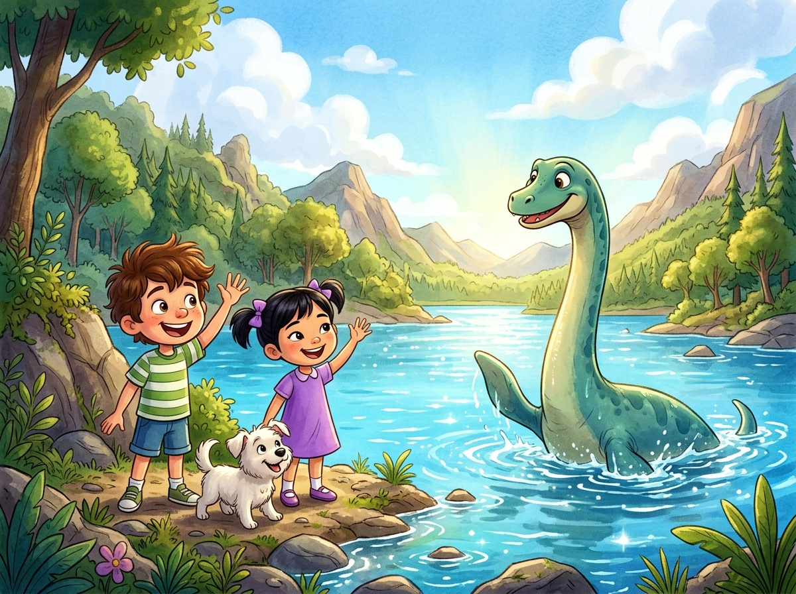
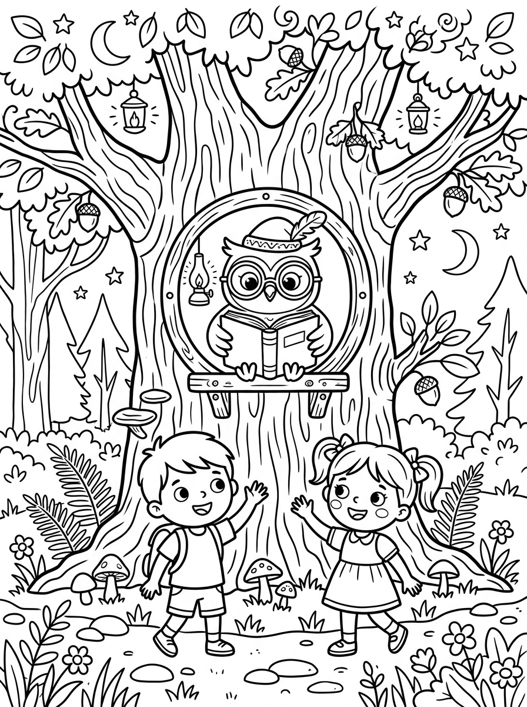
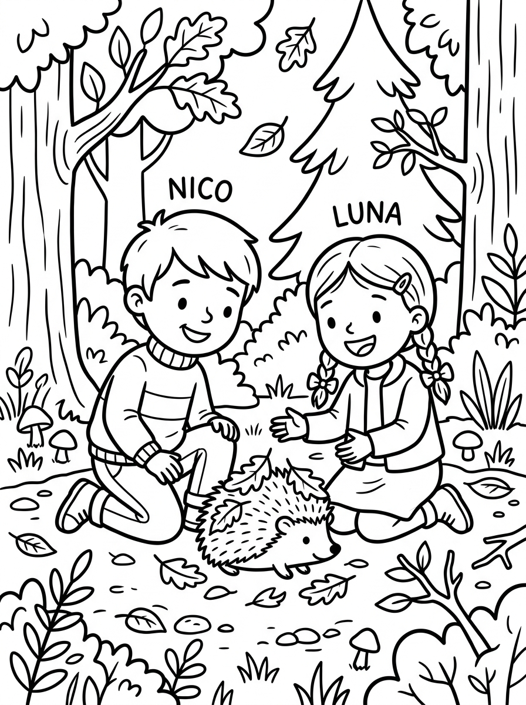

# Capítulo 1: Ficha Inicial y Presentación de la Aventura en el Desierto

---

## [PÁGINA 1: PORTADILLA DE PERTENENCIA]

# LAS AVENTURAS DE NICO Y LUNA

### **Este libro pertenece a la tripulación de:**

__________________________________________________

*¡Que tu viaje por el desierto esté lleno de dunas, oasis y estrellas brillantes!*

---

## [PÁGINA 2: PORTADA INTERIOR]

# LAS AVENTURAS DE NICO Y LUNA
## Aventura en el Desierto Dorado

**Colección:** Las Aventuras de Nico y Luna — Libro 6  
**Escrito e Ilustrado por:** Julio Martín Rodríguez Sánchez  
**Para pequeños lectores y artistas de 4 a 8 años**

---

## [PÁGINA 3: DERECHOS DE AUTOR Y NOTA EDITORIAL]

**Las Aventuras de Nico y Luna: Aventura en el Desierto Dorado**  
© 2026 Julio Martín Rodríguez Sánchez. Todos los derechos reservados.

Queda prohibida la reproducción total o parcial de esta obra por cualquier medio sin la autorización escrita del titular de los derechos de autor.

**Nota para los padres y educadores:**  
Este libro ha sido diseñado para estimular la imaginación, la creatividad y la lectura temprana en niños de 4 a 8 años. Cada capítulo de lectura se separa por portadillas ilustradas y las escenas se presentan con texto en la página izquierda e ilustraciones a página completa en la derecha.

---

## [PÁGINA 4: ¡PREPARADOS PARA EL VIAJE!]

### ¡Hola de nuevo, valiente explorador!

Nico, Luna y Copito están listos para cruzar las dunas y descubrir un oasis de cristal:

- **Nico**: Se ha puesto un pañuelo de desierto de color azul en la cabeza para protegerse del sol y unas gafas de explorador.
- **Luna**: Lleva un traje de aventurera de tonos arena y una mochila ligera con agua mágica.
- **Copito**: Lleva una pequeña cantimplora atada a su arnés y unas simpáticas botitas de tela para no quemarse sus patitas.

¡Hoy cruzaremos dunas cantarinas sobre un camello de peluche que cobra vida con la magia!

> **Instrucción de Coloreado:**  
> Pinta el cielo del desierto con un tono amarillo dorado, dale brillo a las dunas y colorea el turbante de Nico con tu color preferido.

---

## [PÁGINA 5: ILUSTRACIÓN DE BIENVENIDA]

# Capítulo 2: La Expedición en las Dunas Gigantes

---

## [PÁGINA 6: PORTADILLA CAPÍTULO - LA EXPEDICIÓN EN LAS DUNAS GIGANTES]

---

## [PÁGINA 7: ESCENA 1 - EL CAMELLO DE PELUCHE]

En una calurosa tarde de verano, Nico y Luna juegan muy entretenidos sobre la alfombra de su dormitorio. Nico sostiene un pequeño camello de peluche marrón con dos jorobas suaves y unas patitas largas. Luna extiende sobre el suelo un viejo mapa dibujado a mano lleno de pirámides, dunas y oasis de agua de cristal. Copito corretea a su alrededor con su pequeña cantimplora atada al arnés, moviendo la cola con gran alegría al sentir la energía del juego.

El camello de peluche y las mochilas de exploradores están listos para la gran aventura imaginaria del desierto.

> **Texto de Lectura:**  
> —¡Con imaginación, esta habitación se convertirá en el desierto más misterioso del mundo! ¿Listos para cruzar las dunas? —pregunta Nico.

---

## [PÁGINA 8: ILUSTRACIÓN ESCENA 1]

---

## [PÁGINA 9: ESCENA 2 - ¡DESIERTO INFINITO!]

De repente, una misteriosa ráfaga de viento cálido llena de chispas doradas envuelve la habitación. La alfombra de lana se transforma mágicamente en una duna de arena fina y dorada que se extiende hasta el horizonte. El pequeño camello de peluche crece y se convierte en un camello de verdad, fuerte y con una silla de montar decorada con hermosas borlas rojas. Nico y Luna se sujetan fuerte mientras se suben al lomo de su nuevo amigo.

El desierto infinito se extiende frente a ellos bajo un sol brillante y templado que hace brillar la arena.

> **Texto de Lectura:**  
> —¡Mirad, el camello es gigante y la arena brilla como si fuera oro! ¡Vamos a explorar! —grita Luna entusiasmada.

---

## [PÁGINA 10: ILUSTRACIÓN ESCENA 2]

---

## [PÁGINA 11: ESCENA 3 - CAMINANDO POR LA ARENA]

Al descender del camello para estirar las piernas, Nico y Luna sienten la calidez de la arena fina del desierto bajo sus pies. Caminan despacio sobre la cresta de una gran duna, dejando pequeñas huellas que el suave viento borra con delicadeza. El cielo sobre ellos es de un azul profundo que contrasta hermosamente con el dorado infinito del desierto.

Copito corretea feliz por la arena dando vueltas alrededor de las botas de Nico, sintiéndose muy ligero al deslizarse por las laderas suaves de las dunas.

> **Texto de Lectura:**  
> —¡Es increíble! La arena es tan suave como la harina y brilla bajo el sol como si tuviera purpurina —exclama Nico.

---

## [PÁGINA 12: ILUSTRACIÓN ESCENA 3]

---

## [PÁGINA 13: ESCENA 4 - EL CAMELLO DANDI]

Mientras caminan, el camello se acerca de forma cariñosa y les da un suave empujón con su hocico húmedo. Es Dandi, el camello más simpático y juguetón del desierto dorado. Dandi lleva un turbante azul en su cabeza que le hace ver muy gracioso. Dandi se agacha despacio doblando sus rodillas para que los niños puedan subir fácilmente a sus jorobas sin cansarse.

Nico y Luna acarician el suave cuello de Dandi, dándole un dulce dátil como premio por ser tan buen amigo y guía.

> **Texto de Lectura:**  
> —¡Gracias, Dandi! Eres el camello más bueno y elegante de todo el desierto. ¡Vamos a seguir el viaje! —dice Luna.

---

## [PÁGINA 14: ILUSTRACIÓN ESCENA 4]

---

## [PÁGINA 15: ESCENA 5 - LAS DUNAS CANTARINAS]

Dandi los guía hacia un impresionante desfiladero formado por dos enormes dunas de arena roja. Al pasar el viento suave entre las crestas de las dunas, se produce un hermoso y misterioso sonido que suena como el murmullo de un coro de flautas lejanas. Son las famosas dunas cantarinas del desierto. Nico y Luna escuchan en silencio esta increíble melodía de la naturaleza, meciéndose al compás del paso lento de Dandi.

Copito se asoma curioso por encima de la silla de montar, moviendo las orejitas al ritmo del suave silbido.

> **Texto de Lectura:**  
> —¡Escuchad! Parece que la arena nos canta una canción de bienvenida. ¡El desierto está lleno de música! —dice Nico emocionado.

---

## [PÁGINA 16: ILUSTRACIÓN ESCENA 5]

# Capítulo 3: El Oasis del Agua de Cristal y el Espejismo

---

## [PÁGINA 17: PORTADILLA CAPÍTULO - EL OASIS DEL AGUA DE CRISTAL Y EL ESPEJISMO]

---

## [PÁGINA 18: ESCENA 6 - EL ZORRO ZORI]

Al salir del desfiladero, un pequeño animal de pelaje color arena y unas orejas gigantescas sale a saludarlos desde detrás de una roca lisa. Es Zori, un adorable zorro del desierto (fénec) que se presenta dando saltos graciosos en la arena. Zori mueve su cola esponjosa y da vueltas rápidas en círculos, feliz de encontrar nuevos amigos. Se ofrece a guiarlos a través del laberinto de dunas hacia el oasis secreto.

Nico y Luna se acercan despacio, admirando las enormes orejas de Zori que le ayudan a escuchar todos los sonidos lejanos de la arena.

> **Texto de Lectura:**  
> —¡Hola, Zori! Qué orejitas tan graciosas tienes. ¿Nos acompañas a buscar el estanque de cristal? —pregunta Luna.

---

## [PÁGINA 19: ILUSTRACIÓN ESCENA 6]

---

## [PÁGINA 20: ESCENA 7 - EL ESPEJISMO DE PALMERAS]

Mientras siguen a Zori por el desierto, Nico y Luna ven a lo lejos un hermoso estanque rodeado de grandes palmeras cargadas de dátiles. Sin embargo, al acercarse, el estanque parece flotar en el aire y desaparece suavemente como por arte de magia. Zori les explica con un pequeño ladrido que se trata de un espejismo, un divertido truco que hace el sol caliente sobre la arena brillante.

Nico y Luna se ríen de la travesura del desierto, sabiendo que el verdadero oasis está muy cerca gracias al olfato de Zori.

> **Texto de Lectura:**  
> —¡Vaya! Las palmeras flotantes han desaparecido. El desierto juega al escondite con nosotros —dice Nico sonriendo.

---

## [PÁGINA 21: ILUSTRACIÓN ESCENA 7]

---

## [PÁGINA 22: ESCENA 8 - EL HALCÓN CANTOR]

De repente, un gran halcón de plumas doradas y grises aterriza majestuosamente sobre una rama seca de un viejo árbol del desierto. Es Halcón, el cantor más famoso de las dunas. Con su potente voz, emite una hermosa melodía que guía a los viajeros a través del laberinto de arena. El halcón bate sus alas con orgullo en señal de saludo, marcando el camino exacto hacia la entrada secreta del oasis.

Nico y Luna agradecen la ayuda del halcón, disfrutando de su majestuoso vuelo que se recorta contra el cielo.

> **Texto de Lectura:**  
> —¡Siga el canto del halcón! Sus notas musicales vuelan alto sobre la arena del desierto —dice Luna muy contenta.

---

## [PÁGINA 23: ILUSTRACIÓN ESCENA 8]

---

## [PÁGINA 24: ESCENA 9 - EL OASIS DE CRISTAL]

Siguiendo al zorro Zori y al canto del halcón, llegan a un hermoso estanque rodeado de altas palmeras y flores del desierto: el Oasis del Agua de Cristal. En el centro del oasis, el agua fresca brilla con un tono azulado y suave. Al acercarse Nico y Luna, el agua comienza a brillar con destellos luminosos bajo los primeros rayos de las estrellas, revelando una frescura mágica en medio de la arena caliente.

Nico, Luna y Copito beben el agua fresca del estanque, sintiendo cómo recuperan sus fuerzas al instante.

> **Texto de Lectura:**  
> —¡Es precioso! Este oasis es como un tesoro escondido entre dunas de arena gigante —susurra Luna feliz.

---

## [PÁGINA 25: ILUSTRACIÓN ESCENA 9]

---

## [PÁGINA 26: ESCENA 10 - EL REGALO DE LA JARRA]

En agradecimiento por cuidar del oasis y respetar la naturaleza, una hermosa jarra de cristal de bordes dorados flota suavemente sobre el agua. Nico y Luna la llenan con el agua fresca del oasis. Al contacto con la arena, la jarra proyecta una luz dorada y protectora que crea una suave brisa fresca a su alrededor, protegiéndolos del viento cálido del desierto y dándoles energía.

Nico y Luna guardan la jarra de cristal con mucho cuidado en su mochila de exploradores, listos para continuar.

> **Texto de Lectura:**  
> —¡Gracias, hermoso oasis! Tu agua fresca y luminosa nos acompañará de regreso a casa —dice Luna sonriendo.

---

## [PÁGINA 27: ILUSTRACIÓN ESCENA 10]

# Capítulo 4: Las Estrellas Fugaces y la Alfombra Mágica

---

## [PÁGINA 28: PORTADILLA CAPÍTULO - LAS ESTRELLAS FUGACES Y LA ALFOMBRA MÁGICA]

---

## [PÁGINA 29: ESCENA 11 - RODANDO POR LA ARENA]

Al salir del oasis con la jarra de cristal llena de agua luminosa, Nico, Luna y Zori deciden divertirse un rato en una duna de arena suave. Suben hasta la cima más alta y se dejan rodar hacia abajo dando vueltas lentas y divertidas sobre la arena tibia, que no quema gracias a la brisa fresca de la jarra. Copito se desliza tras ellos dando pequeños saltos y ladrando de alegría mientras la arena dorada vuela a su paso.

Dandi los mira desde abajo con una gran sonrisa de camello, moviendo su cabeza al ver las volteretas divertidas de sus amigos.

> **Texto de Lectura:**  
> —¡Mirad cómo rodamos! Deslizarse por la arena es el juego más divertido del desierto —dice Luna riendo.

---

## [PÁGINA 30: ILUSTRACIÓN ESCENA 11]

---

## [PÁGINA 31: ESCENA 12 - EL ESCARABAJO DORADO]

En la entrada de una pequeña cueva de piedra dorada, los amigos se encuentran con un escarabajo de caparazón brillante que brilla como un trozo de oro. Es Escarbi, el escarabajo malabarista del desierto. Escarbi mueve sus patitas a gran velocidad, haciendo malabares en el aire con pequeñas piedras redondas de colores que brillan con luz propia. Nico y Luna le acompañan aplaudiendo y animando cada uno de sus difíciles trucos bajo el atardecer.

Escarbi hace una graciosa reverencia al final de su actuación, moviendo sus antenas con mucho orgullo.

> **Texto de Lectura:**  
> —¡Es fantástico! Tus trucos de magia hacen brillar la tarde del desierto con diversión —dice Nico aplaudiendo.

---

## [PÁGINA 32: ILUSTRACIÓN ESCENA 12]

---

## [PÁGINA 33: ESCENA 13 - EL CIELO ESTRELLADO]

Al caer la noche sobre el desierto, el cielo se cubre por completo de miles de estrellas brillantes que iluminan la arena con destellos plateados. Nico, Luna y Copito se tumban de espaldas sobre una duna de arena templada, contemplando el asombroso espectáculo de constelaciones y estrellas fugaces que cruzan el cielo silencioso. Zori se acurruca junto a Luna, mientras Dandi descansa tranquilo.

La inmensidad del cielo nocturno del desierto les hace sentir protegidos y en paz, rodeados de la magia del universo.

> **Texto de Lectura:**  
> —¡Es precioso! Las estrellas fugaces parecen trazar caminos de plata en la noche —susurra Luna maravillada.

---

## [PÁGINA 34: ILUSTRACIÓN ESCENA 13]

---

## [PÁGINA 35: ESCENA 14 - LA ALFOMBRA MÁGICA]

Para ayudarles a regresar a casa antes del amanecer, Dandi y Zori los llevan ante una gran roca donde descansa una hermosa alfombra tejida con hilos de colores y flecos dorados. Al colocarse los niños sobre ella, la alfombra comienza a flotar suavemente en el aire. Es la alfombra mágica del desierto, el medio de transporte más veloz y divertido de las dunas. Nico y Luna se sujetan fuerte mientras la alfombra asciende despacio.

Copito se sienta en medio de la alfombra, sintiendo el viento fresco de la noche en sus orejitas.

> **Texto de Lectura:**  
> —¡Sujetaos bien! ¡La alfombra mágica nos llevará de regreso volando sobre las dunas! —grita Nico con emoción.

---

## [PÁGINA 36: ILUSTRACIÓN ESCENA 14]

---

## [PÁGINA 37: ESCENA 15 - LA DESPEDIDA DEL DESIERTO]

Al flotar la alfombra mágica cerca del cielo de la noche, el camello Dandi, el zorro Zori, el halcón cantor y el escarabajo Escarbi se reúnen en la cima de una gran duna para despedirse. A través del viento fresco, se envían besos y agitan sus patitas y alas con mucho cariño. Prometen volver a encontrarse muy pronto para explorar nuevos rincones del desierto dorado. Dandi les da un último guiño amistoso.

Este maravilloso viaje por las dunas les recordará siempre la fantástica amistad que nació bajo las estrellas.

> **Texto de Lectura:**  
> —¡Gracias por todo, amigos! ¡Hasta la próxima aventura en el desierto dorado! —gritan Nico y Luna despidiéndose.

---

## [PÁGINA 38: ILUSTRACIÓN ESCENA 15]

# Capítulo 5: El Regreso al Hogar y Dulces Sueños

---

## [PÁGINA 39: PORTADILLA CAPÍTULO - EL REGRESO AL HOGAR Y DULCES SUEÑOS]

---

## [PÁGINA 40: ESCENA 16 - EL VIAJE DE REGRESO]

La alfombra mágica se desplaza a gran velocidad por el cielo nocturno del desierto, meciéndose suavemente entre nubes delgadas y blancas. El viento de la noche es fresco y acaricia los rostros de Nico y Luna, quienes miran con asombro las dunas doradas que van quedando atrás como olas de arena en silencio. En la mochila de exploradores, la jarra de cristal emite una luz cálida y brillante que guía la alfombra hacia la ventana de su hogar.

Poco a poco, las luces del desierto se desvanecen en la lejanía y el cielo se tiñe de un tono azul familiar.

> **Texto de Lectura:**  
> —¡Sujetaos bien, tripulación! ¡La alfombra nos lleva de vuelta a nuestra ventana! —anuncia el capitán Nico con orgullo.

---

## [PÁGINA 41: ILUSTRACIÓN ESCENA 16]

---

## [PÁGINA 42: ESCENA 17 - EL REGRESO A LA HABITACIÓN]

Con un ligerísimo y mágico *¡plop!* de flecos, Nico, Luna y Copito aparecen flotando y se sientan suavemente en la alfombra verde de su dormitorio. A través de la ventana abierta, se filtran las primeras luces del amanecer que tiñen el cuarto de unos hermosos colores dorados y violetas. Copito corretea feliz sacudiéndose las pequeñas motas de arena imaginaria del desierto, ladrando de alegría por estar de vuelta en el hogar.

Nico y Luna se miran sonriendo, cansados pero muy contentos de estar de nuevo en sus camitas cómodas.

> **Texto de Lectura:**  
> —¡Qué viaje tan maravilloso! Pero qué bien se siente estar en nuestra camita —dice Luna abrazando a Copito con cariño.

---

## [PÁGINA 43: ILUSTRACIÓN ESCENA 17]

---

## [PÁGINA 44: ESCENA 18 - EL BRILLO DE LA JARRA]

Antes de cerrar los ojos para descansar, Luna coloca con mucho cuidado la hermosa jarra de cristal dorada que trajeron del oasis sobre la repisa de su ventana. Enseguida, el agua fresca de su interior comienza a brillar con un resplandor dorado y cálido, proyectando en las paredes del cuarto siluetas de camellos, dunas meciéndose y estrellas de mar que parecen flotar en el techo en silencio.

Nico y Luna contemplan este maravilloso mapa de arena desde sus camas, sintiendo que el desierto los abraza con su luz.

> **Texto de Lectura:**  
> —¡Es mágico! Los recuerdos de nuestros amigos del desierto velan por nuestra noche con cariño —susurra Luna sonriendo.

---

## [PÁGINA 45: ILUSTRACIÓN ESCENA 18]

---

## [PÁGINA 46: ESCENA 19 - SUEÑOS DEL DESIERTO]

Los pesados párpados de los pequeños exploradores se van cerrando muy despacito. En el dulce mundo de los sueños, Nico y Luna continúan su fantástico viaje flotando libremente entre dunas cantarinas, camellos con turbante y zorros del desierto que les saludan con sus grandes orejas. Saben muy bien que al amanecer les esperarán mil juegos nuevos en el jardín, pero ahora es momento de dejar volar la imaginación y descansar.

Copito da pequeños suspiros de felicidad a los pies de la cama, soñando tal vez con estrellas fugaces de cristal.

> **Texto de Lectura:**  
> Duerme en paz, pequeño aventurero. El desierto y sus misterios velan por tus hermosos sueños —susurra una voz misteriosa.

---

## [PÁGINA 47: ILUSTRACIÓN ESCENA 19]

---

## [PÁGINA 48: ESCENA 20 - AMANECER CON SONRISAS]

Al brillar los primeros y cálidos rayos de sol de la mañana, Nico y Luna se despiertan con mucha energía y sonrisas en sus rostros. Se estiran y miran hacia el camello de peluche del dormitorio, recordando con emoción el concierto de las dunas cantarinas y al zorro Zori. Saben que el desierto es gigante y guarda misterios hermosos, pero su amistad y su imaginación son la aventura más bonita de todas.

Copito entra corriendo en el cuarto con el mapa del tesoro en la boca, listo para un nuevo día de travesuras.

> **Texto de Lectura:**  
> —¡Buenos días! Cada nuevo amanecer trae un desierto entero de oportunidades para jugar y ser felices —dice Nico muy alegre.

---

## [PÁGINA 49: ILUSTRACIÓN ESCENA 20]

# Capítulo 6: Actividades y Juegos del Desierto Mágico

---

## [PÁGINA 50: PORTADILLA CAPÍTULO - ACTIVIDADES Y JUEGOS DEL DESIERTO MÁGICO]

---

## [PÁGINA 51: ACTIVIDAD 1 - BUSCA, CUENTA Y COLOREA EL DESIERTO MÁGICO]

### 🧩 ¡Busca, Cuenta y Colorea!

Observa el dibujo y cuenta cuántos elementos del desierto encuentras en el oasis. Escribe el número en los círculos y colorea la escena.

---

## [PÁGINA 52: ACTIVIDAD 2 - BUSCA LAS 5 DIFERENCIAS]

### 🔍 ¡Encuentra las 5 diferencias!

Observa las dos escenas del pequeño zorro Zori durmiendo bajo una palmera. ¿Puedes encontrar los 5 detalles cambiados en el dibujo de la derecha?

- [ ] 1. La estrella de mar en el cielo nocturno.
- [ ] 2. La duna en la roca de fondo.
- [ ] 3. Las rayas del tronco de la palmera.
- [ ] 4. El helecho pequeño a la derecha.
- [ ] 5. La sonrisa del halcón de fondo.

---

## [PÁGINA 53: ACTIVIDAD 3 - CONECTA LOS PUNTOS]

### ✏️ ¡Une los puntos del 1 al 20!

Descubre qué majestuoso y cantarín amigo de las dunas se esconde aquí.  
Une los números en orden y luego... ¡coloréalo con tus colores preferidos!

`1 - 2 - 3 - 4 - 5 - 6 - 7 - 8 - 9 - 10 - 11 - 12 - 13 - 14 - 15 - 16 - 17 - 18 - 19 - 20`

---

## [PÁGINA 54: ACTIVIDAD 4 - DIBUJO Y CREATIVIDAD LIBRE]

### 🎨 ¡Diseña tu propia Alfombra Mágica!

En este espacio en blanco, utiliza tu imaginación para dibujar una alfombra mágica o un oasis con el que explorar el desierto dorado.

**¿Cómo se llama tu alfombra o oasis?**: ______________________________________  
**¿Qué adorno o poder mágico tiene?**: ________________________________________

# Capítulo 7: Próxima Aventura, Juegos Adicionales y Soluciones

---

## [PÁGINA 55: PORTADILLA CAPÍTULO - SOLUCIONES Y AVANCE DEL SIGUIENTE LIBRO]

---

## [PÁGINA 56: AVANCE DEL SIGUIENTE LIBRO DE LA COLECCIÓN]

### ⛄ ¡Próxima Aventura!

### LAS AVENTURAS DE NICO Y LUNA — LIBRO 7
## Aventura en las Montañas Nevadas

Nico, Luna y Copito viajan al corazón de unas montañas nevadas llenas de pinos congelados y lagos de hielo.  
Conocerán a un muñeco de nieve simpático llamado Copito de Hielo que adora bailar, a un zorro ártico de pelaje blanco y ayudarán a buscar la estrella de cristal de la cueva congelada.

> **¡Consigue el Libro 7 de la colección en Amazon KDP!**

---

## [PÁGINA 57: ACTIVIDAD 5 - SOPA DE LETRAS MÁGICA]

### 🧩 Encuentra las 5 palabras ocultas del desierto en esta sopa de letras.

Las palabras que debes buscar son: **DUNAS**, **OASIS**, **ARENA**, **LUNA** y **NICO**. ¡Diviértete!

---

## [PÁGINA 58: ACTIVIDAD 6 - CONECTA LAS SOMBRAS DEL DESIERTO]

### 🧩 Une con una línea la alfombra voladora de la izquierda con su sombra correcta a la derecha.

Observa muy bien las borlas, los flecos y la forma de la alfombra mágica.

---

## [PÁGINA 59: SOLUCIONARIO DE ACTIVIDADES]

### 💡 Soluciones de los Juegos

- **Página 51 (Busca y Cuenta):** Encontraste 3 Camellos (🐫), 2 Zorros Fénec (🦊) y 4 Palmeras (🌴).
- **Página 52 (Diferencias):** 1. La estrella de mar en el cielo; 2. La duna en el fondo; 3. Las rayas del tronco; 4. El helecho pequeño; 5. La sonrisa del halcón.
- **Página 53 (Conecta Puntos):** ¡Es el majestuoso Oasis del Agua de Cristal!
- **Página 57 (Sopa de Letras):** Las palabras están ocultas en horizontal.
- **Página 58 (Conecta las Sombras):** La sombra correcta es la opción **B**.

---

## [PÁGINA 60: ¡MUCHAS GRACIAS EXPLORADOR!]

¡Gracias por leer y colorear con nosotros en esta emocionante aventura en el desierto dorado!  

Si te ha gustado explorar las dunas junto a Nico, Luna y Copito, te agradeceríamos enormemente si pudieras dedicarnos un minuto para dejarnos una opinión en Amazon. ¡Nos ayuda muchísimo a seguir creando libros llenos de ilusión y color!
