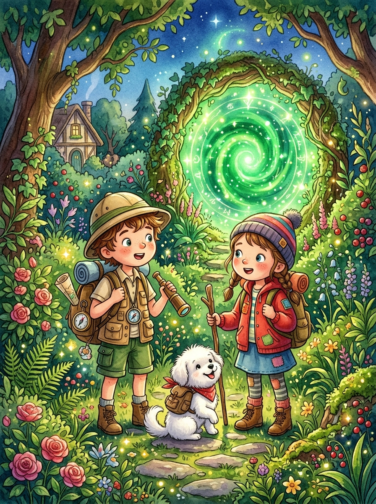

# Capítulo 2: La Expedición en la Montaña de 7 Colores

---

## [PÁGINA 6: PORTADILLA CAPÍTULO - LA EXPEDICIÓN EN LA MONTAÑA DE 7 COLORES]

---

## [PÁGINA 7: ESCENA 1 - LA ALPACA DE PELUCHE]

En una tarde templada de verano, Nico y Luna juegan muy contentos sobre la alfombra de su dormitorio. Nico sostiene una pequeña alpaca de peluche marrón con lana muy suave y borlas rojas en las orejas. Luna extiende sobre el suelo un gran mapa de Perú que muestra la ciudad imperial de Cusco y las cumbres de los Andes. Copito da pequeños saltos a su alrededor con su gorrito de lana chullo, moviendo la cola entusiasmado al sentir la magia del juego que está a punto de comenzar.

La alpaca de juguete y los chullos de lana están listos para la gran expedición imaginaria a la cordillera.

> **Texto de Lectura:**  
> —¡Con imaginación, esta habitación se convertirá en los valles más altos de Perú! ¿Listos para cruzar los Andes? —pregunta Nico.

---

## [PÁGINA 8: ILUSTRACIÓN ESCENA 1]

---

## [PÁGINA 9: ESCENA 2 - ¡BIENVENIDOS A CUSCO!]

De repente, una ráfaga de viento fresco llena de chispas de colores envuelve la habitación. La alfombra de lana se transforma mágicamente en una calle empedrada rodeada de grandes muros de piedra tallada. Se encuentran en la maravillosa ciudad de Cusco, rodeados de tejados rojos y balcones de madera tallada. El pequeño peluche de la alpaca crece y cobra vida, convirtiéndose en una alpaca real de pelaje suave y ojos tiernos.

Nico y Luna miran asombrados los hermosos muros de piedra que encajan perfectamente sin cemento, sintiendo el aire limpio de la ciudad imperial.

> **Texto de Lectura:**  
> —¡Mirad, la alpaca está viva y las calles son mágicas! ¡Vamos a explorar Cusco! —grita Luna llena de emoción.

---

## [PÁGINA 10: ILUSTRACIÓN ESCENA 2]

---

## [PÁGINA 11: ESCENA 3 - PASEANDO ENTRE MUROS INCAS]

Caminando por las cuestas empedradas de la ciudad imperial, Nico y Luna tocan con cuidado los muros incas. Acarician la famosa piedra de los doce ángulos, maravillándose de cómo las piedras encajan como piezas de un puzzle gigante. La gente del pueblo los saluda con una sonrisa, vistiendo coloridos trajes tradicionales tejidos a mano con lana de oveja y alpaca.

Copito corretea muy alegre sobre las piedras, dando pequeños saltos y olfateando las flores de cantuta de color rojo y amarillo que decoran las ventanas coloniales.

> **Texto de Lectura:**  
> —¡Es impresionante! Estos muros son tan fuertes que han aguantado cientos de años. ¡Mira esta piedra gigante, Luna! —exclama Nico.

---

## [PÁGINA 12: ILUSTRACIÓN ESCENA 3]

---

## [PÁGINA 13: ESCENA 4 - LA ALPACA PACO]

Mientras caminan, la tierna alpaca se acerca dando pequeños saltos y les empuja suavemente con su hocico de lana. Es Paco, la alpaca más simpática y juguetona de los Andes peruanos. Paco lleva un collar de borlas de colores rojo, verde y amarillo. Paco se agacha despacio doblando sus patitas para que los niños puedan subir cómodamente a su lomo lanudo y abrigado para comenzar el ascenso a las montañas.

Nico y Luna acarician el suave cuello de Paco, dándole un puñado de hierba fresca andina como premio por su amistad.

> **Texto de Lectura:**  
> —¡Gracias, Paco! Eres la alpaca más buena y lanuda de todo el Perú. ¡Guíanos hacia las montañas altas! —dice Luna.

---

## [PÁGINA 14: ILUSTRACIÓN ESCENA 4]

---

## [PÁGINA 15: ESCENA 5 - EL ASCENSO A LOS ANDES]

Paco la alpaca los guía en un maravilloso camino de ascenso hacia las cumbres de los Andes. El aire se vuelve fresco y puro mientras suben por el sendero rodeado de grandes picos con cumbres cubiertas de nieve perpetua. A lo lejos, divisan grupos de vicuñas salvajes que corren libres por el prado andino. Nico y Luna se abrigan con sus ponchos de lana, disfrutando de la inmensidad del paisaje de las montañas peruanas.

Copito viaja muy abrigado sobre el lomo lanudo de Paco, mirando con ojos muy abiertos los picos blancos.

> **Texto de Lectura:**  
> —¡Es impresionante! Estamos muy arriba y el cielo parece estar al alcance de la mano. ¡Sujetaos fuerte, amigos! —dice Nico.

---

## [PÁGINA 16: ILUSTRACIÓN ESCENA 5]

