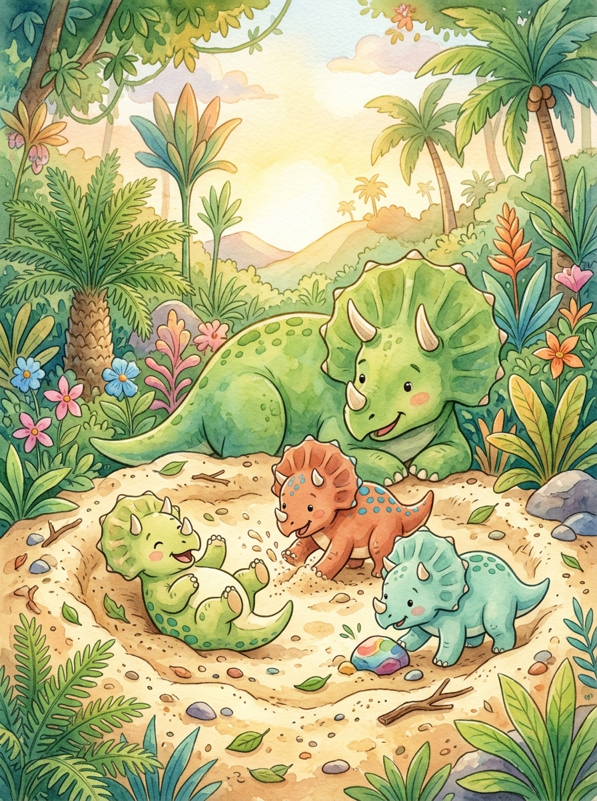
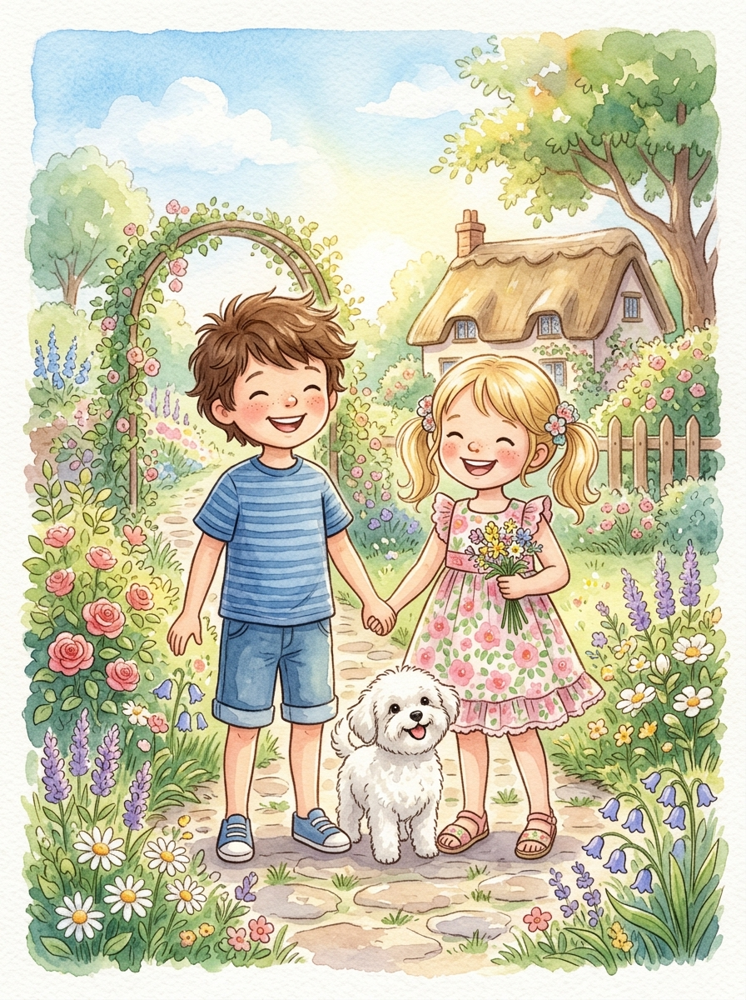
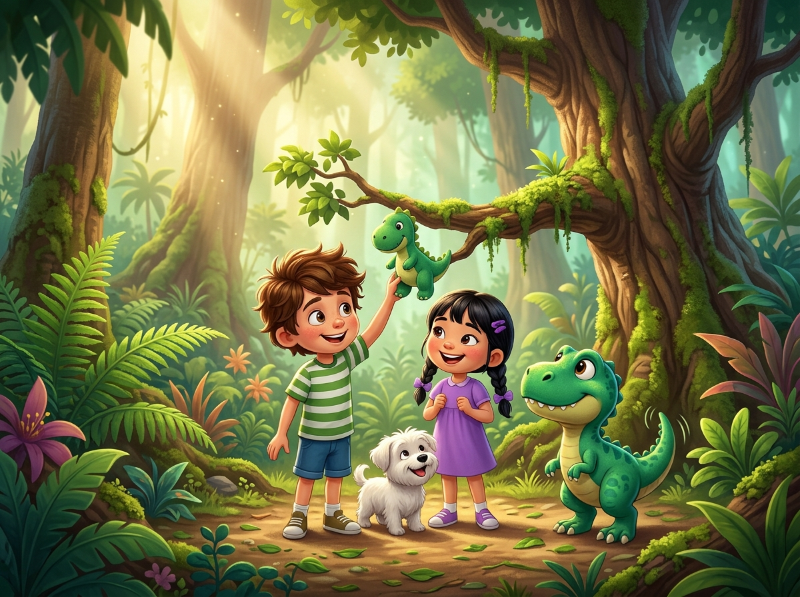
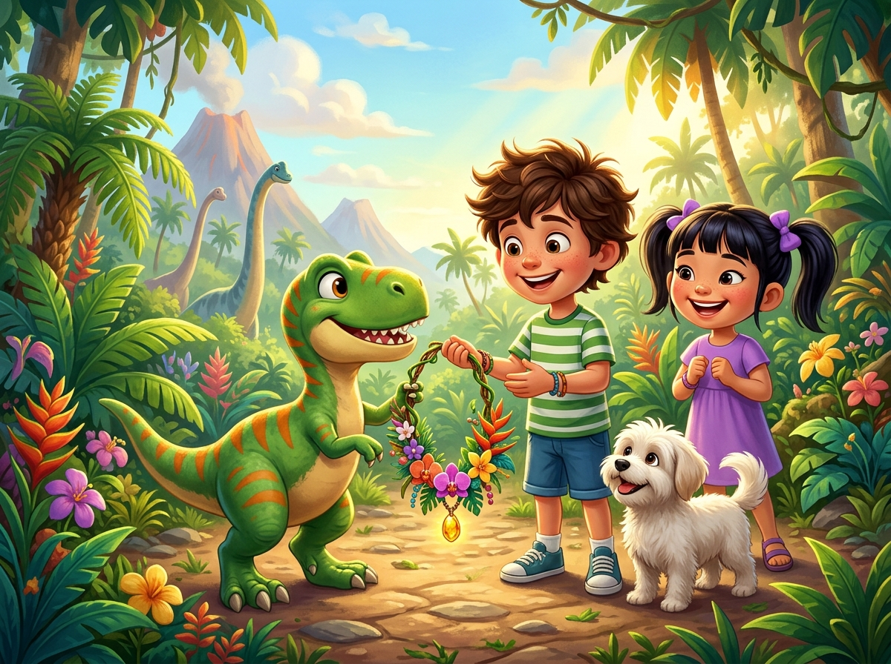
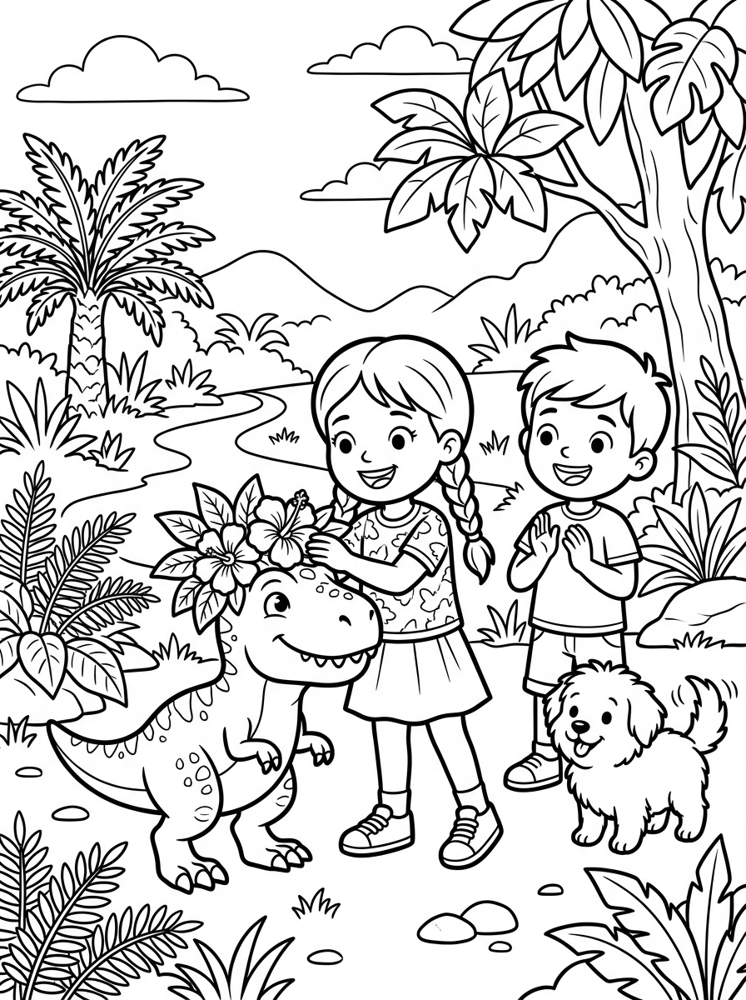

# Capítulo 1: Ficha Inicial y Presentación de la Aventura en el Castillo de España

---

## [PÁGINA 1: PORTADILLA DE PERTENENCIA]

# LAS AVENTURAS DE NICO Y LUNA

### **Este libro pertenece a la tripulación de:**

__________________________________________________

*¡Que tu viaje por el castillo medieval de España esté lleno de caballeros, dragones y coronas brillantes!*

---

## [PÁGINA 2: PORTADA INTERIOR]

# LAS AVENTURAS DE NICO Y LUNA
## Aventura en el Castillo

**Colección:** Las Aventuras de Nico y Luna — Libro 8  
**Escrito e Ilustrado por:** Julio Martín Rodríguez Sánchez  
**Para pequeños lectores y artistas de 4 a 8 años**

---

## [PÁGINA 3: DERECHOS DE AUTOR Y NOTA EDITORIAL]

**Las Aventuras de Nico y Luna: Aventura en el Castillo**  
© 2026 Julio Martín Rodríguez Sánchez. Todos los derechos reservados.

Queda prohibida la reproducción total o parcial de esta obra por cualquier medio sin la autorización escrita del titular de los derechos de autor.

**Nota para los padres y educadores:**  
Este libro ha sido diseñado para estimular la imaginación, la creatividad y la lectura temprana en niños de 4 a 8 años. Cada capítulo de lectura a color se separa por portadillas ilustradas y las escenas se presentan con texto en la página izquierda e ilustraciones a página completa en la derecha.

---

## [PÁGINA 4: ¡PREPARADOS PARA EL VIAJE MEDIEVAL!]

### ¡Hola de nuevo, valiente caballero!

Nico, Luna y Copito están listos para cruzar las murallas de piedra y descubrir una corona brillante:

- **Nico**: Se ha colocado una corona de cartón de color dorado brillante en la cabeza y sostiene un escudo de juguete.
- **Luna**: Lleva una capa de terciopelo de color rojo brillante y un cinturón con una llave de madera antigua.
- **Copito**: Lleva una pequeña bufanda roja y una corona minúscula que le tapa sus orejitas esponjosas de perrito explorador.

¡Hoy cruzaremos puentes levadizos y subiremos a la torre más alta en un castillo de España!

> **Instrucción de Coloreado:**  
> Pinta las murallas del castillo de color gris piedra, dale brillo a la corona dorada de Nico y colorea la capa de Luna con tu color preferido.

---

## [PÁGINA 5: ILUSTRACIÓN DE BIENVENIDA]

# Capítulo 2: La Expedición en la Fortaleza de Piedra

---

## [PÁGINA 6: PORTADILLA CAPÍTULO - LA EXPEDICIÓN EN LA FORTALEZA]

---

## [PÁGINA 7: ESCENA 1 - EL CASTILLO DE JUGUETE]

En una calurosa tarde, Nico y Luna juegan muy entretenidos sobre la alfombra de su dormitorio. Nico sostiene un pequeño castillo de plástico gris con torres redondas y almenas por donde asomarse. Luna extiende sobre el suelo un viejo mapa dibujado a mano lleno de fosos de agua, dragones y torres altas con banderas rojas. Copito corretea a su alrededor con su pequeña bufanda, moviendo la cola entusiasmado al sentir la magia del juego que está a punto de comenzar.

El castillo de juguete y los escudos de cartón están listos para la gran expedición imaginaria al pasado de España.

> **Texto de Lectura:**  
> —¡Con imaginación, esta habitación se convertirá en el castillo más grande e impresionante del mundo! ¿Listos para cruzar el puente? —pregunta Nico.

---

## [PÁGINA 8: ILUSTRACIÓN ESCENA 1]

---

## [PÁGINA 9: ESCENA 2 - ¡LA FORTALEZA GIGANTE!]

De repente, una misteriosa ráfaga de viento fresco llena de chispas de colores envuelve la habitación. La alfombra verde se transforma mágicamente en un foso de agua limpia y verde que rodea un castillo de piedra real. Las murallas de piedra gris se elevan altas hasta las nubes, coronadas por banderas rojas que ondean alegres al viento. Nico y Luna se sujetan fuerte mientras caminan sobre el puente levadizo que baja suavemente para darles paso.

El gran castillo de Loarre se extiende majestuoso ante ellos bajo un cielo azul y templado.

> **Texto de Lectura:**  
> —¡Mirad, las murallas son gigantes y las banderas ondean al viento! ¡Vamos a explorar el castillo! —grita Luna llena de emoción.

---

## [PÁGINA 10: ILUSTRACIÓN ESCENA 2]

---

## [PÁGINA 11: ESCENA 3 - CRUZANDO EL PUENTE LEVADIZO]

Al caminar por encima del gran puente de madera gruesa y cadenas de hierro, Nico y Luna sienten la fuerza de la fortaleza medieval. Las piedras de la muralla están cubiertas de hiedra verde y pequeñas flores amarillas que crecen entre las grietas. Desde lo alto, divisan el foso de agua limpia donde juegan simpáticos pececitos de colores a esconderse bajo los reflejos de las nubes.

Copito camina al frente muy valiente sobre las tablas de madera, olfateando cada rincón con gran curiosidad y moviendo la cola muy contento al entrar por la gran puerta de hierro.

> **Texto de Lectura:**  
> —¡Es impresionante! Este puente de madera nos lleva directos a la plaza de armas. ¡Mirad qué altos son los muros! —exclama Nico.

---

## [PÁGINA 12: ILUSTRACIÓN ESCENA 3]

---

## [PÁGINA 13: ESCENA 4 - EL DRAGONCITO LOLO]

Mientras avanzan por el patio de armas, de un barril de madera sale a saludarlos un pequeño dragoncito de color verde esmeralda brillante. Se presenta dando saltos alegres y soplando pompas de jabón de muchos colores. Es Lolo, el dragoncito más bueno y juguetón del castillo de España. Lolo no echa fuego, sino pompas de jabón que flotan en el aire y estallan en pequeñas gotas perfumadas.

Nico y Luna ríen a carcajadas con las pompas de jabón que echa Lolo, mientras Copito salta intentando atraparlas con su hocico.

> **Texto de Lectura:**  
> —¡Hola, Lolo! Eres el dragón más divertido y cariñoso del mundo. ¿Nos enseñas dónde se esconde la corona? —pregunta Luna.

---

## [PÁGINA 14: ILUSTRACIÓN ESCENA 4]

---

## [PÁGINA 15: ESCENA 5 - LOS CABALLITOS DE MADERA]

Lolo los guía hacia el patio de entrenamiento donde descansan unos hermosos caballitos de madera pintados de colores brillantes con ruedas. Nico y Luna se suben a ellos y, gracias a la magia de Lolo, los caballitos comienzan a trotar suavemente sobre el césped como si corrieran en un carrusel de feria. Sostienen pequeñas lanzas de juguete y escudos decorados con dibujos de leones y castillos de España.

Nico y Luna juegan a ser valientes caballeros andantes en el patio, divirtiéndose de forma muy alegre con sus amigos.

> **Texto de Lectura:**  
> —¡Trota, trota, caballito! Somos los caballeros más valientes y alegres del patio de armas. ¡A explorar! —grita Nico.

---

## [PÁGINA 16: ILUSTRACIÓN ESCENA 5]

# Capítulo 3: El Misterio de la Corona Perdida

---

## [PÁGINA 17: PORTADILLA CAPÍTULO - EL MISTERIO DE LA CORONA PERDIDA]

---

## [PÁGINA 18: ESCENA 6 - EL CABALLERO DON QUIJOTE]

Al entrar en el gran salón del castillo, un caballero de juguete con una armadura plateada brillante y lanza de madera cobra vida y les saluda inclinando su cabeza de forma muy cortés. Es Don Quijote, el caballero andante más valiente y divertido del castillo de España. Don Quijote viste una armadura plateada reluciente y un escudo con un león rojo de juguete pintado a mano.

El caballero andante se presenta haciendo una reverencia graciosa, ofreciéndose a acompañarles en su búsqueda por los salones de piedra.

> **Texto de Lectura:**  
> —¡Saludos, valientes jóvenes exploradores! Buscad en la torre más alta para encontrar el gran tesoro —dice Don Quijote.

---

## [PÁGINA 19: ILUSTRACIÓN ESCENA 6]

---

## [PÁGINA 20: ESCENA 7 - EL LABERINTO DE TAPICES]

Don Quijote y Lolo los guían hacia el salón del trono, cuyas paredes están cubiertas de inmensos tapices tejidos con hilos de oro y plata. Los tapices muestran espectaculares dibujos de castillos, bosques, caballeros con armadura y lagos con barcos. Al pasar junto a ellos, los tapices parecen moverse suavemente como si el viento de los campos soplara entre los hilos de colores.

Nico y Luna caminan despacio entre las mesas de madera tallada, admirando las historias tejidas en los tapices.

> **Texto de Lectura:**  
> —¡Es precioso! Los tapices cuentan historias de antiguas aventuras. ¡Mira cómo brillan las coronas de oro! —dice Luna maravillada.

---

## [PÁGINA 21: ILUSTRACIÓN ESCENA 7]

---

## [PÁGINA 22: ESCENA 8 - EL BÚHO REAL]

Siguiendo por las escaleras de piedra de caracol, llegan a la parte superior de la torre más alta. Allí, sobre un gran pedestal de piedra lisa, descansa un sabio búho real que lleva una pequeña chistera negra en su cabeza. Es el gran guardián de las llaves antiguas del castillo. El búho abre sus alas y les saluda con un graznido suave, mostrando una gran llave dorada que sostiene entre sus garras.

El sabio búho les entrega la llave dorada tras responder de forma correcta a un sencillo juego de adivinanzas sobre el desierto.

> **Texto de Lectura:**  
> —¡Felicidades, niños! Tenéis corazones de valientes y mentes de exploradores. Aquí tenéis la llave secreta —dice el Búho.

---

## [PÁGINA 23: ILUSTRACIÓN ESCENA 8]

---

## [PÁGINA 24: ESCENA 9 - EL COFRE SECRETO]

Utilizando la gran llave dorada que les entregó el búho real, Nico y Luna abren un cofre de madera oscura y herrajes de bronce que descansa en el centro de la torre. Al levantar la pesada tapa, la sala se inunda de una hermosa y cálida luz violeta y rosa. En el interior del cofre descubren la hermosa corona perdida de la reina, hecha de plata brillante y adornada con pequeñas luces de colores.

La corona mágica flota suavemente sobre el manto de terciopelo, proyectando hermosas estrellas de luz en el techo.

> **Texto de Lectura:**  
> —¡Mirad qué luz tan bonita! La corona brilla como si tuviera luciérnagas cautivas de colores —susurra Luna feliz.

---

## [PÁGINA 25: ILUSTRACIÓN ESCENA 9]

---

## [PÁGINA 26: ESCENA 10 - EL BRILLO DE LA CORONA]

La reina, en señal de agradecimiento y amistad por rescatar su corona perdida, permite a Nico y Luna colocarse la corona de luces en la cabeza. Al contacto con su cabello, la corona emite una luz cálida que les protege del frío viento de las alturas de la torre. Nico y Luna agradecen el regalo a la reina, prometiendo cuidar de ella y de su luz durante su viaje de regreso a casa.

Nico y Luna guardan la corona de luces con mucho cariño en su mochila de exploradores, sintiendo su calor.

> **Texto de Lectura:**  
> —¡Gracias, buena reina! Tu corona de luces nos dará abrigo y guiará nuestro viaje de regreso a casa —dice Luna con una sonrisa.

---

## [PÁGINA 27: ILUSTRACIÓN ESCENA 10]

# Capítulo 4: El Gran Banquete y los Duendes del Castillo

---

## [PÁGINA 28: PORTADILLA CAPÍTULO - EL GRAN BANQUETE DE DULCES DEL REY]

---

## [PÁGINA 29: ESCENA 11 - EL BAILE DE LAS JOTAS]

Al bajar de la torre con la corona brillando en su mochila, llegan al patio donde un grupo de músicos toca jotas tradicionales de España con panderetas, laúdes y castañuelas. Visten trajes tradicionales de colores rojo, blanco y negro. Invitan a Nico y Luna a unirse a su baile: las jotas. Nico y Luna dan saltos graciosos en el patio, cogidos de la mano y zapateando al compás alegre de la música medieval.

Copito intenta seguir el compás dando pequeños saltos y ladrando feliz tras los giros rápidos de las panderetas.

> **Texto de Lectura:**  
> —¡Mirad qué ritmo tan alegre! Bailar jotas en el patio del castillo es el juego más divertido —dice Luna riendo.

---

## [PÁGINA 30: ILUSTRACIÓN ESCENA 11]

---

## [PÁGINA 31: ESCENA 12 - LOS DUENDES MALABARISTAS]

Siguiendo por los jardines del castillo, llegan a una zona de setos verdes altos y flores perfumadas. De repente, del interior de un seto salen dando saltos rápidos tres pequeños duendes con sombreritos puntiagudos. Son los duendes traviesos de las murallas, quienes hacen malabares en el aire con pequeñas manzanas rojas que brillan con luz propia. Nico y Luna les acompañan aplaudiendo y animando cada uno de sus difíciles trucos bajo el atardecer.

Los duendes hacen graciosas volteretas y reverencias al final de su actuación, moviendo sus orejas puntiagudas.

> **Texto de Lectura:**  
> —¡Es fantástico! Tus trucos de magia hacen brillar la tarde del castillo con diversión —dice Nico aplaudiendo.

---

## [PÁGINA 32: ILUSTRACIÓN ESCENA 12]

---

## [PÁGINA 33: ESCENA 13 - EL ATARDECER EN LAS TORRES]

Mientras juegan con los duendes, el sol comienza a ocultarse tras las montañas de los Pirineos de fondo. El cielo se tiñe de unos espectaculares tonos rosa, violeta y naranja que se reflejan en las piedras grises y en los tejados de pizarra de las torres. Los amigos se sientan sobre el césped de una muralla alta junto al dragoncito Lolo, disfrutando en silencio de este hermoso atardecer medieval.

Copito se acurruca entre las piernas de Nico, sintiendo el aire fresco de la tarde y el calor de su bufanda de lana.

> **Texto de Lectura:**  
> —¡Mirad qué luz tan bonita! Las torres del castillo brillan como si tuvieran fuego rosa en sus almenas —susurra Luna.

---

## [PÁGINA 34: ILUSTRACIÓN ESCENA 13]

---

## [PÁGINA 35: ESCENA 14 - EL ESCUDO VOLADOR]

Para ayudarles a regresar a casa antes de que caiga la noche cerrada, Don Quijote y Lolo les invitan a subir sobre un gran escudo de caballero de juguete que flota mágicamente en el aire. Nico, Luna y Copito se sientan con cuidado sobre la superficie de metal pulido y brillante. Con un suave silbido del viento, el escudo se eleva por los aires volando por encima del foso de agua y de las altas almenas, planeando entre las estrellas de la tarde.

Nico y Luna sienten el viento fresco de la noche en sus rostros, maravillados por la sensación de volar sobre el castillo.

> **Texto de Lectura:**  
> —¡Sujetaos fuerte! ¡El escudo volador nos lleva de regreso sobre las torres más altas del castillo! —grita Nico con emoción.

---

## [PÁGINA 36: ILUSTRACIÓN ESCENA 14]

---

## [PÁGINA 37: ESCENA 15 - LA DESPEDIDA DE LOS AMIGOS]

Al llegar cerca del cielo de su hogar, el escudo volador planea bajo y se coloca junto al camino para dejarlos descender. El dragoncito Lolo, el caballero Don Quijote, el búho real y los duendes del castillo se colocan al lado para despedirse con mucho cariño. A través del viento de la noche, se envían besos y agitan sus manos y alas. Prometen volver a encontrarse muy pronto para explorar nuevos salones de piedra y torres.

Este maravilloso viaje por las fortalezas de España les recordará siempre la fantástica amistad que nació bajo las murallas.

> **Texto de Lectura:**  
> —¡Gracias por todo, amigos! ¡Cuidaremos siempre de vuestro castillo de piedra y de sus pompas! —gritan Nico y Luna despidiéndose.

---

## [PÁGINA 38: ILUSTRACIÓN ESCENA 15]

# Capítulo 5: El Regreso al Hogar y Dulces Sueños

---

## [PÁGINA 39: PORTADILLA CAPÍTULO - EL REGRESO A CASA Y DULCES SUEÑOS]

---

## [PÁGINA 40: ESCENA 16 - EL VUELO DE REGRESO]

El escudo volador se desplaza a gran velocidad por el cielo nocturno, meciéndose suavemente entre nubes delgadas y blancas. El viento de la noche es fresco y acaricia los rostros de Nico y Luna, quienes miran con asombro las murallas de piedra que van quedando atrás como olas de roca en silencio. En la mochila de exploradores, la corona de luces emite una luz cálida y brillante que guía el escudo hacia la ventana de su hogar.

Poco a poco, las luces del castillo se desvanecen en la lejanía y el cielo se tiñe de un tono azul familiar.

> **Texto de Lectura:**  
> —¡Sujetaos bien, tripulación! ¡El escudo nos lleva de vuelta a nuestra ventana! —anuncia el capitán Nico con orgullo.

---

## [PÁGINA 41: ILUSTRACIÓN ESCENA 16]

---

## [PÁGINA 42: ESCENA 17 - EL REGRESO A LA HABITACIÓN]

Con un mágicos silbido del viento, Nico, Luna y Copito aparecen sentados de nuevo en la alfombra verde de su dormitorio. A través de la ventana abierta, se filtran las primeras luces del amanecer que tiñen el cuarto de unos hermosos colores dorados y violetas. Copito corretea feliz sacudiéndose las pequeñas motas de polvo imaginario del castillo, ladrando de alegría por estar de regreso y buscando sus juguetes.

Nico y Luna se miran sonriendo, cansados pero muy contentos de estar de nuevo en sus camitas cómodas.

> **Texto de Lectura:**  
> —¡Qué viaje tan maravilloso! Pero qué bien se siente estar en nuestra camita —dice Luna abrazando a Copito con cariño.

---

## [PÁGINA 43: ILUSTRACIÓN ESCENA 17]

---

## [PÁGINA 44: ESCENA 18 - LA LUZ DE LA CORONA]

Antes de cerrar los ojos para descansar, Luna coloca con mucho cuidado la hermosa corona de luces que trajeron del castillo sobre la repisa de su ventana. Enseguida, el metal brillante de su interior comienza a brillar con un resplandor violeta y rosa muy suave, proyectando en las paredes del cuarto siluetas de caballeros con lanza, dragoncitos meciéndose y pompas de jabón que parecen flotar en el techo en silencio.

Nico y Luna contemplan este maravilloso mapa del castillo desde sus camas, sintiendo que la fortaleza los abraza con su luz.

> **Texto de Lectura:**  
> —¡Es mágico! Los recuerdos de nuestros amigos del castillo velan por nuestra noche con cariño —susurra Luna sonriendo.

---

## [PÁGINA 45: ILUSTRACIÓN ESCENA 18]

---

## [PÁGINA 46: ESCENA 19 - SUEÑOS MEDIEVALES]

Los pesados párpados de los pequeños exploradores se van cerrando muy despacito. En el dulce mundo de los sueños, Nico y Luna continúan su fantástico viaje flotando libremente entre castillos de piedra, dragoncitos que soplan burbujas y caballeros que les saludan con su lanza. Saben muy bien que al amanecer les esperarán mil juegos nuevos en el jardín, pero ahora es momento de dejar volar la imaginación y descansar.

Copito da pequeños suspiros de felicidad a los pies de la cama, soñando tal vez con pompas de jabón de cristal.

> **Texto de Lectura:**  
> Duerme en paz, pequeño aventurero. El castillo y sus misterios velan por tus hermosos sueños —susurra una voz misteriosa.

---

## [PÁGINA 47: ILUSTRACIÓN ESCENA 19]

---

## [PÁGINA 48: ESCENA 20 - AMANECER CON SONRISAS]

Al brillar los primeros y cálidos rayos de sol de la mañana, Nico y Luna se despiertan con mucha energía y sonrisas en sus rostros. Se estiran y miran hacia el castillo de juguete del dormitorio, recordando con emoción el concierto de las dunas cantarinas y al dragoncito Lolo. Saben que el mundo medieval es gigante y guarda misterios hermosos, pero su amistad y su imaginación son la aventura más bonita de todas.

Copito entra corriendo en el cuarto con su espada de madera en la boca, listo para un nuevo día de travesuras.

> **Texto de Lectura:**  
> —¡Buenos días! Cada nuevo amanecer trae un mundo entero de oportunidades para jugar y ser felices —dice Nico muy alegre.

---

## [PÁGINA 49: ILUSTRACIÓN ESCENA 20]

# Capítulo 6: Actividades y Juegos del Castillo Mágico

---

## [PÁGINA 50: PORTADILLA CAPÍTULO - ACTIVIDADES Y JUEGOS DEL CASTILLO MÁGICO]

---

## [PÁGINA 51: ACTIVIDAD 1 - BUSCA, CUENTA Y COLOREA EL CASTILLO MÁGICO]

### 🧩 ¡Busca, Cuenta y Colorea!

Observa el dibujo y cuenta cuántos elementos del castillo encuentras en el patio de armas. Escribe el número en los círculos y colorea la escena.

---

## [PÁGINA 52: ACTIVIDAD 2 - BUSCA LAS 5 DIFERENCIAS]

### 🔍 ¡Encuentra las 5 diferencias!

Observa las dos escenas del dragoncito Lolo soplando pompas de jabón. ¿Puedes encontrar los 5 detalles cambiados en el dibujo de la derecha?

- [ ] 1. La estrella de mar en el cielo del castillo.
- [ ] 2. La hiedra en la pared de fondo.
- [ ] 3. Las rayas del tronco de la palmera de jardín.
- [ ] 4. El helecho pequeño a la derecha de la muralla.
- [ ] 5. La sonrisa del caballero de fondo.

---

## [PÁGINA 53: ACTIVIDAD 3 - CONECTA LOS PUNTOS]

### ✏️ ¡Une los puntos del 1 al 20!

Descubre qué majestuosa y alta torre del castillo se esconde aquí.  
Une los números en orden y luego... ¡coloréalo con tus colores preferidos!

`1 - 2 - 3 - 4 - 5 - 6 - 7 - 8 - 9 - 10 - 11 - 12 - 13 - 14 - 15 - 16 - 17 - 18 - 19 - 20`

---

## [PÁGINA 54: ACTIVIDAD 4 - DIBUJO Y CREATIVIDAD LIBRE]

### 🎨 ¡Diseña tu propia Corona de Luces!

En este espacio en blanco, utiliza tu imaginación para dibujar una corona de luces o un escudo de caballero con el que proteger el castillo.

**¿Cómo se llama tu corona o escudo?**: ______________________________________  
**¿Qué adorno o poder mágico tiene?**: ________________________________________

# Capítulo 7: Próxima Aventura, Juegos Adicionales y Soluciones

---

## [PÁGINA 55: PORTADILLA CAPÍTULO - SOLUCIONES Y AVANCE DEL SIGUIENTE LIBRO]

---

## [PÁGINA 56: AVANCE DEL SIGUIENTE LIBRO DE LA COLECCIÓN]

### 🦎 ¡Próxima Aventura!

### LAS AVENTURAS DE NICO Y LUNA — LIBRO 9
## Aventura en la Isla Volcánica de España

Nico, Luna y Copito viajan a una hermosa isla volcánica en las Islas Canarias en España.  
Conocerán a un lagarto gigante simpático llamado Guanche que adora comer higos, explorarán playas de arena negra y ayudarán a buscar la estrella de fuego del gran volcán Teide.

> **¡Consigue el Libro 9 de la colección en Amazon KDP!**

---

## [PÁGINA 57: ACTIVIDAD 5 - SOPA DE LETRAS MÁGICA]

### 🧩 Encuentra las 5 palabras ocultas del castillo en esta sopa de letras.

Las palabras que debes buscar son: **TORRE**, **ESCUDO**, **DRAGON**, **LUNA** y **NICO**. ¡Diviértete!

---

## [PÁGINA 58: ACTIVIDAD 6 - CONECTA LAS SOMBRAS DEL CASTILLO]

### 🧩 Une con una línea el escudo de la izquierda con su sombra correcta a la derecha.

Observa muy bien el dibujo del león, los bordes y las borlas decorativas del escudo.

---

## [PÁGINA 59: SOLUCIONARIO DE ACTIVIDADES]

### 💡 Soluciones de los Juegos

- **Página 51 (Busca y Cuenta):** Encontraste 3 Dragones (🐉), 2 Caballeros (⚔️) y 4 Escudos (🛡️).
- **Página 52 (Diferencias):** 1. La estrella en el cielo; 2. La hiedra en la pared; 3. Las rayas de la palmera; 4. El helecho pequeño; 5. La sonrisa del caballero.
- **Página 53 (Conecta Puntos):** ¡Es la gran Torre del Homenaje del castillo!
- **Página 57 (Sopa de Letras):** Las palabras están ocultas en horizontal.
- **Página 58 (Conecta las Sombras):** La sombra correcta es la opción **B**.

---

## [PÁGINA 60: ¡MUCHAS GRACIAS CABALLERO!]

¡Gracias por leer y colorear con nosotros en esta emocionante aventura en el castillo medieval de España!  

Si te ha gustado explorar las murallas junto a Nico, Luna y Copito, te agradeceríamos enormemente si pudieras dedicarnos un minuto para dejarnos una opinión en Amazon. ¡Nos ayuda muchísimo a seguir creando libros llenos de ilusión y color!
