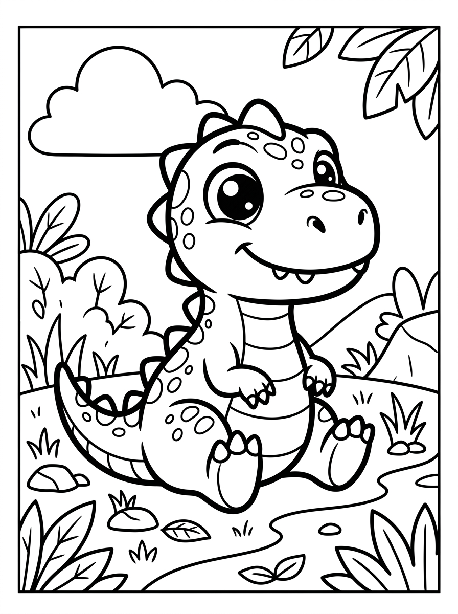
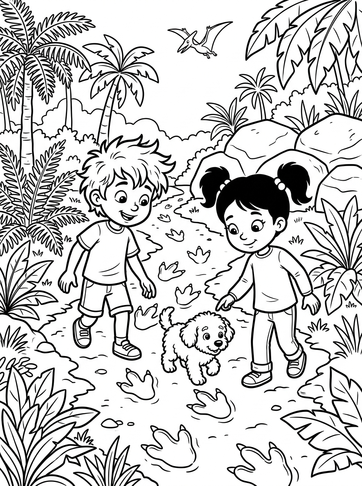

# Capítulo 1: Ficha Inicial y Presentación de la Aventura en la Isla Volcánica de España

---

## [PÁGINA 1: PORTADILLA DE PERTENENCIA]

# LAS AVENTURAS DE NICO Y LUNA

### **Este libro pertenece a la tripulación de:**

__________________________________________________

*¡Que tu viaje por la hermosa isla volcánica de España esté lleno de arena negra, lagartos gigantes y estrellas de fuego brillantes!*

---

## [PÁGINA 2: PORTADA INTERIOR]

# LAS AVENTURAS DE NICO Y LUNA
## Aventura en la Isla Volcánica

**Colección:** Las Aventuras de Nico y Luna — Libro 9  
**Escrito e Ilustrado por:** Julio Martín Rodríguez Sánchez  
**Para pequeños lectores y artistas de 4 a 8 años**

---

## [PÁGINA 3: DERECHOS DE AUTOR Y NOTA EDITORIAL]

**Las Aventuras de Nico y Luna: Aventura en la Isla Volcánica**  
© 2026 Julio Martín Rodríguez Sánchez. Todos los derechos reservados.

Queda prohibida la reproducción total o parcial de esta obra por cualquier medio sin la autorización escrita del titular de los derechos de autor.

**Nota para los padres y educadores:**  
Este libro ha sido diseñado para estimular la imaginación, la creatividad y la lectura temprana en niños de 4 a 8 años. Cada capítulo de lectura a color se separa por portadillas ilustradas y las escenas se presentan con texto en la página izquierda e ilustraciones a página completa en la derecha.

---

## [PÁGINA 4: ¡PREPARADOS PARA EL VIAJE VOLCÁNICO!]

### ¡Hola de nuevo, valiente explorador!

Nico, Luna y Copito están listos para explorar playas exóticas y descubrir el secreto del gran volcán Teide:

- **Nico**: Sostiene una lupa de explorador y lleva un gorro de safari de color beige.
- **Luna**: Lleva un mapa de las Islas Canarias de España y una mochila azul donde guarda un pequeño tarro de cristal para muestras.
- **Copito**: Lleva su bufanda roja y un pequeño collar de conchas marinas que encontró en el jardín.

¡Hoy cruzaremos valles verdes llenos de plataneras y subiremos a la cima del gran volcán del Teide!

> **Instrucción de Coloreado:**  
> Pinta las plataneras de color verde brillante, dale color amarillo a los plátanos maduros y colorea la mochila de Luna con tu color preferido.

---

## [PÁGINA 5: ILUSTRACIÓN DE BIENVENIDA]

# Capítulo 2: La Expedición en la Isla de Fuego

---

## [PÁGINA 6: PORTADILLA CAPÍTULO - LA EXPEDICIÓN EN LA ISLA DE FUEGO]

---

## [PÁGINA 7: ESCENA 1 - EL MUELLE DE ARENA NEGRA]

Nico y Luna están sentados en el borde de un pequeño bote de madera pintado de blanco y azul que se mece suavemente sobre las olas del océano. El cielo está despejado y el sol brilla con fuerza sobre el agua cristalina. Copito asoma su hocico por la borda del bote, olfateando el aire salino con sus orejitas levantadas. A lo lejos, se divisa el muelle de una hermosa isla volcánica con una playa de arena negra como el carbón, rodeada de verdes palmeras y rocas oscuras de formas extrañas.

La arena negra brilla bajo el sol y promete una aventura llena de grandes descubrimientos en las Islas Canarias de España.

> **Texto de Lectura:**  
> —¡Mirad, la playa es negra como el cielo de noche! Es la arena volcánica más bonita del mundo. ¡Vamos a explorarla! —exclama Luna.

---

## [PÁGINA 8: ILUSTRACIÓN ESCENA 1]

---

## [PÁGINA 9: ESCENA 2 - EL VALLE DE LAS PLATANERAS]

Al poner un pie en la playa, una ráfaga de viento cálido rodea a los niños, transportándolos mágicamente a un inmenso valle de plataneras verdes. Grandes hojas de plátano, más anchas que los brazos abiertos de Nico, se curvan formando un pasillo natural lleno de frescor. Entre el espeso follaje verde, un simpático y enorme lagarto de color marrón con manchas azules asoma su cabecita guiñando un ojo de forma muy graciosa. Copito corretea alegremente olfateando la tierra húmeda del valle.

El lagarto gigante observa a la tripulación con curiosidad, moviendo su larga cola entre las plataneras.

> **Texto de Lectura:**  
> —¡Es un lagarto gigante de las islas! Parece muy bueno y nos está saludando con la cabeza —dice Nico en voz baja.

---

## [PÁGINA 10: ILUSTRACIÓN ESCENA 2]

---

## [PÁGINA 11: ESCENA 3 - EL AMIGO GUANCHE]

El gran lagarto sale por completo de su escondite y se presenta como Guanche, el guardián de las plataneras de la isla. Con movimientos pausados y divertidos, Guanche se acerca a Nico, quien sostiene con cuidado un higo maduro y dulce en la palma de su mano. El lagarto acepta encantado el regalo, saboreando la deliciosa fruta tropical mientras Copito mueve la cola entusiasmado a su alrededor. La piel de Guanche brilla con hermosos tonos bronceados que cambian de color bajo la luz cálida del sol.

Guanche y Nico se hacen grandes amigos compartiendo higos dulces en el frondoso valle verde de las islas.

> **Texto de Lectura:**  
> —¡Hola, Guanche! Te encantan los higos maduros. ¿Nos acompañas a buscar el secreto de la isla? —pregunta Luna sonriendo.

---

## [PÁGINA 12: ILUSTRACIÓN ESCENA 3]

---

## [PÁGINA 13: ESCENA 4 - LA LEYENDA DEL TEIDE]

Guanche les guía hacia un claro del bosque desde donde se observa la silueta del majestuoso volcán Teide recortada contra el cielo azul. Con gestos rápidos de sus patas delanteras, el lagarto gigante les habla sobre la estrella de fuego, un cristal brillante de color naranja que se esconde en la cima del volcán y protege a toda la isla. Si la estrella pierde su brillo, la isla se quedará sin sus hermosos colores y las plataneras dejarán de dar frutos dulces.

Nico y Luna escuchan con atención la importante misión, dispuestos a ayudar a su nuevo amigo de las islas.

> **Texto de Lectura:**  
> —¡Debemos recuperar la estrella de fuego para que la isla siga llena de color y alegría! ¡Al Teide, tripulación! —anuncia Nico.

---

## [PÁGINA 14: ILUSTRACIÓN ESCENA 4]

---

## [PÁGINA 15: ESCENA 5 - EL SENDERO DE LAVA]

El camino hacia la cima del volcán se vuelve empinado y está cubierto de pequeñas piedras volcánicas de color azabache brillante. Nico y Luna caminan despacio, usando sus lupas de exploradores para examinar las extrañas rocas que parecen cristal negro pulido. Copito avanza al frente dando saltos ágiles entre las piedras, esquivando pequeños helechos verdes que crecen en las grietas calientes de la tierra. A lo lejos, la cima del gran volcán exhala nubes suaves de vapor blanco.

El sendero de piedra negra cruje bajo los pasos de los amigos mientras ascienden bajo el cálido sol canario.

> **Texto de Lectura:**  
> —¡Estas piedras brillan muchísimo! Son trozos de lava fría que cuentan historias del interior de la tierra —explica Luna fascinada.

---

## [PÁGINA 16: ILUSTRACIÓN ESCENA 5]

# Capítulo 3: El Misterio de la Estrella de Fuego

---

## [PÁGINA 17: PORTADILLA CAPÍTULO - EL MISTERIO DE LA ESTRELLA DE FUEGO]

---

## [PÁGINA 18: ESCENA 6 - EL PUENTE DE LAVA]

Para seguir subiendo hacia el volcán, Nico, Luna y Guanche deben cruzar un estrecho puente de lava petrificada que se extiende sobre un profundo barranco de piedra gris. El puente natural de piedra es fuerte pero requiere equilibrio. Nico camina al frente con paso seguro, extendiendo sus brazos para mantener el equilibrio, mientras Luna le sigue de cerca prestando mucha atención a cada pisada. Copito prefiere viajar cómodamente dentro de la mochila de Luna, asomando solo su cabeza esponjosa y mirando el fondo con asombro.

El abismo de piedra oscura se abre bajo sus pies, rodeado por el silencio de las cumbres canarias.

> **Texto de Lectura:**  
> —¡Despacio y con buena letra! Si nos damos la mano y caminamos juntos, cruzaremos el puente de piedra sin problemas —dice Nico.

---

## [PÁGINA 19: ILUSTRACIÓN ESCENA 6]

---

## [PÁGINA 20: ESCENA 7 - LA ABUBILLA CHOCHI]

Al otro lado del barranco, sobre la rama de un cactus espinoso, descansa una hermosa ave con una cresta de plumas en forma de abanico que abre y cierra alegremente. Es Chochi, la abubilla más cantarina e inteligente de la isla volcánica. Chochi abre su largo pico y les saluda con un silbido melodioso, moviendo sus plumas de color canela y blanco. Guanche saluda al ave agitando su pata delantera, mientras Copito ladra feliz al escuchar el dulce canto del pájaro explorador.

La simpática abubilla Chochi se ofrece a guiarles a través del misterioso jardín de cactus gigantes.

> **Texto de Lectura:**  
> —¡Qué plumas tan bonitas tienes, Chochi! ¿Nos enseñas el camino para llegar al gran árbol de la sabiduría? —pregunta Luna.

---

## [PÁGINA 21: ILUSTRACIÓN ESCENA 7]

---

## [PÁGINA 22: ESCENA 8 - EL ENIGMA DEL DRAGO]

Chochi los guía hacia un impresionante jardín lleno de cactus redondos de color verde y un gigantesco árbol Drago Milenario, cuyas ramas parecen serpientes de madera entrelazadas que apuntan al cielo. Para poder seguir subiendo por la ladera del volcán, el sabio Drago les propone resolver un divertido acertijo sobre las estrellas y el mar. Nico y Luna se sientan sobre una roca de lava fría a pensar, mientras Guanche descansa bajo la fresca sombra del milenario árbol canario.

El Drago Milenario les regala su bendición y una piña madura al escuchar la ingeniosa respuesta de Luna.

> **Texto de Lectura:**  
> —¡Es magnífico! Este árbol parece un guardián de madera gigante. ¡La respuesta al enigma está en el brillo del mar! —exclama Luna.

---

## [PÁGINA 23: ILUSTRACIÓN ESCENA 8]

---

## [PÁGINA 24: ESCENA 9 - LA LADERA DEL VOLCÁN]

Tras resolver el enigma del Drago, la expedición comienza a subir la empinada ladera de azufre del gran volcán Teide. El suelo es de un color amarillo claro y se siente templado bajo sus botas de montaña. De pequeñas aberturas en el suelo salen suaves columnas de humo blanco que huelen a piedra caliente y tierra viva. Nico usa su lupa para observar los cristales de azufre amarillos, mientras Luna y Guanche avanzan despacio ayudándose de ramas secas.

Copito corretea entre las nubes de vapor, divirtiéndose al intentar atrapar el humo blanco con sus patas.

> **Texto de Lectura:**  
> —¡Mirad cómo sale el humo de la tierra! El volcán está respirando muy despacito bajo nuestros pies —comenta Nico asombrado.

---

## [PÁGINA 25: ILUSTRACIÓN ESCENA 9]

---

## [PÁGINA 26: ESCENA 10 - LA ESTRELLA DE FUEGO]

Al llegar al borde del gran cráter del volcán, Nico y Luna descubren sobre un pedestal de obsidiana negra la hermosa estrella de fuego. El gran cristal de color naranja brillante flota en el aire, emitiendo una luz cálida y reconfortante que ilumina todo el Teide con hermosos destellos de color fuego. Guanche da saltos alegres al ver que la estrella aún brilla con fuerza, mientras Copito corre alrededor del pedestal moviendo su esponjosa cola lleno de felicidad.

Nico y Luna recogen con cuidado la estrella de fuego para devolverla a su lugar seguro en el centro de la isla.

> **Texto de Lectura:**  
> —¡Es preciosa! Su calor es muy suave y brilla como un trocito de sol atrapado en un cristal de fuego —susurra Luna feliz.

---

## [PÁGINA 27: ILUSTRACIÓN ESCENA 10]

# Capítulo 4: La Fiesta del Guanche y el Regreso del Volcán

---

## [PÁGINA 28: PORTADILLA CAPÍTULO - LA FIESTA DEL GUANCHE Y EL REGRESO DEL VOLCÁN]

---

## [PÁGINA 29: ESCENA 11 - GUANCHE AGRADECIDO]

Al bajar del gran volcán Teide con la estrella de fuego a salvo, regresan a las plataneras verdes del valle. En señal de agradecimiento por rescatar el cristal brillante, Guanche se coloca la estrella de fuego en medio de su cabeza, la cual emite una luz naranja y dorada muy hermosa que ilumina todo el bosque tropical. Las hojas de las plataneras vuelven a brillar con un verde intenso y los plátanos adquieren un color amarillo de oro puro, devolviendo la alegría a toda la isla.

La estrella de fuego vuelve a proteger a la isla volcánica gracias a la valentía de Nico y Luna.

> **Texto de Lectura:**  
> —¡Mirad qué bonito brilla la estrella en la cabeza de Guanche! Toda la naturaleza de la isla vuelve a llenarse de vida —dice Nico alegre.

---

## [PÁGINA 30: ILUSTRACIÓN ESCENA 11]

---

## [PÁGINA 31: ESCENA 12 - EL BANQUETE CANARIO]

Para celebrar la gran victoria, Guanche y Chochi preparan un delicioso banquete en la playa de arena negra bajo una gran sombrilla de hojas de palmera. Nico y Luna se sientan con cuidado sobre la arena templada para merendar plátanos dulces maduros y un plato de papas arrugadas con salsa mojo roja. Copito olfatea cada plato entusiasmado, recibiendo un pequeño trozo de plátano dulce por ser el perrito más valiente y cariñoso de toda la expedición.

Los amigos disfrutan de la deliciosa comida de las Islas Canarias mientras las olas rompen suavemente en la arena negra.

> **Texto de Lectura:**  
> —¡Qué ricas están las papas con mojo y los plátanos dulces! Es la merienda más sabrosa del mundo —comenta Luna relamiéndose.

---

## [PÁGINA 32: ILUSTRACIÓN ESCENA 12]

---

## [PÁGINA 33: ESCENA 13 - EL ATARDECER EN EL MAR]

Mientras terminan su merienda en la playa, el gran sol de la tarde comienza a ocultarse lentamente tras el horizonte del mar Atlántico. El cielo se tiñe de unos espectaculares tonos de color fuego, rosa y violeta que se reflejan en el oleaje azul y en la arena negra de la playa. Nico y Luna se sientan juntos sobre un tronco de madera arrastrado por el mar, disfrutando de este hermoso atardecer canario junto a su amigo el lagarto Guanche.

Copito se acurruca entre los pies de Nico, sintiendo el aire fresco de la tarde y el murmullo de las olas del mar.

> **Texto de Lectura:**  
> —¡Es impresionante! El cielo parece un lienzo pintado de color naranja y rosa sobre las olas del océano —susurra Luna feliz.

---

## [PÁGINA 34: ILUSTRACIÓN ESCENA 13]

---

## [PÁGINA 35: ESCENA 14 - DESLIZÁNDOSE POR LAS DUNAS]

Antes de despedirse, Guanche les invita a subir sobre su lomo liso y fuerte para realizar un último y divertido juego en las gigantescas dunas de arena dorada de Maspalomas. Nico y Luna se sujetan fuerte con sus manos mientras el lagarto gigante se desliza cuesta abajo por la duna como si fuera un tobogán de agua de un parque de atracciones. Copito corretea a su lado dando pequeños ladridos de alegría, levantando nubes de polvo dorado que brillan bajo los últimos rayos de sol.

Nico y Luna ríen a carcajadas mientras se deslizan a toda velocidad por la duna junto a sus amigos de las islas.

> **Texto de Lectura:**  
> —¡Sujetaos fuerte, tripulación! ¡Deslizarse por las dunas de arena es el juego más divertido del viaje! —grita Nico entusiasmado.

---

## [PÁGINA 36: ILUSTRACIÓN ESCENA 14]

---

## [PÁGINA 37: ESCENA 15 - LA DESPEDIDA EN LA PLAYA]

Al llegar cerca del muelle de madera donde espera su bote de regreso a casa, los amigos de la isla volcánica se reúnen para despedirse con mucho cariño. Guanche, Chochi la abubilla y las plantas de plátano parecen agitar sus hojas y plumas bajo el viento de la tarde. Nico y Luna saludan con sus manos desde la distancia, con un frasco de cristal lleno de arena negra en su mochila como recuerdo de esta hermosa expedición volcánica.

La amistad que nació bajo el gran Teide permanecerá siempre viva en los corazones de los pequeños aventureros de España.

> **Texto de Lectura:**  
> —¡Adiós, Guanche! ¡Adiós, Chochi! Cuidaremos muy bien de vuestra estrella de fuego en nuestros recuerdos —gritan Nico y Luna despidiéndose.

---

## [PÁGINA 38: ILUSTRACIÓN ESCENA 15]

# Capítulo 5: El Regreso al Hogar y Dulces Sueños

---

## [PÁGINA 39: PORTADILLA CAPÍTULO - EL REGRESO A CASA Y DULCES SUEÑOS]

---

## [PÁGINA 40: ESCENA 16 - EL VIAJE DE REGRESO]

El pequeño bote de madera se eleva suavemente por el aire, meciéndose sobre una nube de vapor templado y de un hermoso color rosa que los guía de vuelta a casa. El viento de la noche es fresco y acaricia los rostros de Nico y Luna, quienes miran con gran asombro las palmeras de la playa que van quedando atrás como pequeñas chispas verdes en la lejanía. En la mochila de exploradores, el pequeño tarro de cristal con arena negra emite un brillo naranja muy suave que marca el camino de regreso.

Poco a poco, las siluetas de las islas se desvanecen en el mar Atlántico y el cielo se tiñe de un tono azul familiar.

> **Texto de Lectura:**  
> —¡Sujetaos bien, tripulación! ¡El vapor templado del Teide nos lleva directos hacia nuestra ventana! —anuncia el capitán Nico con orgullo.

---

## [PÁGINA 41: ILUSTRACIÓN ESCENA 16]

---

## [PÁGINA 42: ESCENA 17 - EN LA HABITACIÓN]

Con un suave y mágico silbido de viento marino, Nico, Luna y Copito aparecen sentados de nuevo en la alfombra verde de su dormitorio. A través de la ventana abierta, se filtran las primeras luces del amanecer que tiñen el cuarto de unos hermosos colores dorados y violetas. Copito corretea feliz sacudiéndose las pequeñas motas de arena negra imaginaria del viaje, buscando sus juguetes y dando pequeños ladridos de alegría por estar de regreso en su querido dormitorio.

Nico y Luna se miran sonriendo, cansados pero muy contentos de estar de nuevo en sus camitas cómodas.

> **Texto de Lectura:**  
> —¡Qué viaje tan maravilloso! Pero qué bien se siente estar en nuestra camita y ver nuestro cuarto —dice Luna abrazando a Copito con cariño.

---

## [PÁGINA 43: ILUSTRACIÓN ESCENA 17]

---

## [PÁGINA 44: ESCENA 18 - LA ARENA MÁGICA]

Antes de cerrar los ojos para descansar, Luna coloca con mucho cuidado el pequeño tarro de cristal con arena negra que trajeron de la playa sobre la repisa de su ventana. Enseguida, los pequeños granos de arena comienzan a brillar con un resplandor de color amarillo y naranja muy suave, proyectando en las paredes del cuarto hermosas siluetas de palmeras exóticas, lagartos gigantes que comen higos y nubes de vapor que flotan en el techo en silencio.

Nico y Luna contemplan este maravilloso mapa volcánico desde sus camas, sintiendo el calor de la isla en su habitación.

> **Texto de Lectura:**  
> —¡Es mágico! Los recuerdos de nuestros amigos de la isla volcánica velan por nuestra noche con cariño —susurra Luna sonriendo.

---

## [PÁGINA 45: ILUSTRACIÓN ESCENA 18]

---

## [PÁGINA 46: ESCENA 19 - SUEÑOS VOLCÁNICOS]

Los pesados párpados de los pequeños exploradores se van cerrando muy despacito. En el dulce mundo de los sueños, Nico y Luna continúan su fantástico viaje flotando libremente entre volcanes de agua tibia, lagartos gigantes que vuelan por el cielo y abubillas de colores que cantan dulces canciones de cuna. Saben muy bien que al amanecer les esperarán mil juegos nuevos en el jardín, pero ahora es momento de dejar volar la imaginación y descansar.

Copito da pequeños suspiros de felicidad a los pies de la cama, soñando tal vez con plátanos dulces y conchas de mar.

> **Texto de Lectura:**  
> Duerme en paz, pequeño aventurero. El Teide y sus estrellas de fuego velan por tus hermosos sueños —susurra una voz misteriosa.

---

## [PÁGINA 47: ILUSTRACIÓN ESCENA 19]

---

## [PÁGINA 48: ESCENA 20 - AMANECER FELIZ]

Al brillar los primeros y cálidos rayos de sol de la mañana, Nico y Luna se despiertan con mucha energía y sonrisas en sus rostros. Se estiran y miran hacia el mapa de juguete de la pared, recordando con emoción el concierto de Chochi la abubilla y al simpático lagarto Guanche. Saben que el mundo de las islas es gigante y guarda misterios hermosos, pero su amistad y su imaginación son la aventura más bonita de todas.

Copito entra corriendo en el cuarto con su espada de madera en la boca, listo para un nuevo día de travesuras.

> **Texto de Lectura:**  
> —¡Buenos días! Cada nuevo amanecer trae un mundo entero de oportunidades para jugar y ser felices —dice Nico muy alegre.

---

## [PÁGINA 49: ILUSTRACIÓN ESCENA 20]

# Capítulo 6: Actividades y Juegos de la Isla Volcánica

---

## [PÁGINA 50: PORTADILLA CAPÍTULO - ACTIVIDADES Y JUEGOS DE LA ISLA VOLCÁNICA]

---

## [PÁGINA 51: ACTIVIDAD 1 - BUSCA, CUENTA Y COLOREA LA ISLA DE FUEGO]

### 🧩 ¡Busca, Cuenta y Colorea!

Observa el dibujo y cuenta cuántos elementos encuentras en la playa volcánica de arena negra. Escribe el número en los círculos y colorea la escena.

---

## [PÁGINA 52: ACTIVIDAD 2 - BUSCA LAS 5 DIFERENCIAS]

### 🔍 ¡Encuentra las 5 diferencias!

Observa las dos escenas del lagarto gigante Guanche y el perrito Copito jugando en la playa. ¿Puedes encontrar los 5 detalles cambiados en el dibujo de la derecha?

- [ ] 1. La estrella de fuego en la cabeza de Guanche.
- [ ] 2. La hoja de plátano grande en el fondo.
- [ ] 3. Las conchas del collar de Copito.
- [ ] 4. El cactus pequeño a la derecha de la palmera.
- [ ] 5. La cresta de plumas de Chochi la abubilla.

---

## [PÁGINA 53: ACTIVIDAD 3 - CONECTA LOS PUNTOS]

### ✏️ ¡Une los puntos del 1 al 20!

Descubre qué majestuoso y alto volcán de las Islas Canarias se esconde aquí.  
Une los números en orden y luego... ¡coloréalo con tus colores preferidos!

`1 - 2 - 3 - 4 - 5 - 6 - 7 - 8 - 9 - 10 - 11 - 12 - 13 - 14 - 15 - 16 - 17 - 18 - 19 - 20`

---

## [PÁGINA 54: ACTIVIDAD 4 - DIBUJO Y CREATIVIDAD LIBRE]

### 🎨 ¡Diseña tu propia Estrella de Fuego!

En este espacio en blanco, utiliza tu imaginación para dibujar una estrella de fuego brillante o un lagarto gigante con el que explorar las islas.

**¿Cómo se llama tu estrella o lagarto?**: ______________________________________  
**¿Qué brillo o poder mágico tiene?**: ________________________________________
# Capítulo 7: Próxima Aventura, Juegos Adicionales y Soluciones

---

## [PÁGINA 55: PORTADILLA CAPÍTULO - SOLUCIONES Y AVANCE DEL SIGUIENTE LIBRO]

---

## [PÁGINA 56: AVANCE DEL SIGUIENTE LIBRO DE LA COLECCIÓN]

### 🐿️ ¡Próxima Aventura!

### LAS AVENTURAS DE NICO Y LUNA — LIBRO 10
## Aventura en el Bosque de Secuoyas de España

Nico, Luna y Copito viajan a un bosque de secuoyas gigantes en Cantabria, en el norte de España.  
Conocerán a una simpática ardilla voladora llamada Saltarina que adora coleccionar piñas dulces, explorarán senderos mágicos cubiertos de musgo y helechos gigantes, y ayudarán a buscar la gran piña de oro del gran roble centenario.

> **¡Consigue el Libro 10 de la colección en Amazon KDP!**

---

## [PÁGINA 57: ACTIVIDAD 5 - SOPA DE LETRAS VOLCÁNICA]

### 🧩 Encuentra las 5 palabras ocultas de la isla en esta sopa de letras.

Las palabras que debes buscar son: **TEIDE**, **LAGARTO**, **PLAYA**, **LUNA** y **NICO**. ¡Diviértete!

---

## [PÁGINA 58: ACTIVIDAD 6 - CONECTA LAS SOMBRAS DE LA ABUBILLA]

### 🧩 Une con una línea la abubilla Chochi de la izquierda con su sombra correcta a la derecha.

Observa muy bien la cresta de plumas, el pico largo y las garras del pájaro.

---

## [PÁGINA 59: SOLUCIONARIO DE ACTIVIDADES]

### 💡 Soluciones de los Juegos

- **Página 51 (Busca y Cuenta):** Encontraste 3 Lagartos (🦎), 2 Abubillas (🐦) y 4 Plátanos (🍌).
- **Página 52 (Diferencias):** 1. La estrella en la cabeza; 2. La hoja de plátano grande; 3. Las conchas del collar; 4. El cactus pequeño; 5. La cresta de plumas.
- **Página 53 (Conecta Puntos):** ¡Es el majestuoso volcán del Teide!
- **Página 57 (Sopa de Letras):** Las palabras están ocultas en horizontal.
- **Página 58 (Conecta las Sombras):** La sombra correcta es la opción **C**.

---

## [PÁGINA 60: ¡MUCHAS GRACIAS EXPLORADOR!]

¡Gracias por leer y colorear con nosotros en esta emocionante aventura en la isla volcánica de España!  

Si te ha gustado explorar las playas de arena negra y el volcán junto a Nico, Luna y Copito, te agradeceríamos enormemente si pudieras dedicarnos un minuto para dejarnos una opinión en Amazon. ¡Nos ayuda muchísimo a seguir creando libros llenos de ilusión y color!
